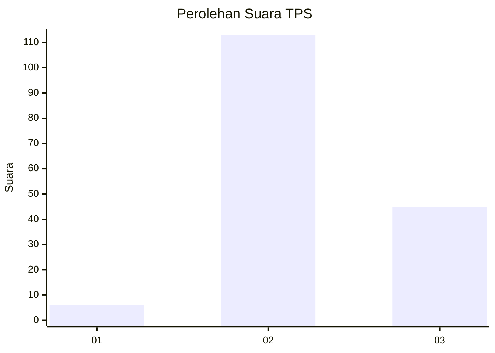
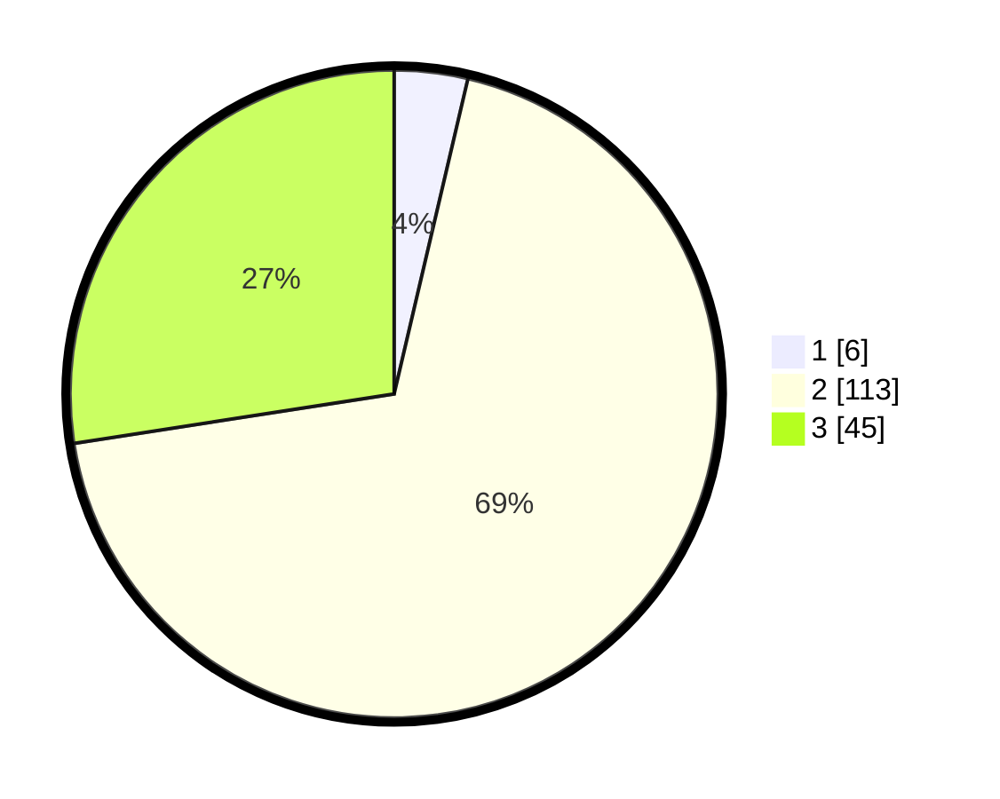

# Hasil

## Grafik

## Tabel

| No. | Nama Paslon    | Suara | Suara (raw) | Persentase |
|:--- |:-------------- | -----:| -----------:| ----------:|
| 1   | ANIES MUHAIMIN | 6     | [6][p-1]    | 3,66       |
| 2   | PRABOWO GIBRAN | 113   | [113][p-2]  | 68,90      |
| 3   | GANJAR MAHFUD  | 45    | [45][p-3]   | 27,44      |

[p-1]: https://github.com/gigit-pemilu/pemilu-2024-35-jawa-timur/blob/main/pilpres/hitung-suara/sub/35-jawa-timur/sub/03-trenggalek/sub/07-kampak/sub/2005-karangrejo/sub/014-tps/sub/paslon-1.txt
[p-2]: https://github.com/gigit-pemilu/pemilu-2024-35-jawa-timur/blob/main/pilpres/hitung-suara/sub/35-jawa-timur/sub/03-trenggalek/sub/07-kampak/sub/2005-karangrejo/sub/014-tps/sub/paslon-2.txt
[p-3]: https://github.com/gigit-pemilu/pemilu-2024-35-jawa-timur/blob/main/pilpres/hitung-suara/sub/35-jawa-timur/sub/03-trenggalek/sub/07-kampak/sub/2005-karangrejo/sub/014-tps/sub/paslon-3.txt

## Foto C Plano

https://sirekap-obj-formc.kpu.go.id/3bc9/pemilu/ppwp/35/03/07/20/05/3503072005014-20240215-204737--73cba0e2-514f-4630-837d-7aaf4df080bb.jpg

https://sirekap-obj-formc.kpu.go.id/3bc9/pemilu/ppwp/35/03/07/20/05/3503072005014-20240216-085251--659d7595-45ba-4cd6-844b-29ee5b4fa3a4.jpg

https://sirekap-obj-formc.kpu.go.id/3bc9/pemilu/ppwp/35/03/07/20/05/3503072005014-20240216-172743--93fa4762-7e38-4d8f-a499-c05687f60993.jpg

## Metadata

| Key        | Value               |
| ---------- | ------------------- |
| Time Stamp | 2024-02-20 09:00:00 |

## DATA PEMILIH TETAP

Jumlah pemilih dalam DPT: **204**.
 * L: **103**.
 * P: **401**.

## DATA PENGGUNA HAK PILIH

Jumlah pengguna hak pilih dalam DPT: **124**.
 * L: **885**.
 * P: **690**.

Jumlah pengguna hak pilih dalam DPTb: **882**.
 * L: **882**.
 * P: **884**.

Jumlah pengguna hak pilih dalam DPK: **0**.
 * L: **0**.
 * P: **0**.

Jumlah pengguna hak pilih: **476**.
 * L: **26**.
 * P: **90**.

## JUMLAH SUARA SAH DAN TIDAK SAH

JUMLAH SELURUH SUARA SAH: **123**.

JUMLAH SUARA TIDAK SAH: **53**.

JUMLAH SELURUH SUARA SAH DAN SUARA TIDAK SAH: **176**.

