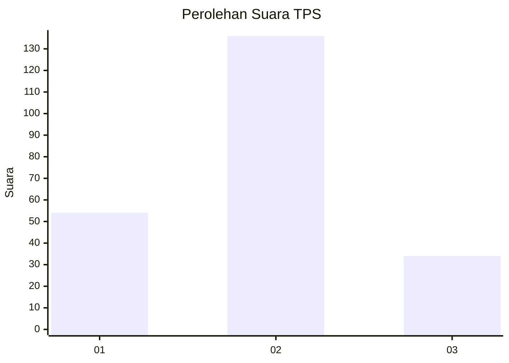
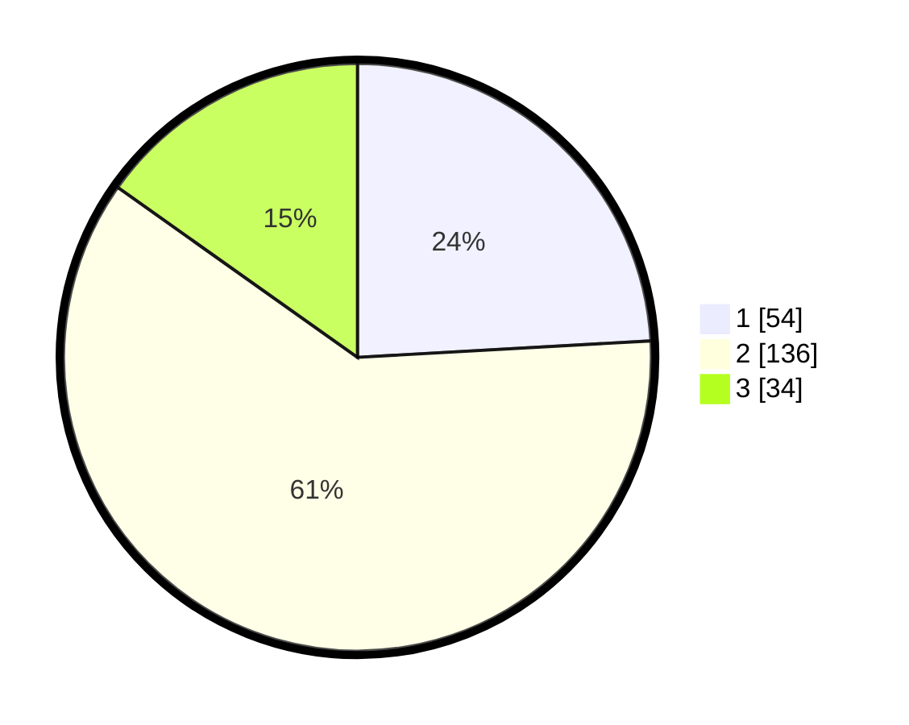

# Hasil

## Grafik

## Tabel

| No. | Nama Paslon    | Suara | Suara (raw) | Persentase |
|:--- |:-------------- | -----:| -----------:| ----------:|
| 1   | ANIES MUHAIMIN | 54    | [54][p-1]   | 24,11      |
| 2   | PRABOWO GIBRAN | 136   | [136][p-2]  | 60,71      |
| 3   | GANJAR MAHFUD  | 34    | [34][p-3]   | 15,18      |

[p-1]: https://github.com/gigit-pemilu/pemilu-2024-35-jawa-timur/blob/main/pilpres/hitung-suara/sub/35-jawa-timur/sub/03-trenggalek/sub/07-kampak/sub/2007-senden/sub/002-tps/sub/paslon-1.txt
[p-2]: https://github.com/gigit-pemilu/pemilu-2024-35-jawa-timur/blob/main/pilpres/hitung-suara/sub/35-jawa-timur/sub/03-trenggalek/sub/07-kampak/sub/2007-senden/sub/002-tps/sub/paslon-2.txt
[p-3]: https://github.com/gigit-pemilu/pemilu-2024-35-jawa-timur/blob/main/pilpres/hitung-suara/sub/35-jawa-timur/sub/03-trenggalek/sub/07-kampak/sub/2007-senden/sub/002-tps/sub/paslon-3.txt

## Foto C Plano

https://sirekap-obj-formc.kpu.go.id/6eb3/pemilu/ppwp/35/03/07/20/07/3503072007002-20240217-171300--9f6631fa-cb22-4e26-afed-4a9dda3d3b33.jpg

https://sirekap-obj-formc.kpu.go.id/6eb3/pemilu/ppwp/35/03/07/20/07/3503072007002-20240216-165752--63f4a49a-41c1-4880-80a7-8d530cf2b0ad.jpg

https://sirekap-obj-formc.kpu.go.id/6eb3/pemilu/ppwp/35/03/07/20/07/3503072007002-20240216-165829--63852d2c-8eae-426c-bebe-e1dc14ef30d4.jpg

## Metadata

| Key        | Value               |
| ---------- | ------------------- |
| Time Stamp | 2024-02-17 17:30:00 |

