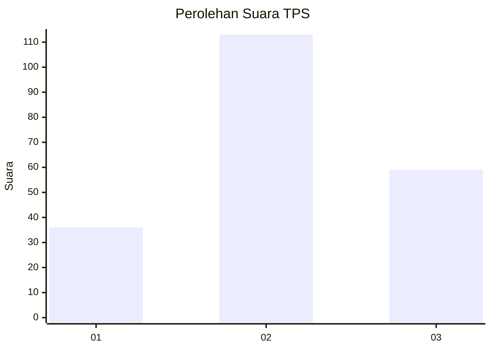
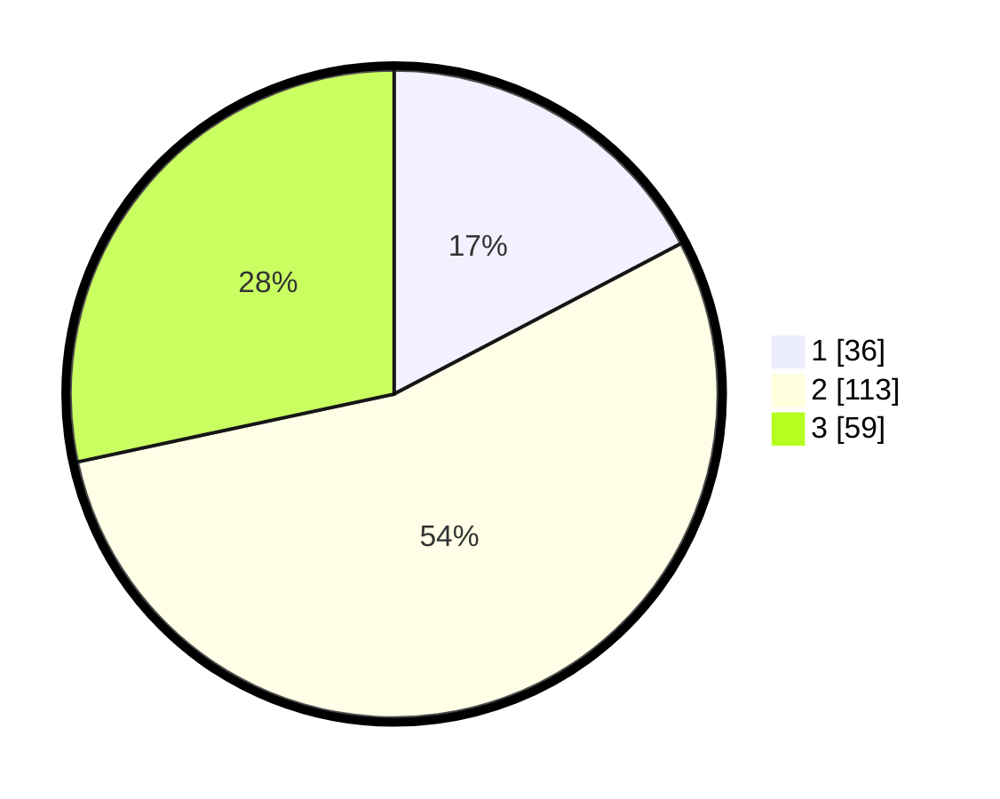

# Hasil

## Grafik

## Tabel

| No. | Nama Paslon    | Suara | Suara (raw) | Persentase |
|:--- |:-------------- | -----:| -----------:| ----------:|
| 1   | ANIES MUHAIMIN | 36    | [36][p-1]   | 17,31      |
| 2   | PRABOWO GIBRAN | 113   | [113][p-2]  | 54,33      |
| 3   | GANJAR MAHFUD  | 59    | [59][p-3]   | 28,37      |

[p-1]: https://github.com/gigit-pemilu/pemilu-2024/blob/main/pilpres/hitung-suara/sub/35-jawa-timur/sub/03-trenggalek/sub/07-kampak/sub/2007-senden/sub/004-tps/sub/paslon-1.txt
[p-2]: https://github.com/gigit-pemilu/pemilu-2024/blob/main/pilpres/hitung-suara/sub/35-jawa-timur/sub/03-trenggalek/sub/07-kampak/sub/2007-senden/sub/004-tps/sub/paslon-2.txt
[p-3]: https://github.com/gigit-pemilu/pemilu-2024/blob/main/pilpres/hitung-suara/sub/35-jawa-timur/sub/03-trenggalek/sub/07-kampak/sub/2007-senden/sub/004-tps/sub/paslon-3.txt

## Foto C Plano

https://sirekap-obj-formc.kpu.go.id/042c/pemilu/ppwp/35/03/07/20/07/3503072007004-20240215-011805--08e862e1-e0a1-4cac-ba93-9211b370553e.jpg

https://sirekap-obj-formc.kpu.go.id/042c/pemilu/ppwp/35/03/07/20/07/3503072007004-20240215-011931--e6597250-7fa6-494e-b45f-87570663061d.jpg

https://sirekap-obj-formc.kpu.go.id/042c/pemilu/ppwp/35/03/07/20/07/3503072007004-20240215-012018--ae5bc9e6-b25c-4dbd-ad1d-b65e565559f8.jpg

## Metadata

| Key        | Value               |
| ---------- | ------------------- |
| Time Stamp | 2024-02-16 16:25:10 |

