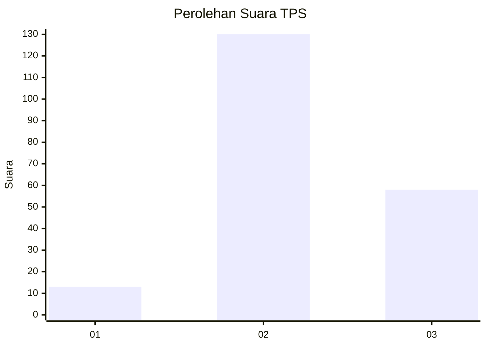
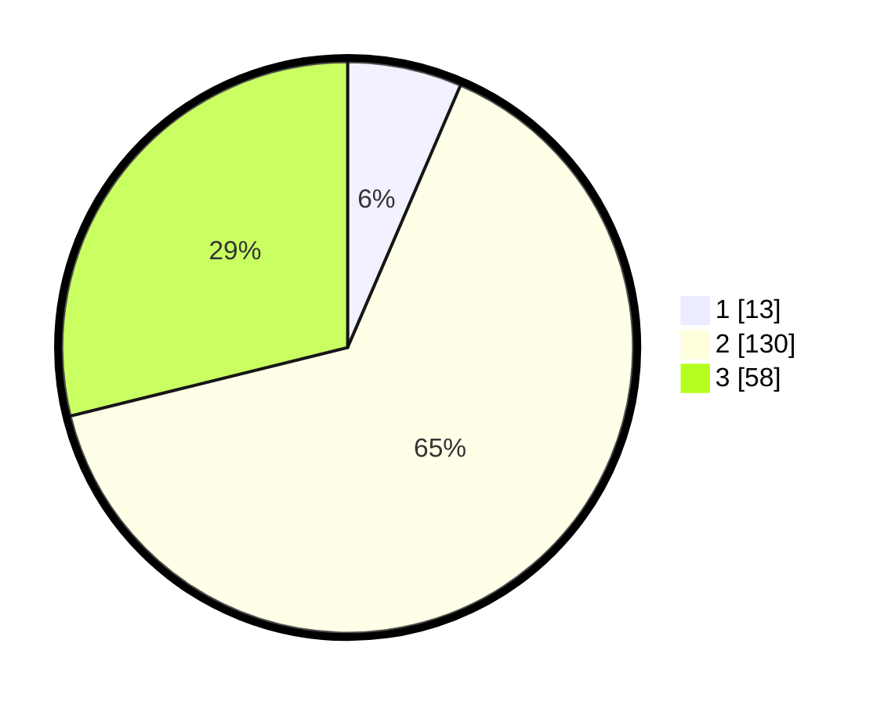

# Hasil

## Grafik

## Tabel

| No. | Nama Paslon    | Suara | Suara (raw) | Persentase |
|:--- |:-------------- | -----:| -----------:| ----------:|
| 1   | ANIES MUHAIMIN | 13    | [13][p-1]   | 6,47       |
| 2   | PRABOWO GIBRAN | 130   | [130][p-2]  | 64,68      |
| 3   | GANJAR MAHFUD  | 58    | [58][p-3]   | 28,86      |

[p-1]: https://github.com/gigit-pemilu/pemilu-2024-35-jawa-timur/blob/main/pilpres/hitung-suara/sub/35-jawa-timur/sub/03-trenggalek/sub/08-watulimo/sub/2001-karanggandu/sub/009-tps/sub/paslon-1.txt
[p-2]: https://github.com/gigit-pemilu/pemilu-2024-35-jawa-timur/blob/main/pilpres/hitung-suara/sub/35-jawa-timur/sub/03-trenggalek/sub/08-watulimo/sub/2001-karanggandu/sub/009-tps/sub/paslon-2.txt
[p-3]: https://github.com/gigit-pemilu/pemilu-2024-35-jawa-timur/blob/main/pilpres/hitung-suara/sub/35-jawa-timur/sub/03-trenggalek/sub/08-watulimo/sub/2001-karanggandu/sub/009-tps/sub/paslon-3.txt

## Foto C Plano

https://sirekap-obj-formc.kpu.go.id/6317/pemilu/ppwp/35/03/08/20/01/3503082001009-20240215-175543--15ef6562-ad49-4603-ab01-b1567387cc96.jpg

https://sirekap-obj-formc.kpu.go.id/6317/pemilu/ppwp/35/03/08/20/01/3503082001009-20240215-180326--ca7cdfc3-b414-484a-b167-29c05f255f1c.jpg

https://sirekap-obj-formc.kpu.go.id/6317/pemilu/ppwp/35/03/08/20/01/3503082001009-20240215-061547--103490cc-0b0f-4866-9a20-ef88edaa34f8.jpg

## Metadata

| Key        | Value               |
| ---------- | ------------------- |
| Time Stamp | 2024-02-25 11:00:00 |

