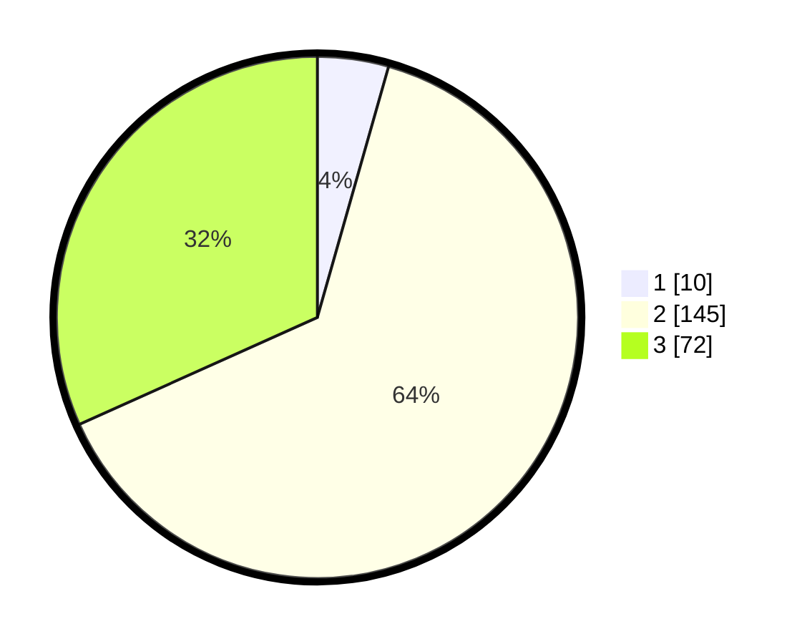

# Hasil

## Grafik

## Tabel

| No. | Nama Paslon    | Suara | Suara (raw) | Persentase |
|:--- |:-------------- | -----:| -----------:| ----------:|
| 1   | ANIES MUHAIMIN | 10    | [10][p-1]   | 4,41       |
| 2   | PRABOWO GIBRAN | 145   | [145][p-2]  | 63,88      |
| 3   | GANJAR MAHFUD  | 72    | [72][p-3]   | 31,72      |

[p-1]: https://github.com/gigit-pemilu/pemilu-2024-35-jawa-timur/blob/main/pilpres/hitung-suara/sub/35-jawa-timur/sub/03-trenggalek/sub/08-watulimo/sub/2001-karanggandu/sub/012-tps/sub/paslon-1.txt
[p-2]: https://github.com/gigit-pemilu/pemilu-2024-35-jawa-timur/blob/main/pilpres/hitung-suara/sub/35-jawa-timur/sub/03-trenggalek/sub/08-watulimo/sub/2001-karanggandu/sub/012-tps/sub/paslon-2.txt
[p-3]: https://github.com/gigit-pemilu/pemilu-2024-35-jawa-timur/blob/main/pilpres/hitung-suara/sub/35-jawa-timur/sub/03-trenggalek/sub/08-watulimo/sub/2001-karanggandu/sub/012-tps/sub/paslon-3.txt

## Foto C Plano

https://sirekap-obj-formc.kpu.go.id/f876/pemilu/ppwp/35/03/08/20/01/3503082001012-20240215-011053--3d4e08f0-bf6d-4cbb-b49b-e53408a9e007.jpg

https://sirekap-obj-formc.kpu.go.id/f876/pemilu/ppwp/35/03/08/20/01/3503082001012-20240215-011226--c5aa874f-077c-4d8f-a5b1-ab7b03a758f8.jpg

https://sirekap-obj-formc.kpu.go.id/f876/pemilu/ppwp/35/03/08/20/01/3503082001012-20240215-011129--810242a7-5953-4f91-9a18-8beda9b7c142.jpg

## Metadata

| Key        | Value               |
| ---------- | ------------------- |
| Time Stamp | 2024-02-15 16:30:25 |

