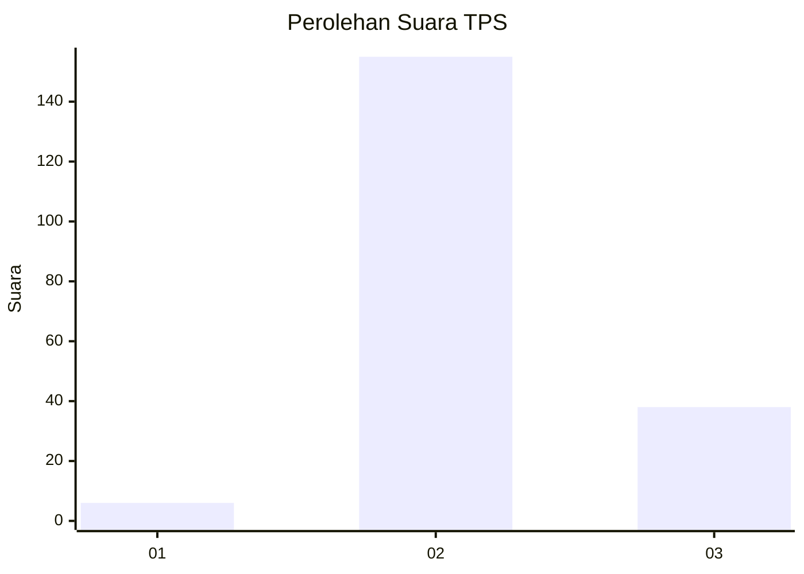
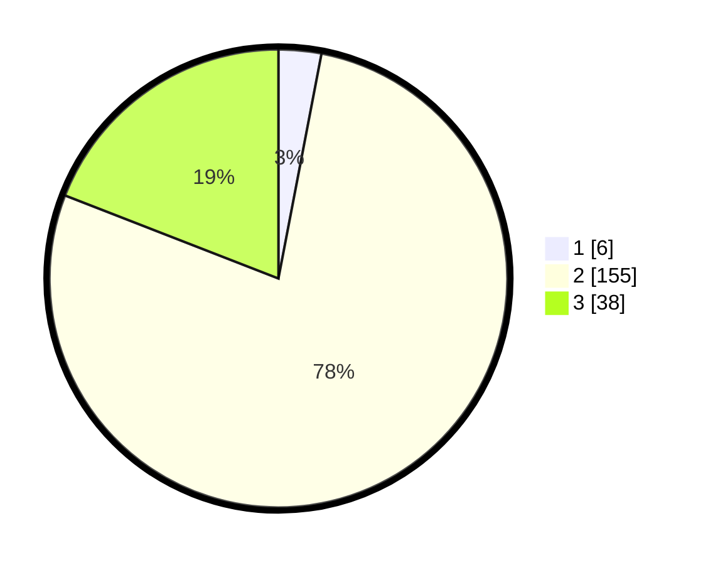

# Hasil

## Grafik

## Tabel

| No. | Nama Paslon    | Suara | Suara (raw) | Persentase |
|:--- |:-------------- | -----:| -----------:| ----------:|
| 1   | ANIES MUHAIMIN | 6     | [6][p-1]    | 3,02       |
| 2   | PRABOWO GIBRAN | 155   | [155][p-2]  | 77,89      |
| 3   | GANJAR MAHFUD  | 38    | [38][p-3]   | 19,10      |

[p-1]: https://github.com/gigit-pemilu/pemilu-2024/blob/main/pilpres/hitung-suara/sub/35-jawa-timur/sub/03-trenggalek/sub/08-watulimo/sub/2001-karanggandu/sub/015-tps/sub/paslon-1.txt
[p-2]: https://github.com/gigit-pemilu/pemilu-2024/blob/main/pilpres/hitung-suara/sub/35-jawa-timur/sub/03-trenggalek/sub/08-watulimo/sub/2001-karanggandu/sub/015-tps/sub/paslon-2.txt
[p-3]: https://github.com/gigit-pemilu/pemilu-2024/blob/main/pilpres/hitung-suara/sub/35-jawa-timur/sub/03-trenggalek/sub/08-watulimo/sub/2001-karanggandu/sub/015-tps/sub/paslon-3.txt

## Foto C Plano

https://sirekap-obj-formc.kpu.go.id/9860/pemilu/ppwp/35/03/08/20/01/3503082001015-20240217-081343--12f54a51-aa3e-40cd-8b6e-2d09f37ece49.jpg

https://sirekap-obj-formc.kpu.go.id/9860/pemilu/ppwp/35/03/08/20/01/3503082001015-20240217-080220--23e6795c-b814-4c18-93b1-87322e621b0e.jpg

https://sirekap-obj-formc.kpu.go.id/9860/pemilu/ppwp/35/03/08/20/01/3503082001015-20240217-080440--d80e0ec3-4dc9-4694-8d04-a6dab17cb45e.jpg

## Metadata

| Key        | Value               |
| ---------- | ------------------- |
| Time Stamp | 2024-02-17 08:30:03 |

