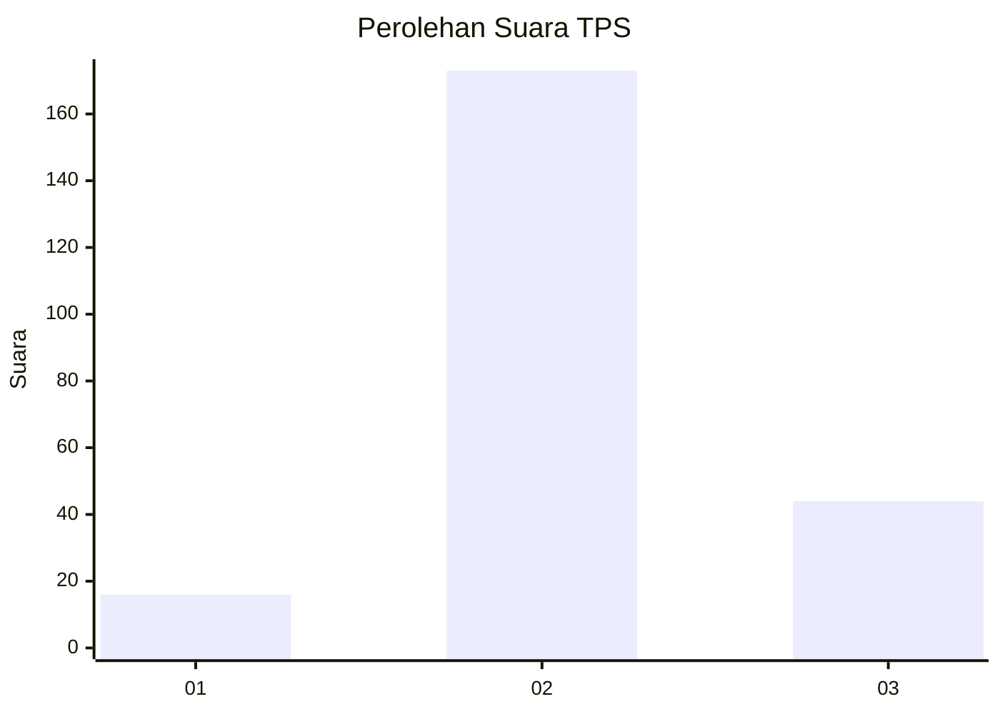
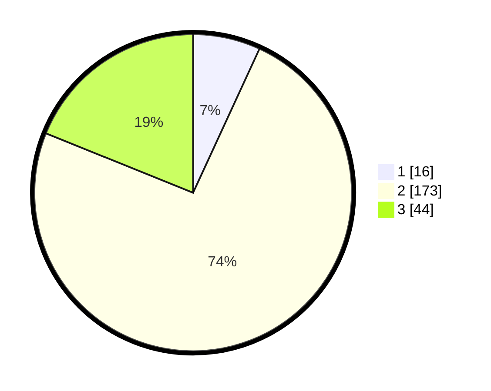

# Hasil

## Grafik

## Tabel

| No. | Nama Paslon    | Suara | Suara (raw) | Persentase |
|:--- |:-------------- | -----:| -----------:| ----------:|
| 1   | ANIES MUHAIMIN | 16    | [16][p-1]   | 6,87       |
| 2   | PRABOWO GIBRAN | 173   | [173][p-2]  | 74,25      |
| 3   | GANJAR MAHFUD  | 44    | [44][p-3]   | 18,88      |

[p-1]: https://github.com/gigit-pemilu/pemilu-2024/blob/main/pilpres/hitung-suara/sub/35-jawa-timur/sub/03-trenggalek/sub/08-watulimo/sub/2002-sawahan/sub/004-tps/sub/paslon-1.txt
[p-2]: https://github.com/gigit-pemilu/pemilu-2024/blob/main/pilpres/hitung-suara/sub/35-jawa-timur/sub/03-trenggalek/sub/08-watulimo/sub/2002-sawahan/sub/004-tps/sub/paslon-2.txt
[p-3]: https://github.com/gigit-pemilu/pemilu-2024/blob/main/pilpres/hitung-suara/sub/35-jawa-timur/sub/03-trenggalek/sub/08-watulimo/sub/2002-sawahan/sub/004-tps/sub/paslon-3.txt

## Foto C Plano

https://sirekap-obj-formc.kpu.go.id/281a/pemilu/ppwp/35/03/08/20/02/3503082002004-20240218-100213--6e480d85-7f8c-4a34-b977-d370aca48bf9.jpg

https://sirekap-obj-formc.kpu.go.id/281a/pemilu/ppwp/35/03/08/20/02/3503082002004-20240216-145927--d5f2aa09-1312-4862-8a3c-b70b0f4a9a99.jpg

https://sirekap-obj-formc.kpu.go.id/281a/pemilu/ppwp/35/03/08/20/02/3503082002004-20240218-210545--f11a4541-80a9-42ac-a793-7246aa586fcc.jpg

## Metadata

| Key        | Value               |
| ---------- | ------------------- |
| Time Stamp | 2024-02-19 06:16:00 |

