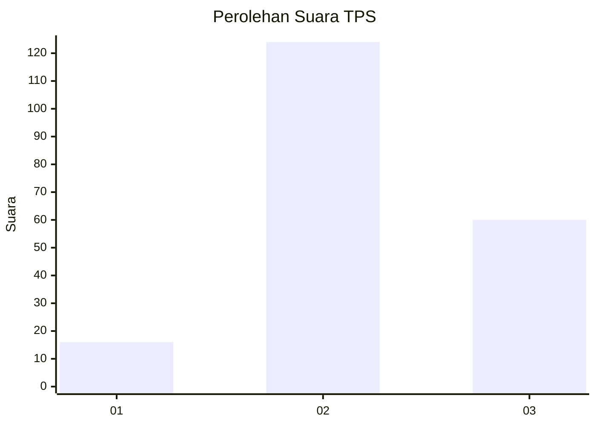
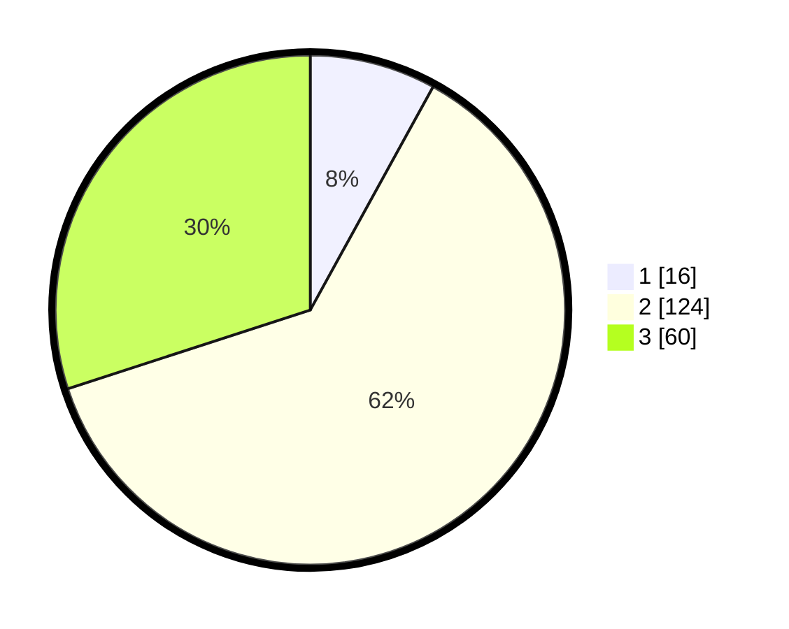

# Hasil

## Grafik

## Tabel

| No. | Nama Paslon    | Suara | Suara (raw) | Persentase |
|:--- |:-------------- | -----:| -----------:| ----------:|
| 1   | ANIES MUHAIMIN | 16    | [16][p-1]   | 8,00       |
| 2   | PRABOWO GIBRAN | 124   | [124][p-2]  | 62,00      |
| 3   | GANJAR MAHFUD  | 60    | [60][p-3]   | 30,00      |

[p-1]: https://github.com/gigit-pemilu/pemilu-2024/blob/main/pilpres/hitung-suara/sub/35-jawa-timur/sub/03-trenggalek/sub/08-watulimo/sub/2003-dukuh/sub/004-tps/sub/paslon-1.txt
[p-2]: https://github.com/gigit-pemilu/pemilu-2024/blob/main/pilpres/hitung-suara/sub/35-jawa-timur/sub/03-trenggalek/sub/08-watulimo/sub/2003-dukuh/sub/004-tps/sub/paslon-2.txt
[p-3]: https://github.com/gigit-pemilu/pemilu-2024/blob/main/pilpres/hitung-suara/sub/35-jawa-timur/sub/03-trenggalek/sub/08-watulimo/sub/2003-dukuh/sub/004-tps/sub/paslon-3.txt

## Foto C Plano

https://sirekap-obj-formc.kpu.go.id/e79c/pemilu/ppwp/35/03/08/20/03/3503082003004-20240219-103316--abef4c85-07a1-4be8-9abf-a9e88862de7a.jpg

https://sirekap-obj-formc.kpu.go.id/e79c/pemilu/ppwp/35/03/08/20/03/3503082003004-20240219-103440--e68f1407-7f3a-486a-9f0e-445175d547ae.jpg

https://sirekap-obj-formc.kpu.go.id/e79c/pemilu/ppwp/35/03/08/20/03/3503082003004-20240219-104155--2fc660d8-41a2-4a35-a11e-8c94a6614a22.jpg

## Metadata

| Key        | Value               |
| ---------- | ------------------- |
| Time Stamp | 2024-02-25 13:00:00 |

