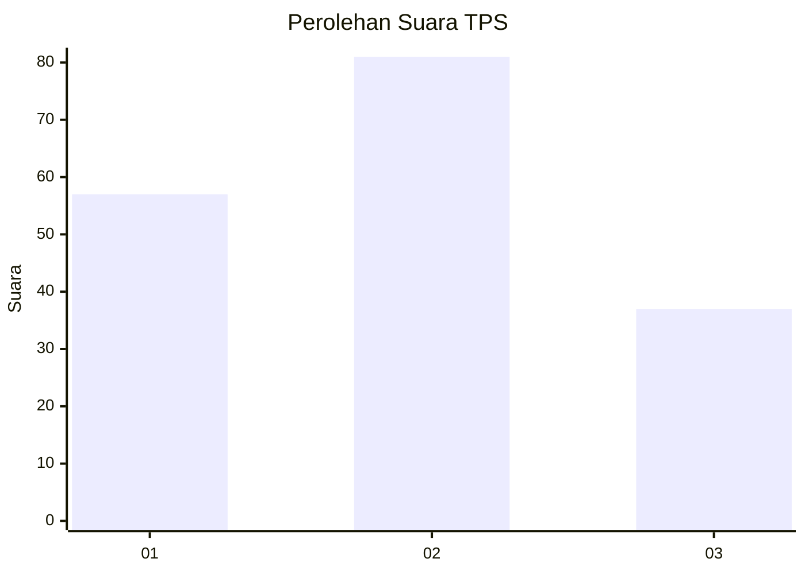
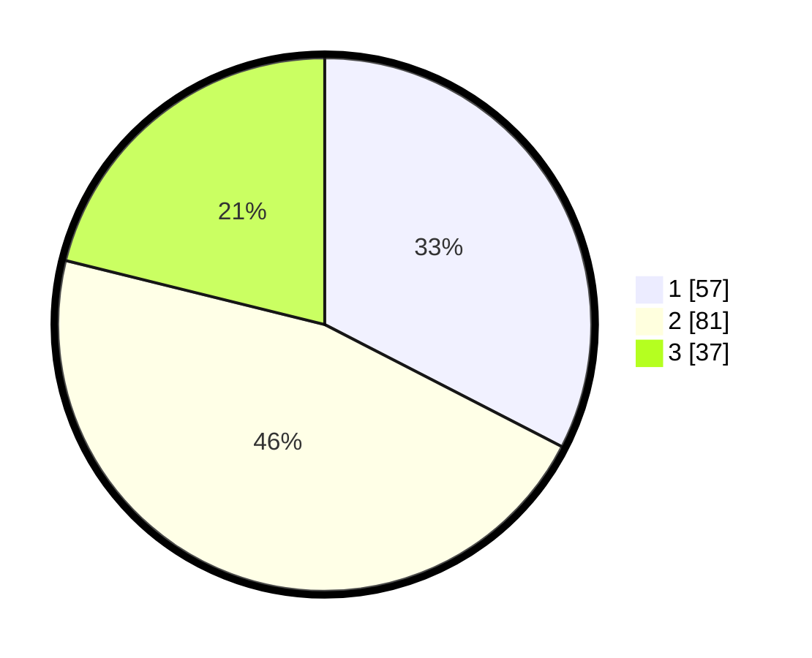

# Hasil

## Grafik

## Tabel

| No. | Nama Paslon    | Suara | Suara (raw) | Persentase |
|:--- |:-------------- | -----:| -----------:| ----------:|
| 1   | ANIES MUHAIMIN | 57    | [57][p-1]   | 32,57      |
| 2   | PRABOWO GIBRAN | 81    | [81][p-2]   | 46,29      |
| 3   | GANJAR MAHFUD  | 37    | [37][p-3]   | 21,14      |

[p-1]: https://github.com/gigit-pemilu/pemilu-2024-35-jawa-timur/blob/main/pilpres/hitung-suara/sub/35-jawa-timur/sub/03-trenggalek/sub/08-watulimo/sub/2003-dukuh/sub/008-tps/sub/paslon-1.txt
[p-2]: https://github.com/gigit-pemilu/pemilu-2024-35-jawa-timur/blob/main/pilpres/hitung-suara/sub/35-jawa-timur/sub/03-trenggalek/sub/08-watulimo/sub/2003-dukuh/sub/008-tps/sub/paslon-2.txt
[p-3]: https://github.com/gigit-pemilu/pemilu-2024-35-jawa-timur/blob/main/pilpres/hitung-suara/sub/35-jawa-timur/sub/03-trenggalek/sub/08-watulimo/sub/2003-dukuh/sub/008-tps/sub/paslon-3.txt

## Foto C Plano

https://sirekap-obj-formc.kpu.go.id/4908/pemilu/ppwp/35/03/08/20/03/3503082003008-20240219-104835--2b65c0a8-4c1a-4fbc-bb5f-60a1b33f5138.jpg

https://sirekap-obj-formc.kpu.go.id/4908/pemilu/ppwp/35/03/08/20/03/3503082003008-20240219-104924--b554a9f9-e0d3-4e40-9301-9a01d6d43d53.jpg

https://sirekap-obj-formc.kpu.go.id/4908/pemilu/ppwp/35/03/08/20/03/3503082003008-20240219-105619--e659989d-99ea-4f2a-b658-18fde9f3147f.jpg

## Metadata

| Key        | Value               |
| ---------- | ------------------- |
| Time Stamp | 2024-02-24 22:31:28 |

