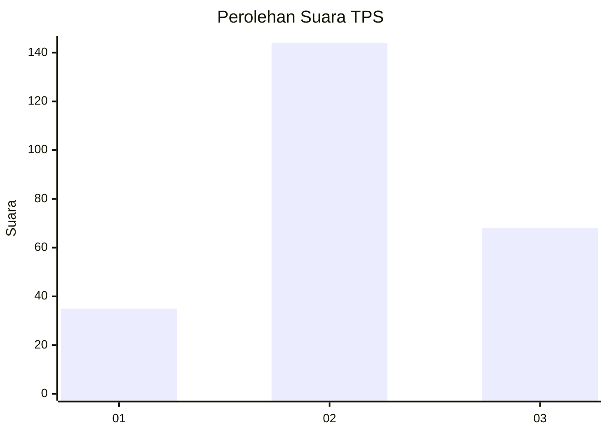
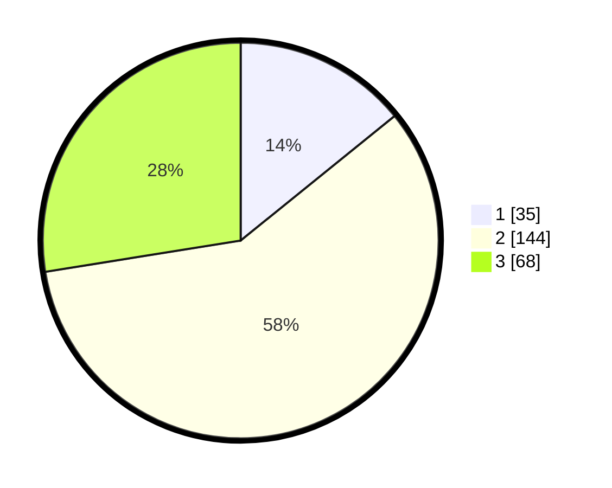

# Hasil

## Grafik

## Tabel

| No. | Nama Paslon    | Suara | Suara (raw) | Persentase |
|:--- |:-------------- | -----:| -----------:| ----------:|
| 1   | ANIES MUHAIMIN | 35    | [35][p-1]   | 14,17      |
| 2   | PRABOWO GIBRAN | 144   | [144][p-2]  | 58,30      |
| 3   | GANJAR MAHFUD  | 68    | [68][p-3]   | 27,53      |

[p-1]: https://github.com/gigit-pemilu/pemilu-2024-35-jawa-timur/blob/main/pilpres/hitung-suara/sub/35-jawa-timur/sub/03-trenggalek/sub/08-watulimo/sub/2003-dukuh/sub/011-tps/sub/paslon-1.txt
[p-2]: https://github.com/gigit-pemilu/pemilu-2024-35-jawa-timur/blob/main/pilpres/hitung-suara/sub/35-jawa-timur/sub/03-trenggalek/sub/08-watulimo/sub/2003-dukuh/sub/011-tps/sub/paslon-2.txt
[p-3]: https://github.com/gigit-pemilu/pemilu-2024-35-jawa-timur/blob/main/pilpres/hitung-suara/sub/35-jawa-timur/sub/03-trenggalek/sub/08-watulimo/sub/2003-dukuh/sub/011-tps/sub/paslon-3.txt

## Foto C Plano

https://sirekap-obj-formc.kpu.go.id/ef9c/pemilu/ppwp/35/03/08/20/03/3503082003011-20240219-110201--a1f76746-347d-495f-915e-5dd7435695cd.jpg

https://sirekap-obj-formc.kpu.go.id/ef9c/pemilu/ppwp/35/03/08/20/03/3503082003011-20240219-110243--cf937453-eecf-4325-a41b-a17d2de46443.jpg

https://sirekap-obj-formc.kpu.go.id/ef9c/pemilu/ppwp/35/03/08/20/03/3503082003011-20240219-110331--2563986a-ad32-4b1a-8afe-11f6d266db4d.jpg

## Metadata

| Key        | Value               |
| ---------- | ------------------- |
| Time Stamp | 2024-02-24 22:31:28 |

