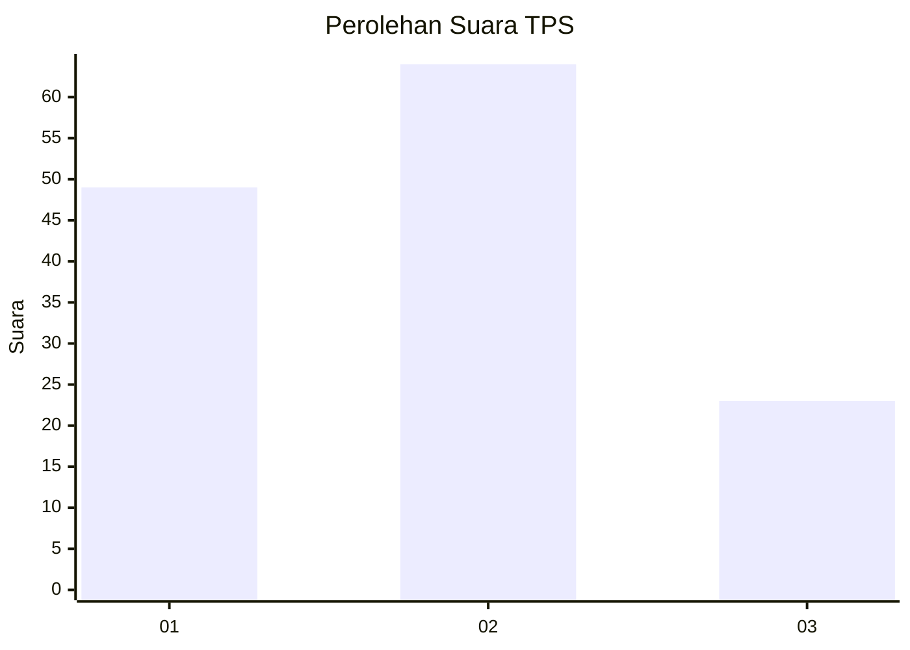
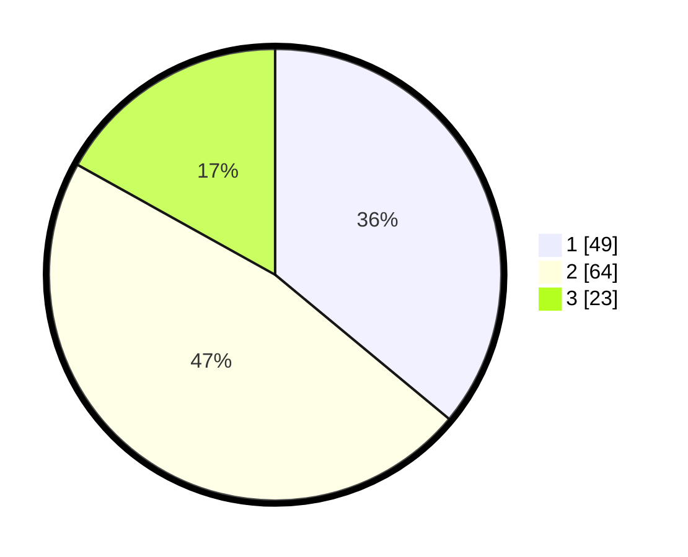

# Hasil

## Grafik

## Tabel

| No. | Nama Paslon    | Suara | Suara (raw) | Persentase |
|:--- |:-------------- | -----:| -----------:| ----------:|
| 1   | ANIES MUHAIMIN | 49    | [49][p-1]   | 36,03      |
| 2   | PRABOWO GIBRAN | 64    | [64][p-2]   | 47,06      |
| 3   | GANJAR MAHFUD  | 23    | [23][p-3]   | 16,91      |

[p-1]: https://github.com/gigit-pemilu/pemilu-2024-35-jawa-timur/blob/main/pilpres/hitung-suara/sub/35-jawa-timur/sub/03-trenggalek/sub/08-watulimo/sub/2005-margomulyo/sub/004-tps/sub/paslon-1.txt
[p-2]: https://github.com/gigit-pemilu/pemilu-2024-35-jawa-timur/blob/main/pilpres/hitung-suara/sub/35-jawa-timur/sub/03-trenggalek/sub/08-watulimo/sub/2005-margomulyo/sub/004-tps/sub/paslon-2.txt
[p-3]: https://github.com/gigit-pemilu/pemilu-2024-35-jawa-timur/blob/main/pilpres/hitung-suara/sub/35-jawa-timur/sub/03-trenggalek/sub/08-watulimo/sub/2005-margomulyo/sub/004-tps/sub/paslon-3.txt

## Foto C Plano

https://sirekap-obj-formc.kpu.go.id/a39a/pemilu/ppwp/35/03/08/20/05/3503082005004-20240214-221426--a5077a6a-0081-4b8f-a1a1-ecace4067100.jpg

https://sirekap-obj-formc.kpu.go.id/a39a/pemilu/ppwp/35/03/08/20/05/3503082005004-20240214-221611--b735a9b7-f546-4c6f-8134-d9e3fb3548b6.jpg

https://sirekap-obj-formc.kpu.go.id/a39a/pemilu/ppwp/35/03/08/20/05/3503082005004-20240214-221719--927f0ddf-6940-4184-a8b8-12b4d4b483e2.jpg

## Metadata

| Key        | Value               |
| ---------- | ------------------- |
| Time Stamp | 2024-02-16 21:01:00 |

