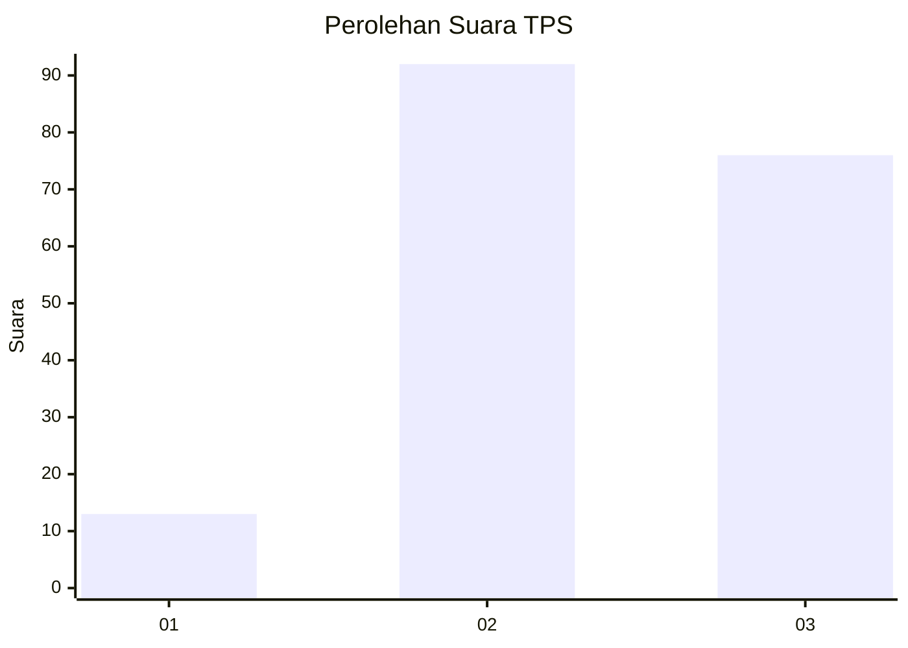
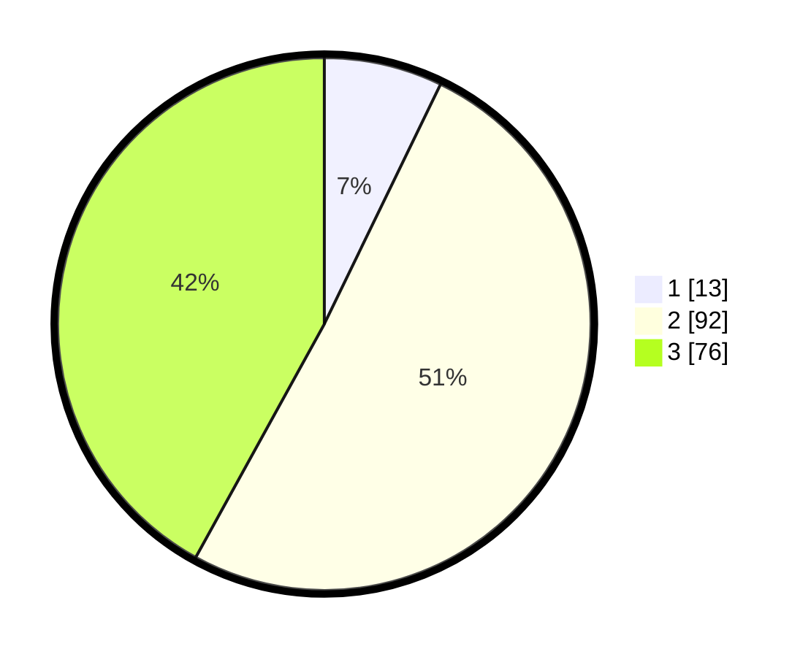

# Hasil

## Grafik

## Tabel

| No. | Nama Paslon    | Suara | Suara (raw) | Persentase |
|:--- |:-------------- | -----:| -----------:| ----------:|
| 1   | ANIES MUHAIMIN | 13    | [13][p-1]   | 7,18       |
| 2   | PRABOWO GIBRAN | 92    | [92][p-2]   | 50,83      |
| 3   | GANJAR MAHFUD  | 76    | [76][p-3]   | 41,99      |

[p-1]: https://github.com/gigit-pemilu/pemilu-2024-35-jawa-timur/blob/main/pilpres/hitung-suara/sub/35-jawa-timur/sub/03-trenggalek/sub/08-watulimo/sub/2006-ngembel/sub/005-tps/sub/paslon-1.txt
[p-2]: https://github.com/gigit-pemilu/pemilu-2024-35-jawa-timur/blob/main/pilpres/hitung-suara/sub/35-jawa-timur/sub/03-trenggalek/sub/08-watulimo/sub/2006-ngembel/sub/005-tps/sub/paslon-2.txt
[p-3]: https://github.com/gigit-pemilu/pemilu-2024-35-jawa-timur/blob/main/pilpres/hitung-suara/sub/35-jawa-timur/sub/03-trenggalek/sub/08-watulimo/sub/2006-ngembel/sub/005-tps/sub/paslon-3.txt

## Foto C Plano

https://sirekap-obj-formc.kpu.go.id/d9ac/pemilu/ppwp/35/03/08/20/06/3503082006005-20240215-181300--fc0ab5ba-1260-4b03-a6c2-fba6eb00ea25.jpg

https://sirekap-obj-formc.kpu.go.id/d9ac/pemilu/ppwp/35/03/08/20/06/3503082006005-20240215-220930--0e99e2e3-7a27-4215-8744-84f9d9c11bc4.jpg

https://sirekap-obj-formc.kpu.go.id/d9ac/pemilu/ppwp/35/03/08/20/06/3503082006005-20240215-182939--e08d5ffb-542d-4ef9-bfd0-708a86db069e.jpg

## Metadata

| Key        | Value               |
| ---------- | ------------------- |
| Time Stamp | 2024-02-16 00:00:26 |

