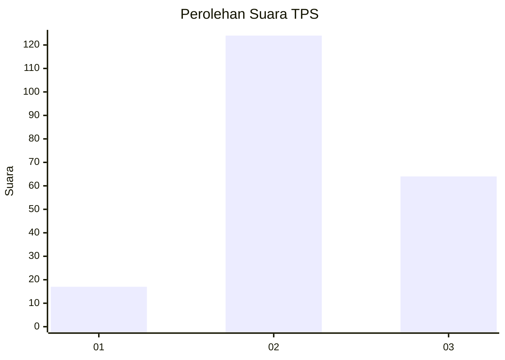
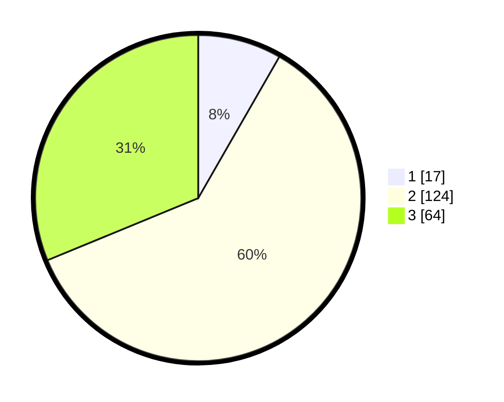

# Hasil

## Grafik

## Tabel

| No. | Nama Paslon    | Suara | Suara (raw) | Persentase |
|:--- |:-------------- | -----:| -----------:| ----------:|
| 1   | ANIES MUHAIMIN | 17    | [17][p-1]   | 8,29       |
| 2   | PRABOWO GIBRAN | 124   | [124][p-2]  | 60,49      |
| 3   | GANJAR MAHFUD  | 64    | [64][p-3]   | 31,22      |

[p-1]: https://github.com/gigit-pemilu/pemilu-2024/blob/main/pilpres/hitung-suara/sub/35-jawa-timur/sub/03-trenggalek/sub/08-watulimo/sub/2007-slawe/sub/003-tps/sub/paslon-1.txt
[p-2]: https://github.com/gigit-pemilu/pemilu-2024/blob/main/pilpres/hitung-suara/sub/35-jawa-timur/sub/03-trenggalek/sub/08-watulimo/sub/2007-slawe/sub/003-tps/sub/paslon-2.txt
[p-3]: https://github.com/gigit-pemilu/pemilu-2024/blob/main/pilpres/hitung-suara/sub/35-jawa-timur/sub/03-trenggalek/sub/08-watulimo/sub/2007-slawe/sub/003-tps/sub/paslon-3.txt

## Foto C Plano

https://sirekap-obj-formc.kpu.go.id/c744/pemilu/ppwp/35/03/08/20/07/3503082007003-20240216-172154--c71531a1-2c08-41c3-91a7-282073f86102.jpg

https://sirekap-obj-formc.kpu.go.id/c744/pemilu/ppwp/35/03/08/20/07/3503082007003-20240216-172318--d41c45d8-519f-4cda-b970-6d228b440b23.jpg

https://sirekap-obj-formc.kpu.go.id/c744/pemilu/ppwp/35/03/08/20/07/3503082007003-20240216-221747--68ee4cf4-07c4-4c49-9163-1b2804f1b36a.jpg

## Metadata

| Key        | Value               |
| ---------- | ------------------- |
| Time Stamp | 2024-02-24 22:31:28 |

