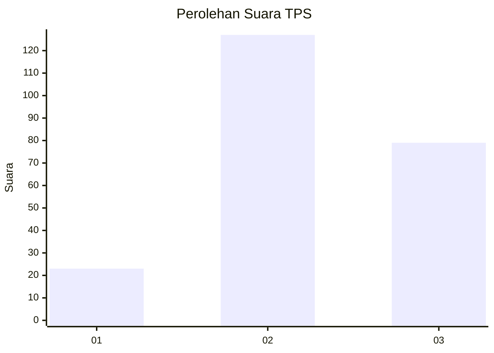
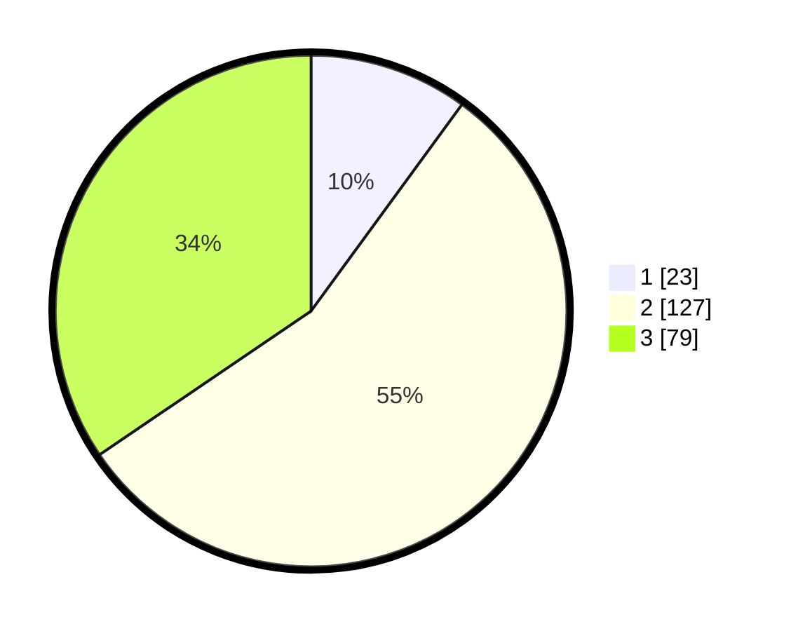

# Hasil

## Grafik

## Tabel

| No. | Nama Paslon    | Suara | Suara (raw) | Persentase |
|:--- |:-------------- | -----:| -----------:| ----------:|
| 1   | ANIES MUHAIMIN | 23    | [23][p-1]   | 10,04      |
| 2   | PRABOWO GIBRAN | 127   | [127][p-2]  | 55,46      |
| 3   | GANJAR MAHFUD  | 79    | [79][p-3]   | 34,50      |

[p-1]: https://github.com/gigit-pemilu/pemilu-2024-35-jawa-timur/blob/main/pilpres/hitung-suara/sub/35-jawa-timur/sub/03-trenggalek/sub/08-watulimo/sub/2007-slawe/sub/008-tps/sub/paslon-1.txt
[p-2]: https://github.com/gigit-pemilu/pemilu-2024-35-jawa-timur/blob/main/pilpres/hitung-suara/sub/35-jawa-timur/sub/03-trenggalek/sub/08-watulimo/sub/2007-slawe/sub/008-tps/sub/paslon-2.txt
[p-3]: https://github.com/gigit-pemilu/pemilu-2024-35-jawa-timur/blob/main/pilpres/hitung-suara/sub/35-jawa-timur/sub/03-trenggalek/sub/08-watulimo/sub/2007-slawe/sub/008-tps/sub/paslon-3.txt

## Foto C Plano

https://sirekap-obj-formc.kpu.go.id/0ce9/pemilu/ppwp/35/03/08/20/07/3503082007008-20240215-055437--c797dd4d-38c8-420a-b81a-656fea7d449e.jpg

https://sirekap-obj-formc.kpu.go.id/0ce9/pemilu/ppwp/35/03/08/20/07/3503082007008-20240215-195237--394fca0c-aa2f-47df-9458-a6623aebd47f.jpg

https://sirekap-obj-formc.kpu.go.id/0ce9/pemilu/ppwp/35/03/08/20/07/3503082007008-20240214-235610--6d7c2d56-8f7d-41aa-8a08-6dd37b68f093.jpg

## Metadata

| Key        | Value               |
| ---------- | ------------------- |
| Time Stamp | 2024-02-25 21:00:00 |

