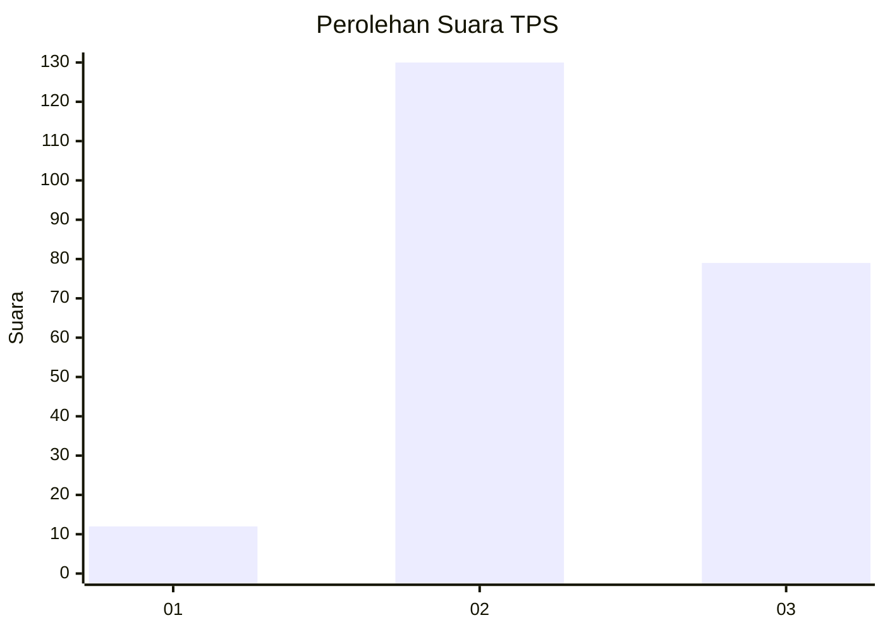
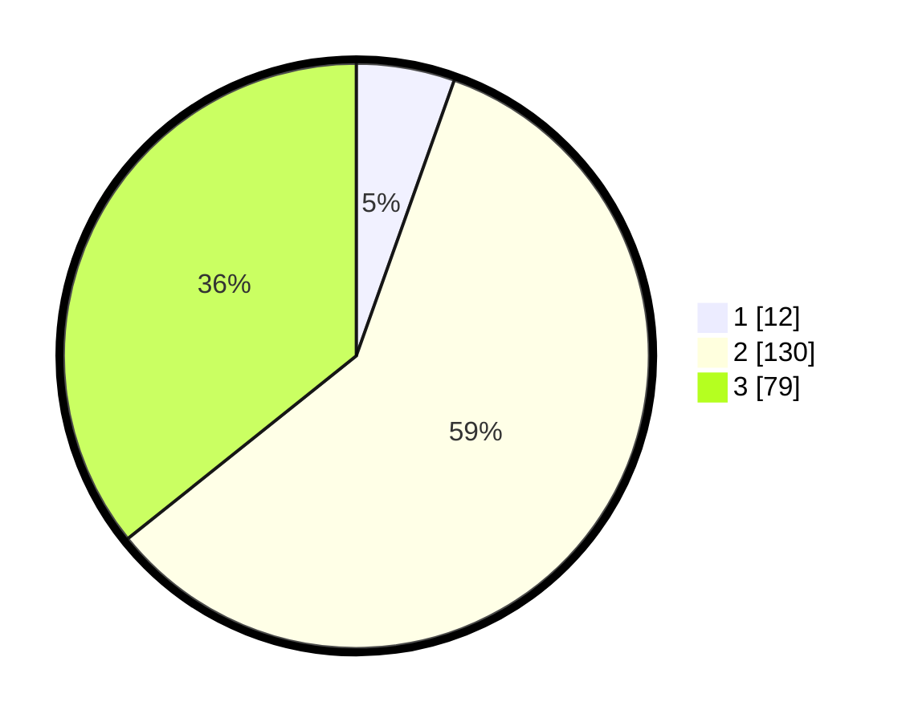

# Hasil

## Grafik

## Tabel

| No. | Nama Paslon    | Suara | Suara (raw) | Persentase |
|:--- |:-------------- | -----:| -----------:| ----------:|
| 1   | ANIES MUHAIMIN | 12    | [12][p-1]   | 5,43       |
| 2   | PRABOWO GIBRAN | 130   | [130][p-2]  | 58,82      |
| 3   | GANJAR MAHFUD  | 79    | [79][p-3]   | 35,75      |

[p-1]: https://github.com/gigit-pemilu/pemilu-2024/blob/main/pilpres/hitung-suara/sub/35-jawa-timur/sub/03-trenggalek/sub/08-watulimo/sub/2009-watulimo/sub/001-tps/sub/paslon-1.txt
[p-2]: https://github.com/gigit-pemilu/pemilu-2024/blob/main/pilpres/hitung-suara/sub/35-jawa-timur/sub/03-trenggalek/sub/08-watulimo/sub/2009-watulimo/sub/001-tps/sub/paslon-2.txt
[p-3]: https://github.com/gigit-pemilu/pemilu-2024/blob/main/pilpres/hitung-suara/sub/35-jawa-timur/sub/03-trenggalek/sub/08-watulimo/sub/2009-watulimo/sub/001-tps/sub/paslon-3.txt

## Foto C Plano

https://sirekap-obj-formc.kpu.go.id/9d0b/pemilu/ppwp/35/03/08/20/09/3503082009001-20240215-004953--d1c59f06-0045-4111-a0f0-849d0e24b7cc.jpg

https://sirekap-obj-formc.kpu.go.id/9d0b/pemilu/ppwp/35/03/08/20/09/3503082009001-20240215-005343--0f52ac30-3611-4042-a365-e3c145879c22.jpg

https://sirekap-obj-formc.kpu.go.id/9d0b/pemilu/ppwp/35/03/08/20/09/3503082009001-20240215-010042--e4b9e281-d957-426c-adc3-0b969e7d7dd5.jpg

## Metadata

| Key        | Value               |
| ---------- | ------------------- |
| Time Stamp | 2024-02-16 21:01:00 |

