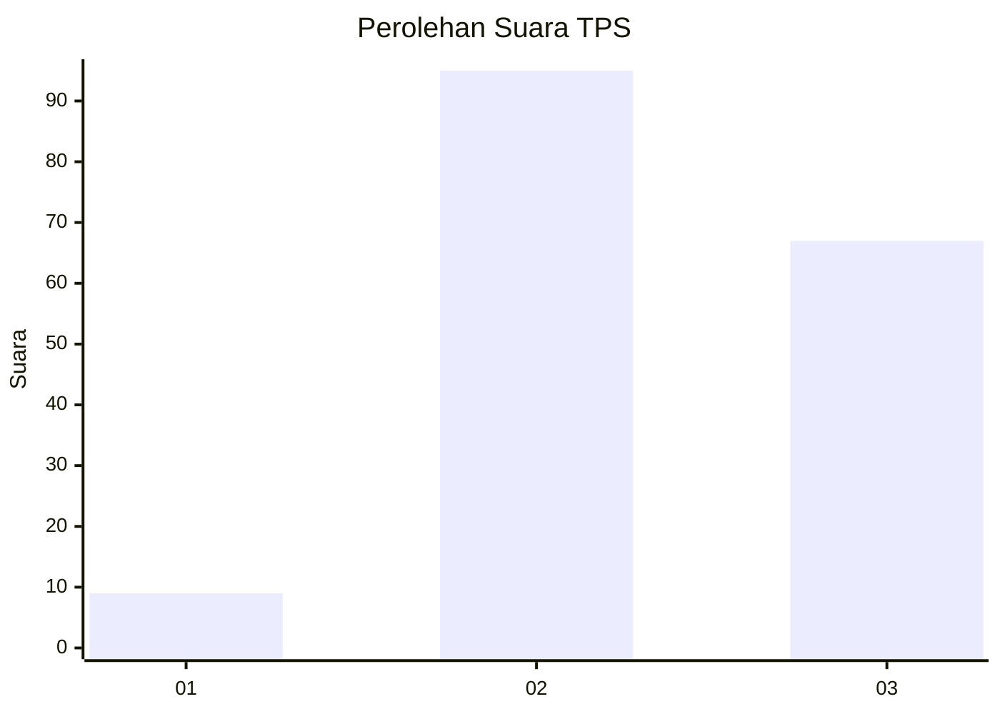
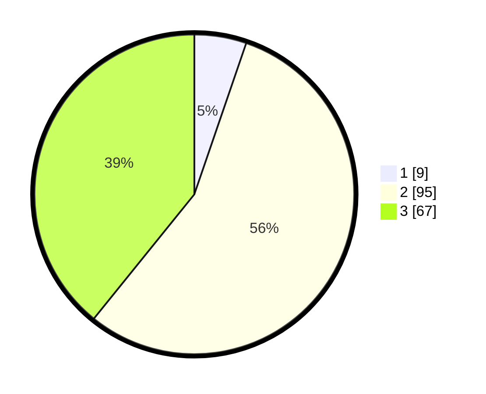

# Hasil

## Grafik

## Tabel

| No. | Nama Paslon    | Suara | Suara (raw) | Persentase |
|:--- |:-------------- | -----:| -----------:| ----------:|
| 1   | ANIES MUHAIMIN | 9     | [9][p-1]    | 5,26       |
| 2   | PRABOWO GIBRAN | 95    | [95][p-2]   | 55,56      |
| 3   | GANJAR MAHFUD  | 67    | [67][p-3]   | 39,18      |

[p-1]: https://github.com/gigit-pemilu/pemilu-2024-35-jawa-timur/blob/main/pilpres/hitung-suara/sub/35-jawa-timur/sub/03-trenggalek/sub/08-watulimo/sub/2010-watuagung/sub/004-tps/sub/paslon-1.txt
[p-2]: https://github.com/gigit-pemilu/pemilu-2024-35-jawa-timur/blob/main/pilpres/hitung-suara/sub/35-jawa-timur/sub/03-trenggalek/sub/08-watulimo/sub/2010-watuagung/sub/004-tps/sub/paslon-2.txt
[p-3]: https://github.com/gigit-pemilu/pemilu-2024-35-jawa-timur/blob/main/pilpres/hitung-suara/sub/35-jawa-timur/sub/03-trenggalek/sub/08-watulimo/sub/2010-watuagung/sub/004-tps/sub/paslon-3.txt

## Foto C Plano

https://sirekap-obj-formc.kpu.go.id/acf6/pemilu/ppwp/35/03/08/20/10/3503082010004-20240217-072104--e8b4d552-039d-45d5-ac4b-450c776ffee5.jpg

https://sirekap-obj-formc.kpu.go.id/acf6/pemilu/ppwp/35/03/08/20/10/3503082010004-20240217-072217--5978e8f3-c640-4174-87aa-0ba62204e00a.jpg

https://sirekap-obj-formc.kpu.go.id/acf6/pemilu/ppwp/35/03/08/20/10/3503082010004-20240217-072645--2d3a9440-a96d-4fee-8798-fa4fc643a08e.jpg

## Metadata

| Key        | Value               |
| ---------- | ------------------- |
| Time Stamp | 2024-02-25 16:00:00 |

