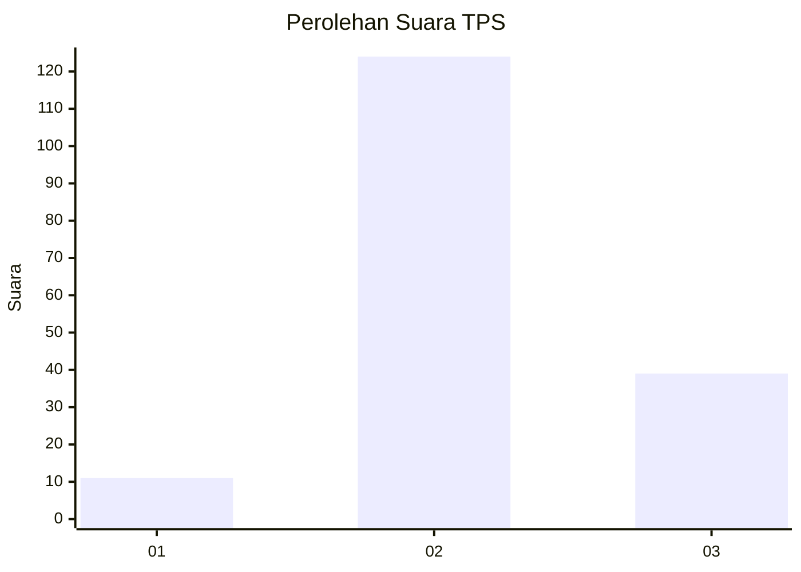
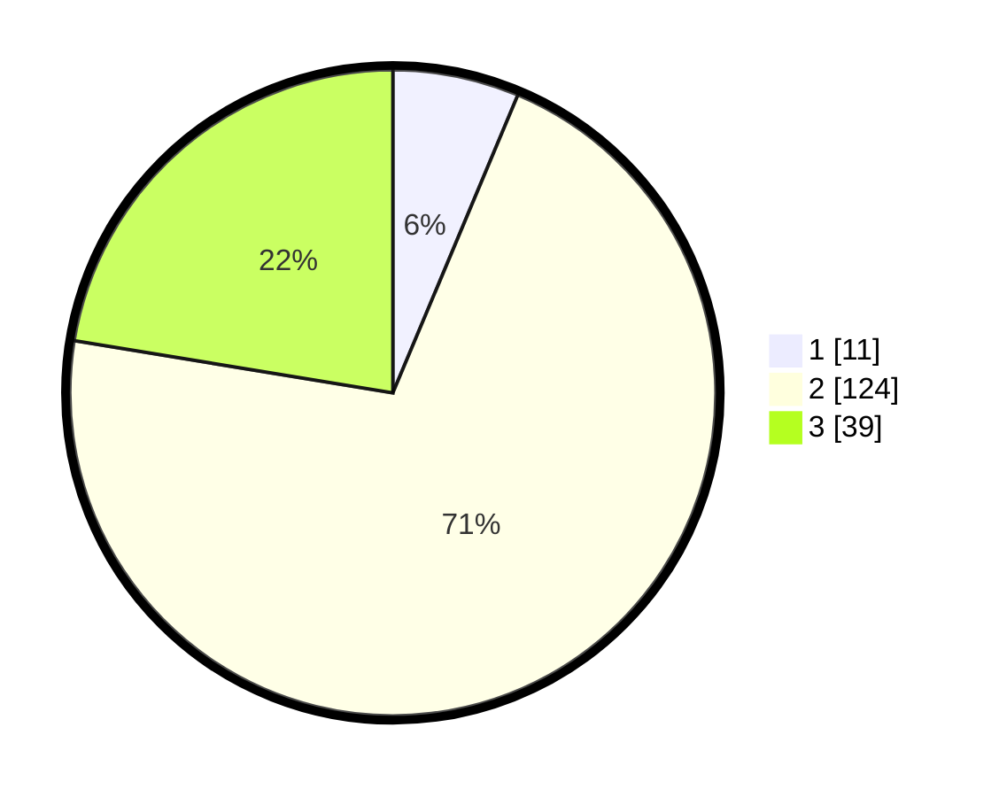

# Hasil

## Grafik

## Tabel

| No. | Nama Paslon    | Suara | Suara (raw) | Persentase |
|:--- |:-------------- | -----:| -----------:| ----------:|
| 1   | ANIES MUHAIMIN | 11    | [11][p-1]   | 6,32       |
| 2   | PRABOWO GIBRAN | 124   | [124][p-2]  | 71,26      |
| 3   | GANJAR MAHFUD  | 39    | [39][p-3]   | 22,41      |

[p-1]: https://github.com/gigit-pemilu/pemilu-2024-35-jawa-timur/blob/main/pilpres/hitung-suara/sub/35-jawa-timur/sub/03-trenggalek/sub/08-watulimo/sub/2011-prigi/sub/009-tps/sub/paslon-1.txt
[p-2]: https://github.com/gigit-pemilu/pemilu-2024-35-jawa-timur/blob/main/pilpres/hitung-suara/sub/35-jawa-timur/sub/03-trenggalek/sub/08-watulimo/sub/2011-prigi/sub/009-tps/sub/paslon-2.txt
[p-3]: https://github.com/gigit-pemilu/pemilu-2024-35-jawa-timur/blob/main/pilpres/hitung-suara/sub/35-jawa-timur/sub/03-trenggalek/sub/08-watulimo/sub/2011-prigi/sub/009-tps/sub/paslon-3.txt

## Foto C Plano

https://sirekap-obj-formc.kpu.go.id/b84d/pemilu/ppwp/35/03/08/20/11/3503082011009-20240216-192029--d6972442-b166-458b-8fa5-c5b6368757b3.jpg

https://sirekap-obj-formc.kpu.go.id/b84d/pemilu/ppwp/35/03/08/20/11/3503082011009-20240214-215251--23948b2d-fa72-44c8-a7d9-8b5aa4742d69.jpg

https://sirekap-obj-formc.kpu.go.id/b84d/pemilu/ppwp/35/03/08/20/11/3503082011009-20240214-215509--6e18a842-8957-42eb-bde3-c45ef22d989c.jpg

## Metadata

| Key        | Value               |
| ---------- | ------------------- |
| Time Stamp | 2024-02-25 17:00:00 |

