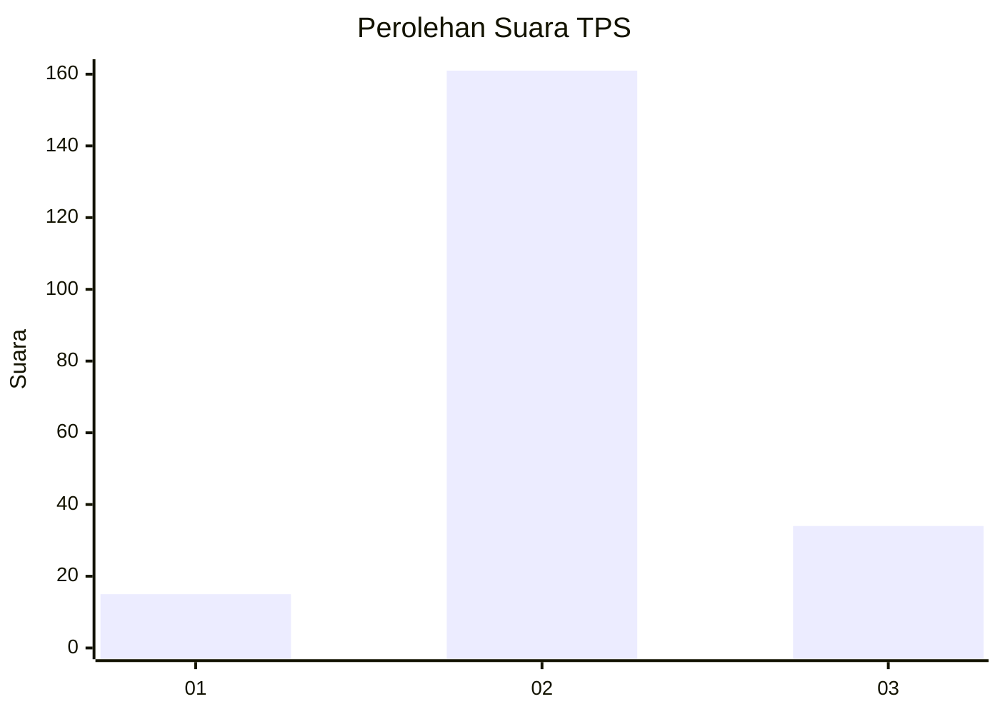
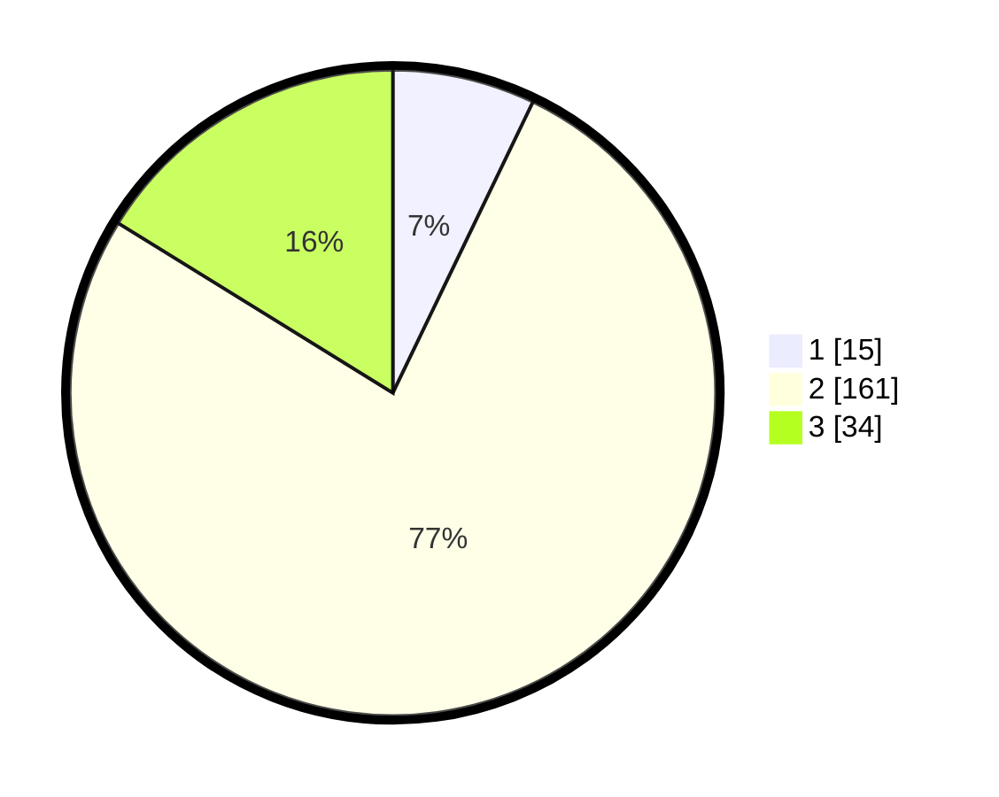

# Hasil

## Grafik

## Tabel

| No. | Nama Paslon    | Suara | Suara (raw) | Persentase |
|:--- |:-------------- | -----:| -----------:| ----------:|
| 1   | ANIES MUHAIMIN | 15    | [15][p-1]   | 7,14       |
| 2   | PRABOWO GIBRAN | 161   | [161][p-2]  | 76,67      |
| 3   | GANJAR MAHFUD  | 34    | [34][p-3]   | 16,19      |

[p-1]: https://github.com/gigit-pemilu/pemilu-2024-35-jawa-timur/blob/main/pilpres/hitung-suara/sub/35-jawa-timur/sub/03-trenggalek/sub/08-watulimo/sub/2012-tasikmadu/sub/021-tps/sub/paslon-1.txt
[p-2]: https://github.com/gigit-pemilu/pemilu-2024-35-jawa-timur/blob/main/pilpres/hitung-suara/sub/35-jawa-timur/sub/03-trenggalek/sub/08-watulimo/sub/2012-tasikmadu/sub/021-tps/sub/paslon-2.txt
[p-3]: https://github.com/gigit-pemilu/pemilu-2024-35-jawa-timur/blob/main/pilpres/hitung-suara/sub/35-jawa-timur/sub/03-trenggalek/sub/08-watulimo/sub/2012-tasikmadu/sub/021-tps/sub/paslon-3.txt

## Foto C Plano

https://sirekap-obj-formc.kpu.go.id/8645/pemilu/ppwp/35/03/08/20/12/3503082012021-20240217-132753--236368cf-d678-493c-ac06-2ffd79f8d104.jpg

https://sirekap-obj-formc.kpu.go.id/8645/pemilu/ppwp/35/03/08/20/12/3503082012021-20240217-132838--572d3b1b-2bb7-4789-9b29-aa696e26e84c.jpg

https://sirekap-obj-formc.kpu.go.id/8645/pemilu/ppwp/35/03/08/20/12/3503082012021-20240217-132921--7d7e18b8-5fc8-487b-ab21-86bb7430a08a.jpg

## Metadata

| Key        | Value               |
| ---------- | ------------------- |
| Time Stamp | 2024-02-25 21:00:00 |

