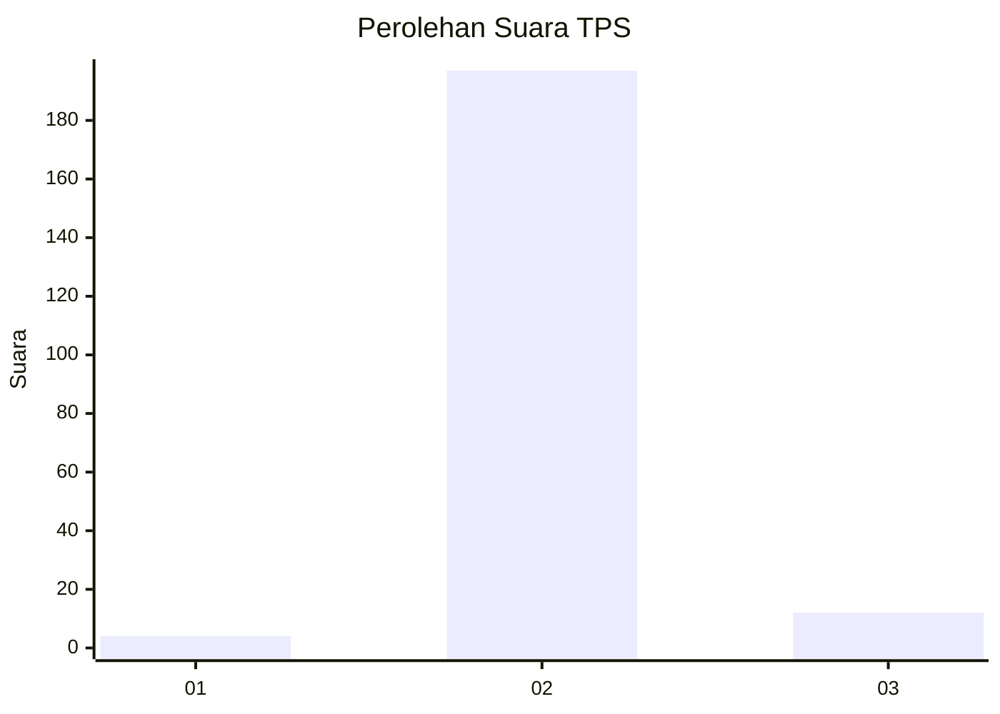
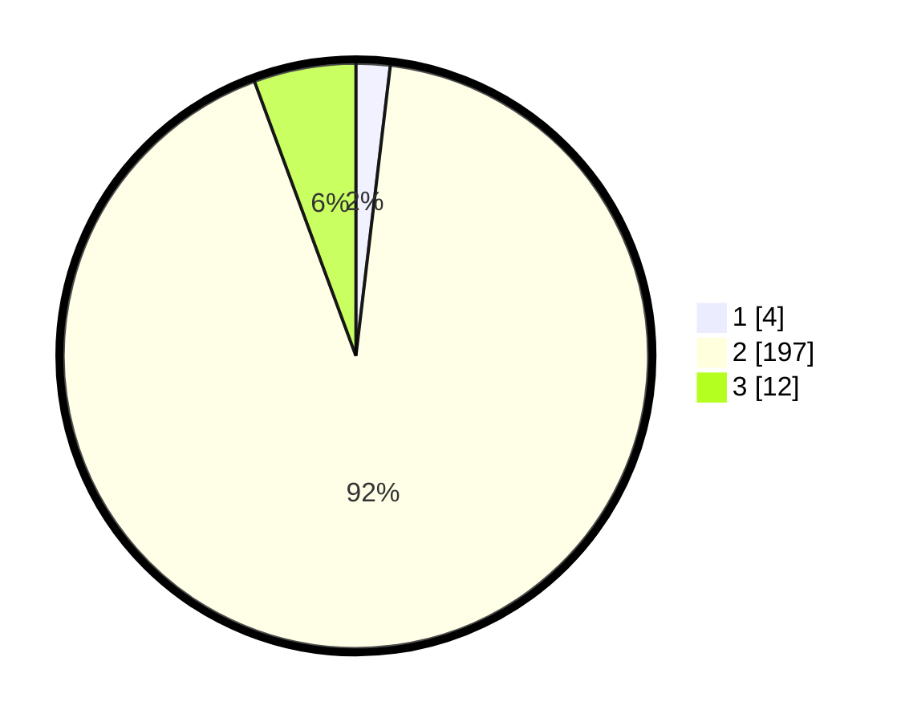

# Hasil

## Grafik

## Tabel

| No. | Nama Paslon    | Suara | Suara (raw) | Persentase |
|:--- |:-------------- | -----:| -----------:| ----------:|
| 1   | ANIES MUHAIMIN | 4     | [4][p-1]    | 1,88       |
| 2   | PRABOWO GIBRAN | 197   | [197][p-2]  | 92,49      |
| 3   | GANJAR MAHFUD  | 12    | [12][p-3]   | 5,63       |

[p-1]: https://github.com/gigit-pemilu/pemilu-2024/blob/main/pilpres/hitung-suara/sub/35-jawa-timur/sub/03-trenggalek/sub/09-bendungan/sub/2001-masaran/sub/002-tps/sub/paslon-1.txt
[p-2]: https://github.com/gigit-pemilu/pemilu-2024/blob/main/pilpres/hitung-suara/sub/35-jawa-timur/sub/03-trenggalek/sub/09-bendungan/sub/2001-masaran/sub/002-tps/sub/paslon-2.txt
[p-3]: https://github.com/gigit-pemilu/pemilu-2024/blob/main/pilpres/hitung-suara/sub/35-jawa-timur/sub/03-trenggalek/sub/09-bendungan/sub/2001-masaran/sub/002-tps/sub/paslon-3.txt

## Foto C Plano

https://sirekap-obj-formc.kpu.go.id/3ffe/pemilu/ppwp/35/03/09/20/01/3503092001002-20240218-100113--234ed2de-8b14-40cb-aeae-624519d0a31f.jpg

https://sirekap-obj-formc.kpu.go.id/3ffe/pemilu/ppwp/35/03/09/20/01/3503092001002-20240218-095314--5aeadae9-843c-4ab2-bbc7-7ba9e1a500ce.jpg

https://sirekap-obj-formc.kpu.go.id/3ffe/pemilu/ppwp/35/03/09/20/01/3503092001002-20240218-100327--3c98296a-1166-46a5-999d-390c86d03295.jpg

## Metadata

| Key        | Value               |
| ---------- | ------------------- |
| Time Stamp | 2024-02-24 22:31:28 |

