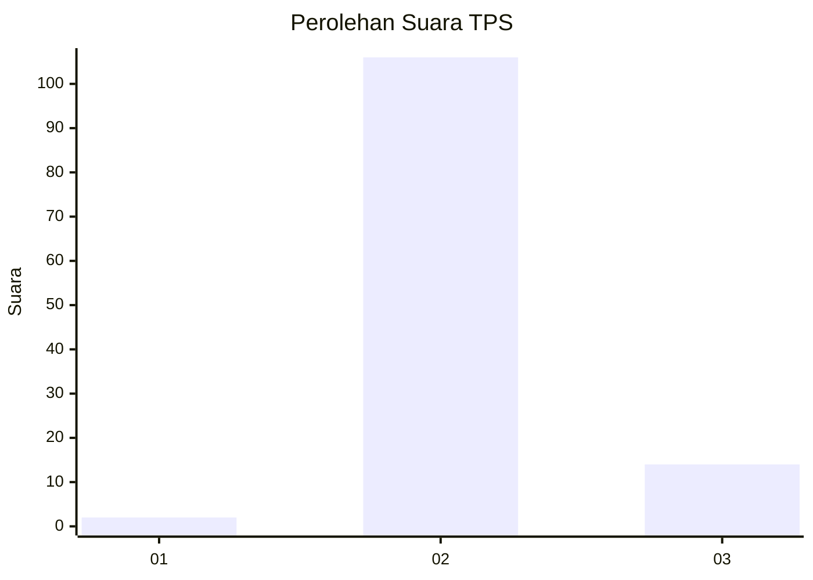
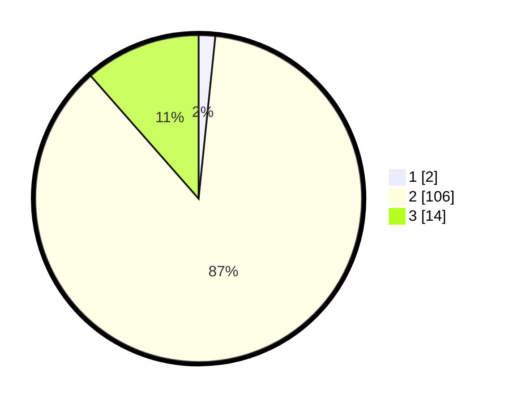

# Hasil

## Grafik

## Tabel

| No. | Nama Paslon    | Suara | Suara (raw) | Persentase |
|:--- |:-------------- | -----:| -----------:| ----------:|
| 1   | ANIES MUHAIMIN | 2     | [2][p-1]    | 1,64       |
| 2   | PRABOWO GIBRAN | 106   | [106][p-2]  | 86,89      |
| 3   | GANJAR MAHFUD  | 14    | [14][p-3]   | 11,48      |

[p-1]: https://github.com/gigit-pemilu/pemilu-2024-35-jawa-timur/blob/main/pilpres/hitung-suara/sub/35-jawa-timur/sub/03-trenggalek/sub/09-bendungan/sub/2001-masaran/sub/003-tps/sub/paslon-1.txt
[p-2]: https://github.com/gigit-pemilu/pemilu-2024-35-jawa-timur/blob/main/pilpres/hitung-suara/sub/35-jawa-timur/sub/03-trenggalek/sub/09-bendungan/sub/2001-masaran/sub/003-tps/sub/paslon-2.txt
[p-3]: https://github.com/gigit-pemilu/pemilu-2024-35-jawa-timur/blob/main/pilpres/hitung-suara/sub/35-jawa-timur/sub/03-trenggalek/sub/09-bendungan/sub/2001-masaran/sub/003-tps/sub/paslon-3.txt

## Foto C Plano

https://sirekap-obj-formc.kpu.go.id/34fc/pemilu/ppwp/35/03/09/20/01/3503092001003-20240218-111927--c5325c6c-2c57-4e2c-9ed8-34a828a5707b.jpg

https://sirekap-obj-formc.kpu.go.id/34fc/pemilu/ppwp/35/03/09/20/01/3503092001003-20240218-112659--36f9b4ec-d9e2-4759-bb87-e9d69743b13b.jpg

https://sirekap-obj-formc.kpu.go.id/34fc/pemilu/ppwp/35/03/09/20/01/3503092001003-20240218-115242--94739944-7251-4e7a-8ecd-9951aaf764df.jpg

## Metadata

| Key        | Value               |
| ---------- | ------------------- |
| Time Stamp | 2024-02-21 18:00:00 |

## DATA PEMILIH TETAP

Jumlah pemilih dalam DPT: **169**.
 * L: **85**.
 * P: **84**.

## DATA PENGGUNA HAK PILIH

Jumlah pengguna hak pilih dalam DPT: **138**.
 * L: **66**.
 * P: **72**.

Jumlah pengguna hak pilih dalam DPTb: **0**.
 * L: **0**.
 * P: **0**.

Jumlah pengguna hak pilih dalam DPK: **2**.
 * L: **0**.
 * P: **2**.

Jumlah pengguna hak pilih: **140**.
 * L: **66**.
 * P: **74**.

## JUMLAH SUARA SAH DAN TIDAK SAH

JUMLAH SELURUH SUARA SAH: **122**.

JUMLAH SUARA TIDAK SAH: **18**.

JUMLAH SELURUH SUARA SAH DAN SUARA TIDAK SAH: **140**.

