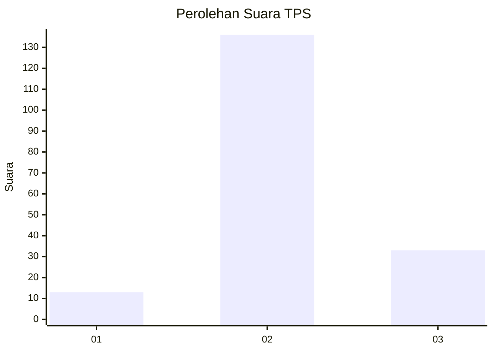

# Hasil

## Grafik

## Tabel

| No. | Nama Paslon    | Suara | Suara (raw) | Persentase |
|:--- |:-------------- | -----:| -----------:| ----------:|
| 1   | ANIES MUHAIMIN | 13    | [13][p-1]   | 7,14       |
| 2   | PRABOWO GIBRAN | 136   | [136][p-2]  | 74,73      |
| 3   | GANJAR MAHFUD  | 33    | [33][p-3]   | 18,13      |

[p-1]: https://github.com/gigit-pemilu/pemilu-2024-35-jawa-timur/blob/main/pilpres/hitung-suara/sub/35-jawa-timur/sub/03-trenggalek/sub/09-bendungan/sub/2001-masaran/sub/006-tps/sub/paslon-1.txt
[p-2]: https://github.com/gigit-pemilu/pemilu-2024-35-jawa-timur/blob/main/pilpres/hitung-suara/sub/35-jawa-timur/sub/03-trenggalek/sub/09-bendungan/sub/2001-masaran/sub/006-tps/sub/paslon-2.txt
[p-3]: https://github.com/gigit-pemilu/pemilu-2024-35-jawa-timur/blob/main/pilpres/hitung-suara/sub/35-jawa-timur/sub/03-trenggalek/sub/09-bendungan/sub/2001-masaran/sub/006-tps/sub/paslon-3.txt

## Foto C Plano

https://sirekap-obj-formc.kpu.go.id/83af/pemilu/ppwp/35/03/09/20/01/3503092001006-20240215-133528--fd3b0b19-bc34-418a-bd83-b37f31a7e64a.jpg

https://sirekap-obj-formc.kpu.go.id/83af/pemilu/ppwp/35/03/09/20/01/3503092001006-20240215-133703--99afc8eb-3cb1-452f-8a8e-fcabdfdc3832.jpg

https://sirekap-obj-formc.kpu.go.id/83af/pemilu/ppwp/35/03/09/20/01/3503092001006-20240215-133822--88cbf516-11c3-4f59-bb67-75ce4265bf42.jpg

## Metadata

| Key        | Value               |
| ---------- | ------------------- |
| Time Stamp | 2024-02-16 12:51:22 |

