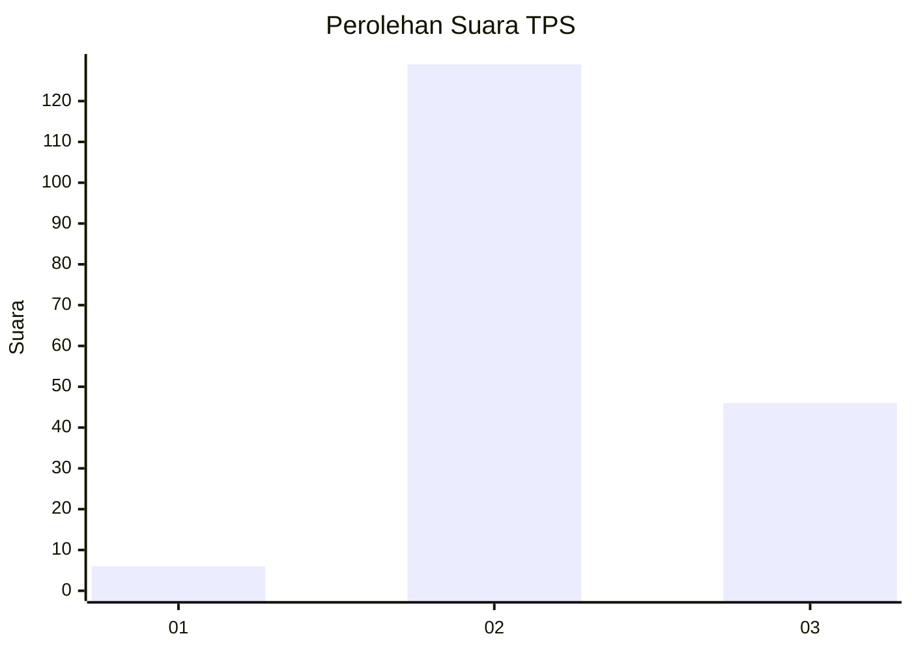
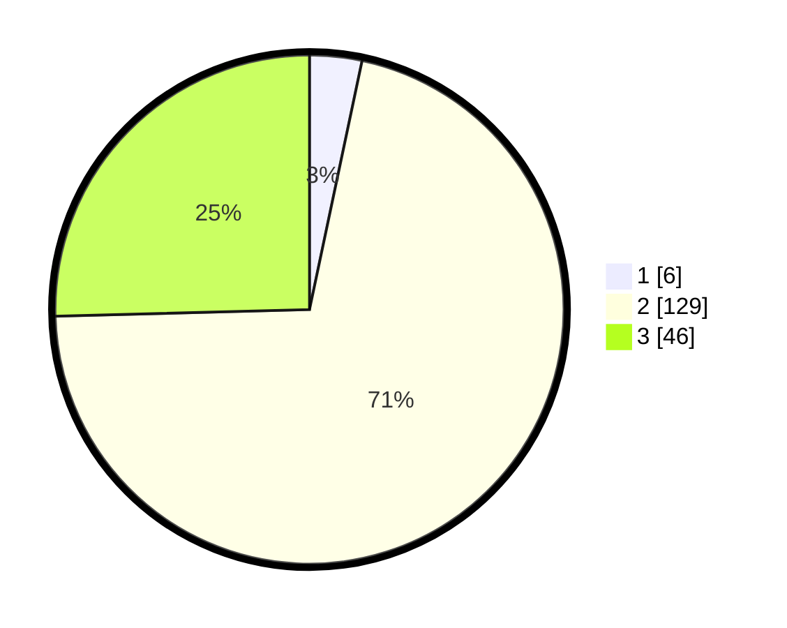

# Hasil

## Grafik

## Tabel

| No. | Nama Paslon    | Suara | Suara (raw) | Persentase |
|:--- |:-------------- | -----:| -----------:| ----------:|
| 1   | ANIES MUHAIMIN | 6     | [6][p-1]    | 3,31       |
| 2   | PRABOWO GIBRAN | 129   | [129][p-2]  | 71,27      |
| 3   | GANJAR MAHFUD  | 46    | [46][p-3]   | 25,41      |

[p-1]: https://github.com/gigit-pemilu/pemilu-2024-35-jawa-timur/blob/main/pilpres/hitung-suara/sub/35-jawa-timur/sub/03-trenggalek/sub/09-bendungan/sub/2001-masaran/sub/007-tps/sub/paslon-1.txt
[p-2]: https://github.com/gigit-pemilu/pemilu-2024-35-jawa-timur/blob/main/pilpres/hitung-suara/sub/35-jawa-timur/sub/03-trenggalek/sub/09-bendungan/sub/2001-masaran/sub/007-tps/sub/paslon-2.txt
[p-3]: https://github.com/gigit-pemilu/pemilu-2024-35-jawa-timur/blob/main/pilpres/hitung-suara/sub/35-jawa-timur/sub/03-trenggalek/sub/09-bendungan/sub/2001-masaran/sub/007-tps/sub/paslon-3.txt

## Foto C Plano

https://sirekap-obj-formc.kpu.go.id/91b7/pemilu/ppwp/35/03/09/20/01/3503092001007-20240214-192610--70bc2c6e-f639-43a5-ad1a-4be26bf35286.jpg

https://sirekap-obj-formc.kpu.go.id/91b7/pemilu/ppwp/35/03/09/20/01/3503092001007-20240214-192620--9cef9e91-3119-4844-ad93-cbaa03ab26e5.jpg

https://sirekap-obj-formc.kpu.go.id/91b7/pemilu/ppwp/35/03/09/20/01/3503092001007-20240217-172927--d3ccb6cf-f708-49ab-9aac-bbdcf76327b9.jpg

## Metadata

| Key        | Value               |
| ---------- | ------------------- |
| Time Stamp | 2024-02-17 17:30:00 |

