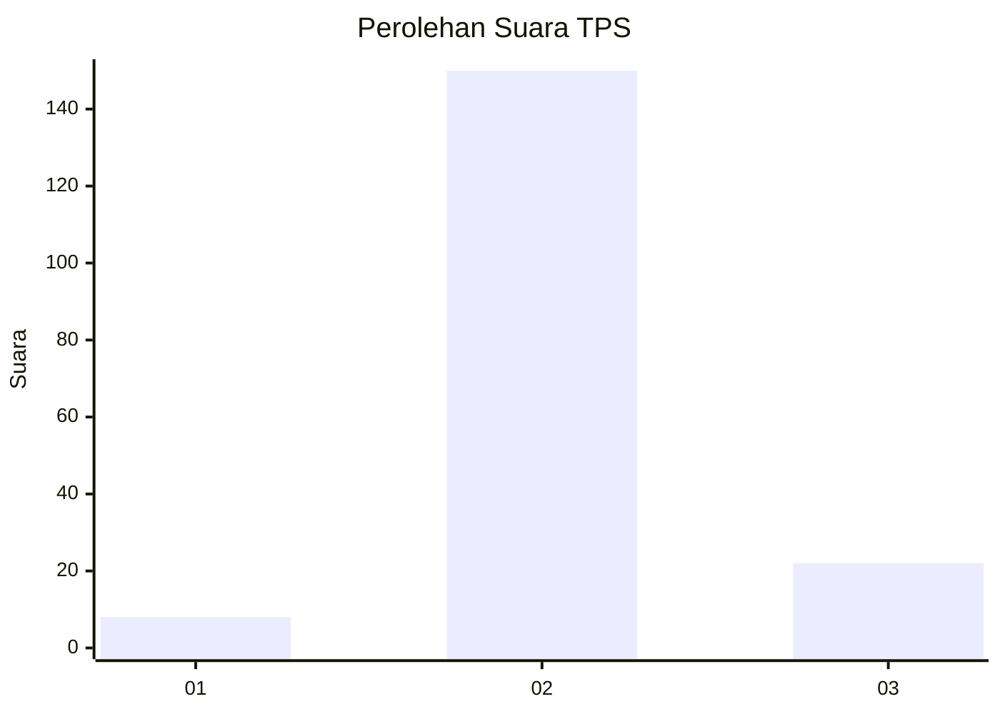
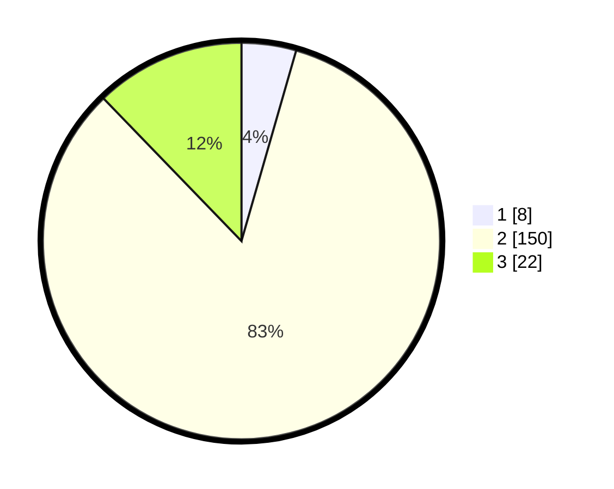

# Hasil

## Grafik

## Tabel

| No. | Nama Paslon    | Suara | Suara (raw) | Persentase |
|:--- |:-------------- | -----:| -----------:| ----------:|
| 1   | ANIES MUHAIMIN | 8     | [8][p-1]    | 4,44       |
| 2   | PRABOWO GIBRAN | 150   | [150][p-2]  | 83,33      |
| 3   | GANJAR MAHFUD  | 22    | [22][p-3]   | 12,22      |

[p-1]: https://github.com/gigit-pemilu/pemilu-2024-35-jawa-timur/blob/main/pilpres/hitung-suara/sub/35-jawa-timur/sub/03-trenggalek/sub/09-bendungan/sub/2003-surenlor/sub/002-tps/sub/paslon-1.txt
[p-2]: https://github.com/gigit-pemilu/pemilu-2024-35-jawa-timur/blob/main/pilpres/hitung-suara/sub/35-jawa-timur/sub/03-trenggalek/sub/09-bendungan/sub/2003-surenlor/sub/002-tps/sub/paslon-2.txt
[p-3]: https://github.com/gigit-pemilu/pemilu-2024-35-jawa-timur/blob/main/pilpres/hitung-suara/sub/35-jawa-timur/sub/03-trenggalek/sub/09-bendungan/sub/2003-surenlor/sub/002-tps/sub/paslon-3.txt

## Foto C Plano

https://sirekap-obj-formc.kpu.go.id/df1c/pemilu/ppwp/35/03/09/20/03/3503092003002-20240216-155249--895f06ab-ab6e-4f40-9cfa-c0df9c255948.jpg

https://sirekap-obj-formc.kpu.go.id/df1c/pemilu/ppwp/35/03/09/20/03/3503092003002-20240217-085559--a1cec076-00aa-4cb5-9e18-367f5c24d3b3.jpg

## Metadata

| Key        | Value               |
| ---------- | ------------------- |
| Time Stamp | 2024-02-17 09:00:02 |

