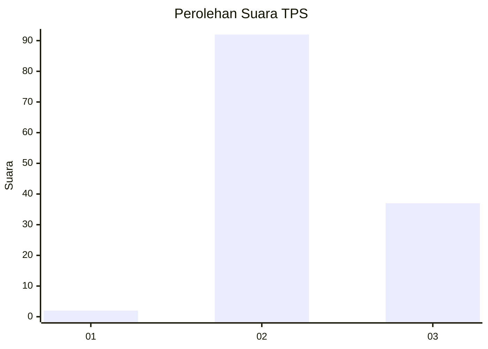
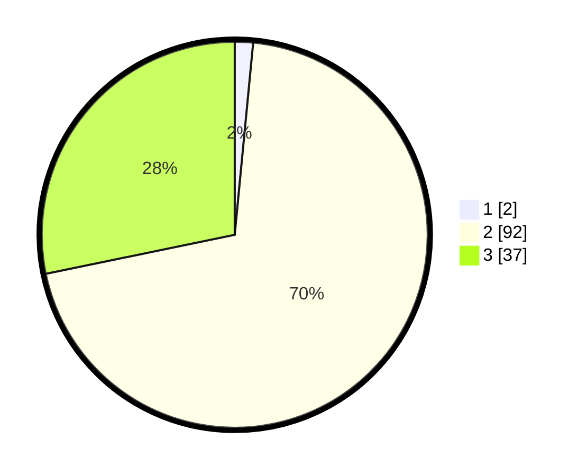

# Hasil

## Grafik

## Tabel

| No. | Nama Paslon    | Suara | Suara (raw) | Persentase |
|:--- |:-------------- | -----:| -----------:| ----------:|
| 1   | ANIES MUHAIMIN | 2     | [2][p-1]    | 1,53       |
| 2   | PRABOWO GIBRAN | 92    | [92][p-2]   | 70,23      |
| 3   | GANJAR MAHFUD  | 37    | [37][p-3]   | 28,24      |

[p-1]: https://github.com/gigit-pemilu/pemilu-2024/blob/main/pilpres/hitung-suara/sub/35-jawa-timur/sub/03-trenggalek/sub/09-bendungan/sub/2004-sumurup/sub/013-tps/sub/paslon-1.txt
[p-2]: https://github.com/gigit-pemilu/pemilu-2024/blob/main/pilpres/hitung-suara/sub/35-jawa-timur/sub/03-trenggalek/sub/09-bendungan/sub/2004-sumurup/sub/013-tps/sub/paslon-2.txt
[p-3]: https://github.com/gigit-pemilu/pemilu-2024/blob/main/pilpres/hitung-suara/sub/35-jawa-timur/sub/03-trenggalek/sub/09-bendungan/sub/2004-sumurup/sub/013-tps/sub/paslon-3.txt

## Foto C Plano

https://sirekap-obj-formc.kpu.go.id/3657/pemilu/ppwp/35/03/09/20/04/3503092004013-20240217-184834--4c280ab5-52b1-47bb-9419-13c5db1d4cf6.jpg

https://sirekap-obj-formc.kpu.go.id/3657/pemilu/ppwp/35/03/09/20/04/3503092004013-20240217-185040--b6db36ee-ee5b-4944-9c3d-fb2c6c05265b.jpg

https://sirekap-obj-formc.kpu.go.id/3657/pemilu/ppwp/35/03/09/20/04/3503092004013-20240217-185440--04d8221b-95dd-4940-b0dd-72342a3a7553.jpg

## Metadata

| Key        | Value               |
| ---------- | ------------------- |
| Time Stamp | 2024-02-24 22:31:28 |

