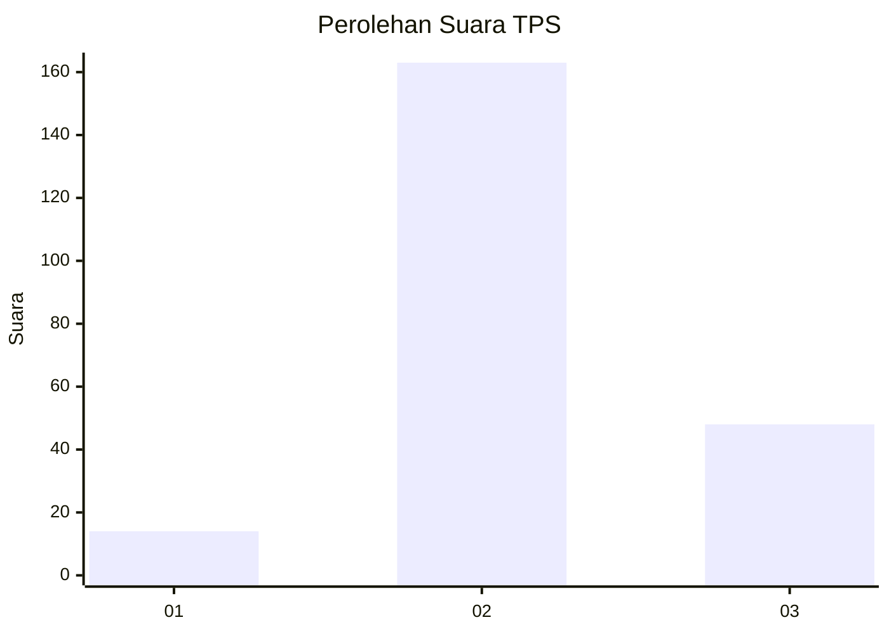

# Hasil

## Grafik

## Tabel

| No. | Nama Paslon    | Suara | Suara (raw) | Persentase |
|:--- |:-------------- | -----:| -----------:| ----------:|
| 1   | ANIES MUHAIMIN | 14    | [14][p-1]   | 6,22       |
| 2   | PRABOWO GIBRAN | 163   | [163][p-2]  | 72,44      |
| 3   | GANJAR MAHFUD  | 48    | [48][p-3]   | 21,33      |

[p-1]: https://github.com/gigit-pemilu/pemilu-2024-35-jawa-timur/blob/main/pilpres/hitung-suara/sub/35-jawa-timur/sub/03-trenggalek/sub/09-bendungan/sub/2004-sumurup/sub/019-tps/sub/paslon-1.txt
[p-2]: https://github.com/gigit-pemilu/pemilu-2024-35-jawa-timur/blob/main/pilpres/hitung-suara/sub/35-jawa-timur/sub/03-trenggalek/sub/09-bendungan/sub/2004-sumurup/sub/019-tps/sub/paslon-2.txt
[p-3]: https://github.com/gigit-pemilu/pemilu-2024-35-jawa-timur/blob/main/pilpres/hitung-suara/sub/35-jawa-timur/sub/03-trenggalek/sub/09-bendungan/sub/2004-sumurup/sub/019-tps/sub/paslon-3.txt

## Foto C Plano

https://sirekap-obj-formc.kpu.go.id/dd5b/pemilu/ppwp/35/03/09/20/04/3503092004019-20240218-230513--737690b4-eeee-4c13-b87a-49f334defe57.jpg

https://sirekap-obj-formc.kpu.go.id/dd5b/pemilu/ppwp/35/03/09/20/04/3503092004019-20240218-230622--f39e4315-55bb-4f84-b6ae-467918d344ac.jpg

https://sirekap-obj-formc.kpu.go.id/dd5b/pemilu/ppwp/35/03/09/20/04/3503092004019-20240218-203040--8db0098f-19c1-4d83-98df-b182d7928ab6.jpg

## Metadata

| Key        | Value               |
| ---------- | ------------------- |
| Time Stamp | 2024-02-25 14:00:00 |

