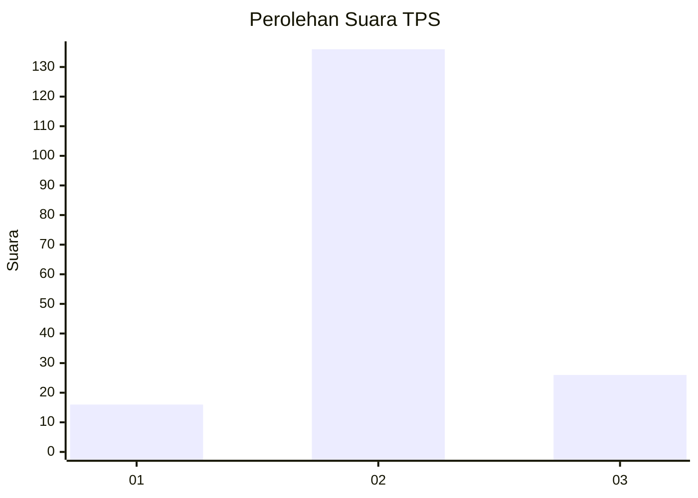

# Hasil

## Grafik

## Tabel

| No. | Nama Paslon    | Suara | Suara (raw) | Persentase |
|:--- |:-------------- | -----:| -----------:| ----------:|
| 1   | ANIES MUHAIMIN | 16    | [16][p-1]   | 8,99       |
| 2   | PRABOWO GIBRAN | 136   | [136][p-2]  | 76,40      |
| 3   | GANJAR MAHFUD  | 26    | [26][p-3]   | 14,61      |

[p-1]: https://github.com/gigit-pemilu/pemilu-2024/blob/main/pilpres/hitung-suara/sub/35-jawa-timur/sub/03-trenggalek/sub/09-bendungan/sub/2006-dompyong/sub/005-tps/sub/paslon-1.txt
[p-2]: https://github.com/gigit-pemilu/pemilu-2024/blob/main/pilpres/hitung-suara/sub/35-jawa-timur/sub/03-trenggalek/sub/09-bendungan/sub/2006-dompyong/sub/005-tps/sub/paslon-2.txt
[p-3]: https://github.com/gigit-pemilu/pemilu-2024/blob/main/pilpres/hitung-suara/sub/35-jawa-timur/sub/03-trenggalek/sub/09-bendungan/sub/2006-dompyong/sub/005-tps/sub/paslon-3.txt

## Foto C Plano

https://sirekap-obj-formc.kpu.go.id/c6e3/pemilu/ppwp/35/03/09/20/06/3503092006005-20240214-155655--727c226d-ba49-421f-ae2c-0c2acea57e22.jpg

https://sirekap-obj-formc.kpu.go.id/c6e3/pemilu/ppwp/35/03/09/20/06/3503092006005-20240214-224345--a11cfe42-c066-4865-bfc0-a97c3c0baea4.jpg

## Metadata

| Key        | Value               |
| ---------- | ------------------- |
| Time Stamp | 2024-02-15 15:30:25 |

