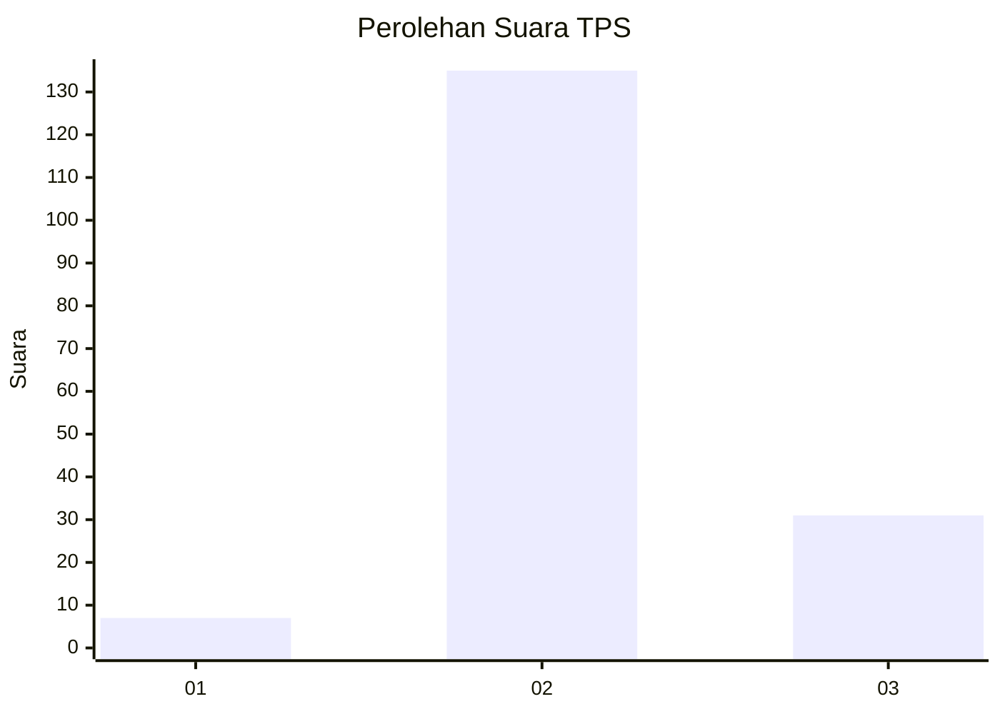

# Hasil

## Grafik

## Tabel

| No. | Nama Paslon    | Suara | Suara (raw) | Persentase |
|:--- |:-------------- | -----:| -----------:| ----------:|
| 1   | ANIES MUHAIMIN | 7     | [7][p-1]    | 4,05       |
| 2   | PRABOWO GIBRAN | 135   | [135][p-2]  | 78,03      |
| 3   | GANJAR MAHFUD  | 31    | [31][p-3]   | 17,92      |

[p-1]: https://github.com/gigit-pemilu/pemilu-2024/blob/main/pilpres/hitung-suara/sub/35-jawa-timur/sub/03-trenggalek/sub/09-bendungan/sub/2006-dompyong/sub/007-tps/sub/paslon-1.txt
[p-2]: https://github.com/gigit-pemilu/pemilu-2024/blob/main/pilpres/hitung-suara/sub/35-jawa-timur/sub/03-trenggalek/sub/09-bendungan/sub/2006-dompyong/sub/007-tps/sub/paslon-2.txt
[p-3]: https://github.com/gigit-pemilu/pemilu-2024/blob/main/pilpres/hitung-suara/sub/35-jawa-timur/sub/03-trenggalek/sub/09-bendungan/sub/2006-dompyong/sub/007-tps/sub/paslon-3.txt

## Foto C Plano

https://sirekap-obj-formc.kpu.go.id/eef1/pemilu/ppwp/35/03/09/20/06/3503092006007-20240215-153623--66ba78b7-d1cb-4ae5-9952-6c105c8a0496.jpg

https://sirekap-obj-formc.kpu.go.id/eef1/pemilu/ppwp/35/03/09/20/06/3503092006007-20240215-153716--d55f7492-dd50-4c57-b4dc-495be0f5a38f.jpg

## Metadata

| Key        | Value               |
| ---------- | ------------------- |
| Time Stamp | 2024-02-24 22:31:28 |

