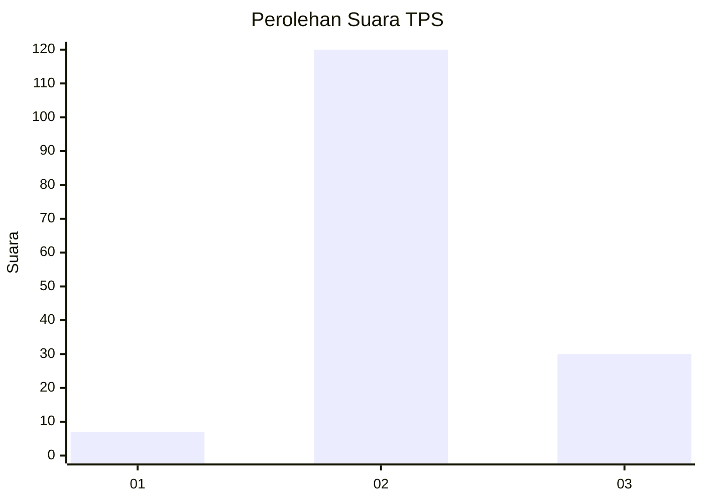
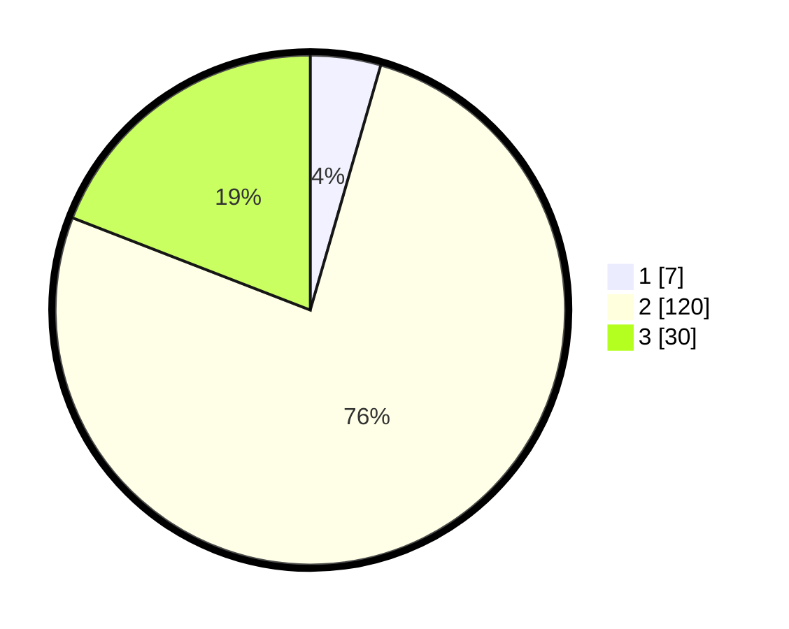

# Hasil

## Grafik

## Tabel

| No. | Nama Paslon    | Suara | Suara (raw) | Persentase |
|:--- |:-------------- | -----:| -----------:| ----------:|
| 1   | ANIES MUHAIMIN | 7     | [7][p-1]    | 4,46       |
| 2   | PRABOWO GIBRAN | 120   | [120][p-2]  | 76,43      |
| 3   | GANJAR MAHFUD  | 30    | [30][p-3]   | 19,11      |

[p-1]: https://github.com/gigit-pemilu/pemilu-2024/blob/main/pilpres/hitung-suara/sub/35-jawa-timur/sub/03-trenggalek/sub/09-bendungan/sub/2006-dompyong/sub/009-tps/sub/paslon-1.txt
[p-2]: https://github.com/gigit-pemilu/pemilu-2024/blob/main/pilpres/hitung-suara/sub/35-jawa-timur/sub/03-trenggalek/sub/09-bendungan/sub/2006-dompyong/sub/009-tps/sub/paslon-2.txt
[p-3]: https://github.com/gigit-pemilu/pemilu-2024/blob/main/pilpres/hitung-suara/sub/35-jawa-timur/sub/03-trenggalek/sub/09-bendungan/sub/2006-dompyong/sub/009-tps/sub/paslon-3.txt

## Foto C Plano

https://sirekap-obj-formc.kpu.go.id/c0d9/pemilu/ppwp/35/03/09/20/06/3503092006009-20240215-143228--de4e4ee8-5ee3-4532-a229-2590da7f6680.jpg

https://sirekap-obj-formc.kpu.go.id/c0d9/pemilu/ppwp/35/03/09/20/06/3503092006009-20240214-230754--c03c5a3a-300d-4fc7-9ac9-1817d94bc187.jpg

https://sirekap-obj-formc.kpu.go.id/c0d9/pemilu/ppwp/35/03/09/20/06/3503092006009-20240214-230601--972ca81c-a3ec-4e6a-b69e-db3bfa7f03db.jpg

## Metadata

| Key        | Value               |
| ---------- | ------------------- |
| Time Stamp | 2024-02-15 16:30:25 |

