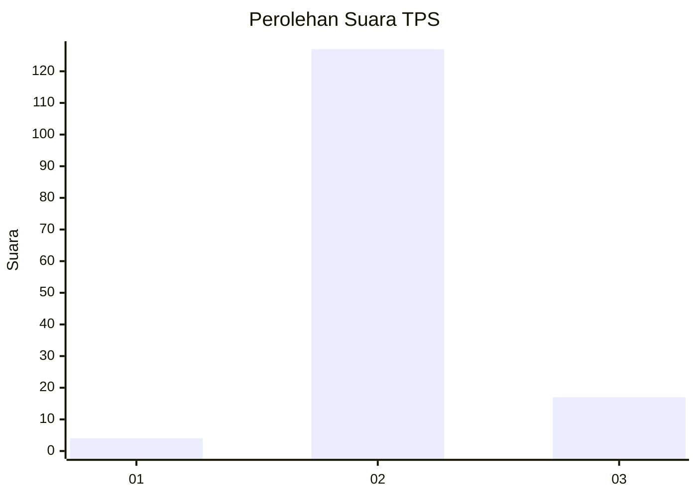
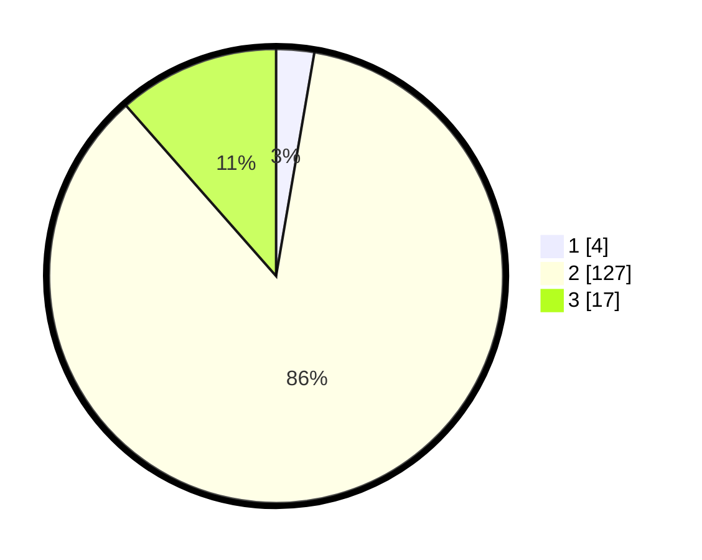

# Hasil

## Grafik

## Tabel

| No. | Nama Paslon    | Suara | Suara (raw) | Persentase |
|:--- |:-------------- | -----:| -----------:| ----------:|
| 1   | ANIES MUHAIMIN | 4     | [4][p-1]    | 2,70       |
| 2   | PRABOWO GIBRAN | 127   | [127][p-2]  | 85,81      |
| 3   | GANJAR MAHFUD  | 17    | [17][p-3]   | 11,49      |

[p-1]: https://github.com/gigit-pemilu/pemilu-2024-35-jawa-timur/blob/main/pilpres/hitung-suara/sub/35-jawa-timur/sub/03-trenggalek/sub/09-bendungan/sub/2007-depok/sub/004-tps/sub/paslon-1.txt
[p-2]: https://github.com/gigit-pemilu/pemilu-2024-35-jawa-timur/blob/main/pilpres/hitung-suara/sub/35-jawa-timur/sub/03-trenggalek/sub/09-bendungan/sub/2007-depok/sub/004-tps/sub/paslon-2.txt
[p-3]: https://github.com/gigit-pemilu/pemilu-2024-35-jawa-timur/blob/main/pilpres/hitung-suara/sub/35-jawa-timur/sub/03-trenggalek/sub/09-bendungan/sub/2007-depok/sub/004-tps/sub/paslon-3.txt

## Foto C Plano

https://sirekap-obj-formc.kpu.go.id/9ca5/pemilu/ppwp/35/03/09/20/07/3503092007004-20240217-095348--805438cf-1e44-40a6-8c61-7254801f29d4.jpg

https://sirekap-obj-formc.kpu.go.id/9ca5/pemilu/ppwp/35/03/09/20/07/3503092007004-20240217-095544--367ce223-f6cb-478f-a8b9-15b8d8fca3f6.jpg

https://sirekap-obj-formc.kpu.go.id/9ca5/pemilu/ppwp/35/03/09/20/07/3503092007004-20240217-104617--2a35afe9-e091-4056-a220-2493c5545844.jpg

## Metadata

| Key        | Value               |
| ---------- | ------------------- |
| Time Stamp | 2024-02-24 22:31:28 |

