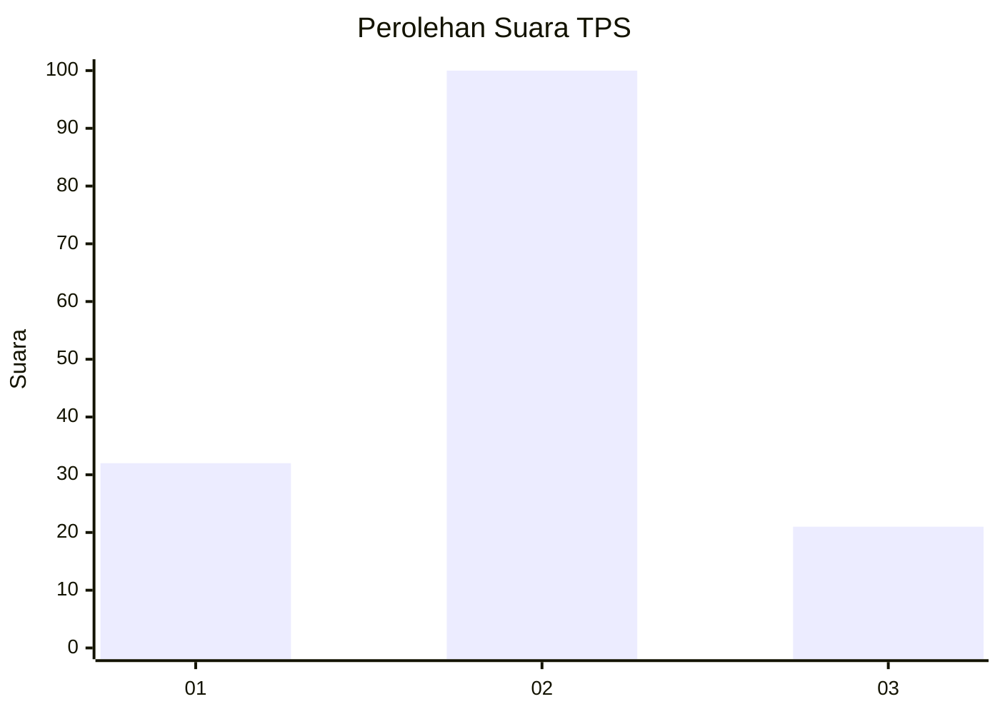
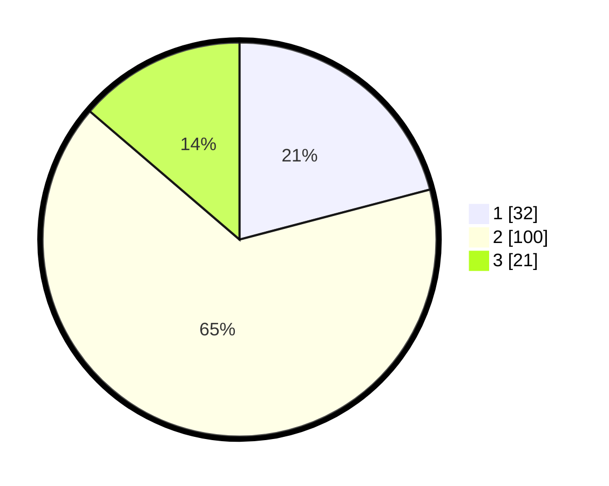

# Hasil

## Grafik

## Tabel

| No. | Nama Paslon    | Suara | Suara (raw) | Persentase |
|:--- |:-------------- | -----:| -----------:| ----------:|
| 1   | ANIES MUHAIMIN | 32    | [32][p-1]   | 20,92      |
| 2   | PRABOWO GIBRAN | 100   | [100][p-2]  | 65,36      |
| 3   | GANJAR MAHFUD  | 21    | [21][p-3]   | 13,73      |

[p-1]: https://github.com/gigit-pemilu/pemilu-2024/blob/main/pilpres/hitung-suara/sub/35-jawa-timur/sub/03-trenggalek/sub/09-bendungan/sub/2007-depok/sub/006-tps/sub/paslon-1.txt
[p-2]: https://github.com/gigit-pemilu/pemilu-2024/blob/main/pilpres/hitung-suara/sub/35-jawa-timur/sub/03-trenggalek/sub/09-bendungan/sub/2007-depok/sub/006-tps/sub/paslon-2.txt
[p-3]: https://github.com/gigit-pemilu/pemilu-2024/blob/main/pilpres/hitung-suara/sub/35-jawa-timur/sub/03-trenggalek/sub/09-bendungan/sub/2007-depok/sub/006-tps/sub/paslon-3.txt

## Foto C Plano

https://sirekap-obj-formc.kpu.go.id/7c1e/pemilu/ppwp/35/03/09/20/07/3503092007006-20240215-065601--c878edeb-4d38-44a7-99f6-9393ed15d091.jpg

https://sirekap-obj-formc.kpu.go.id/7c1e/pemilu/ppwp/35/03/09/20/07/3503092007006-20240215-095044--d6eaaf7b-4457-4036-88e3-ef5a9966f474.jpg

https://sirekap-obj-formc.kpu.go.id/7c1e/pemilu/ppwp/35/03/09/20/07/3503092007006-20240215-095113--0d37974f-17db-4809-8746-0ab6009f72e1.jpg

## Metadata

| Key        | Value               |
| ---------- | ------------------- |
| Time Stamp | 2024-02-16 13:30:32 |

