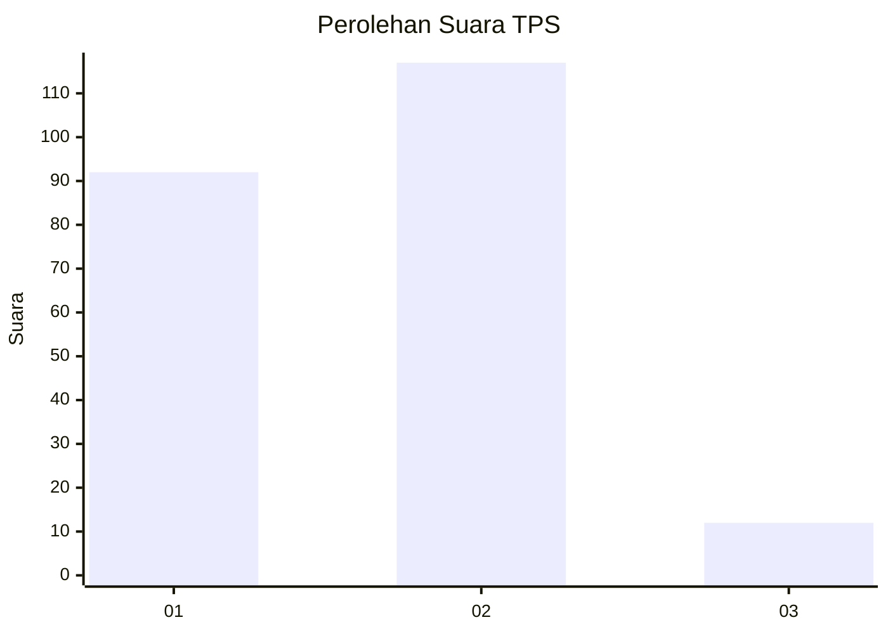
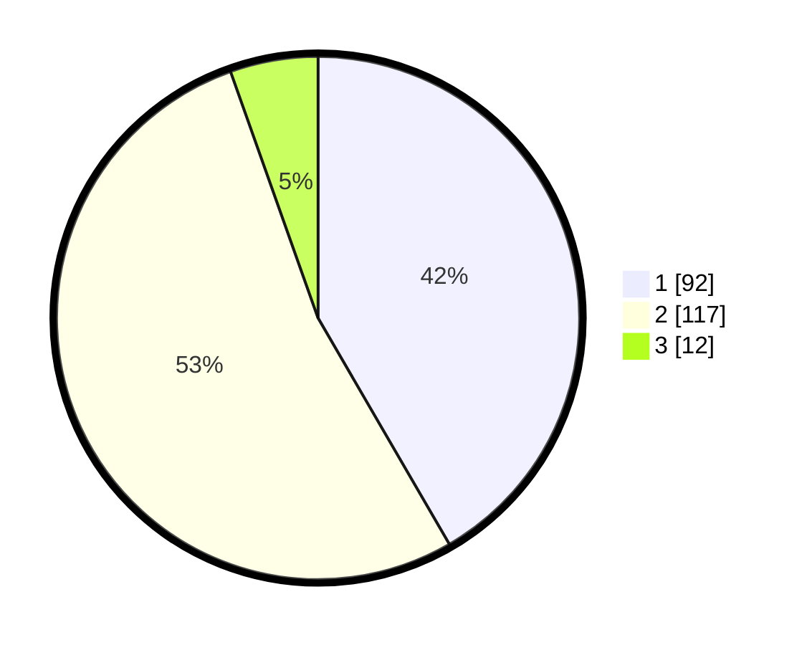

# Hasil

## Grafik

## Tabel

| No. | Nama Paslon    | Suara | Suara (raw) | Persentase |
|:--- |:-------------- | -----:| -----------:| ----------:|
| 1   | ANIES MUHAIMIN | 92    | [92][p-1]   | 41,63      |
| 2   | PRABOWO GIBRAN | 117   | [117][p-2]  | 52,94      |
| 3   | GANJAR MAHFUD  | 12    | [12][p-3]   | 5,43       |

[p-1]: https://github.com/gigit-pemilu/pemilu-2024-35-jawa-timur/blob/main/pilpres/hitung-suara/sub/35-jawa-timur/sub/03-trenggalek/sub/09-bendungan/sub/2007-depok/sub/007-tps/sub/paslon-1.txt
[p-2]: https://github.com/gigit-pemilu/pemilu-2024-35-jawa-timur/blob/main/pilpres/hitung-suara/sub/35-jawa-timur/sub/03-trenggalek/sub/09-bendungan/sub/2007-depok/sub/007-tps/sub/paslon-2.txt
[p-3]: https://github.com/gigit-pemilu/pemilu-2024-35-jawa-timur/blob/main/pilpres/hitung-suara/sub/35-jawa-timur/sub/03-trenggalek/sub/09-bendungan/sub/2007-depok/sub/007-tps/sub/paslon-3.txt

## Foto C Plano

https://sirekap-obj-formc.kpu.go.id/74fe/pemilu/ppwp/35/03/09/20/07/3503092007007-20240215-103220--ec18dcc1-09ab-41e9-9a13-a5fa0018c619.jpg

https://sirekap-obj-formc.kpu.go.id/74fe/pemilu/ppwp/35/03/09/20/07/3503092007007-20240215-101844--f61207da-6404-455c-b50c-67b294f42b6f.jpg

https://sirekap-obj-formc.kpu.go.id/74fe/pemilu/ppwp/35/03/09/20/07/3503092007007-20240215-102943--f1779fb0-0fd3-4061-b21f-8c4ef7f49214.jpg

## Metadata

| Key        | Value               |
| ---------- | ------------------- |
| Time Stamp | 2024-02-15 21:01:18 |

