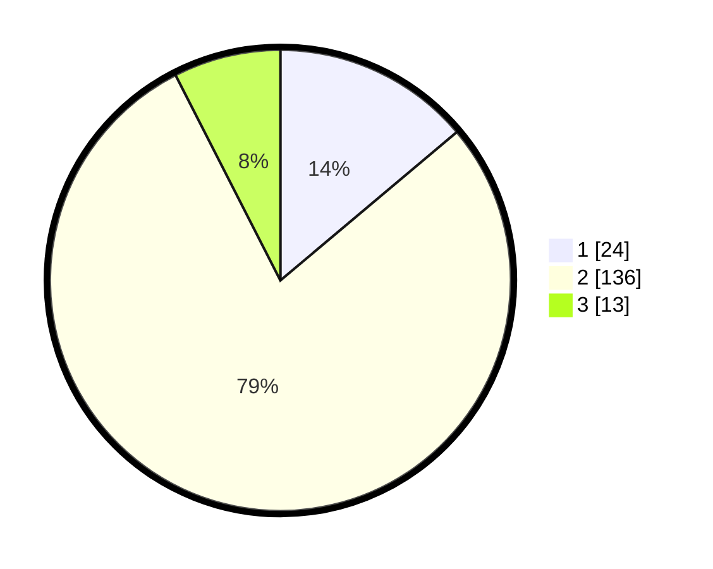

# Hasil

## Grafik

## Tabel

| No. | Nama Paslon    | Suara | Suara (raw) | Persentase |
|:--- |:-------------- | -----:| -----------:| ----------:|
| 1   | ANIES MUHAIMIN | 24    | [24][p-1]   | 13,87      |
| 2   | PRABOWO GIBRAN | 136   | [136][p-2]  | 78,61      |
| 3   | GANJAR MAHFUD  | 13    | [13][p-3]   | 7,51       |

[p-1]: https://github.com/gigit-pemilu/pemilu-2024-35-jawa-timur/blob/main/pilpres/hitung-suara/sub/35-jawa-timur/sub/03-trenggalek/sub/09-bendungan/sub/2007-depok/sub/009-tps/sub/paslon-1.txt
[p-2]: https://github.com/gigit-pemilu/pemilu-2024-35-jawa-timur/blob/main/pilpres/hitung-suara/sub/35-jawa-timur/sub/03-trenggalek/sub/09-bendungan/sub/2007-depok/sub/009-tps/sub/paslon-2.txt
[p-3]: https://github.com/gigit-pemilu/pemilu-2024-35-jawa-timur/blob/main/pilpres/hitung-suara/sub/35-jawa-timur/sub/03-trenggalek/sub/09-bendungan/sub/2007-depok/sub/009-tps/sub/paslon-3.txt

## Foto C Plano

https://sirekap-obj-formc.kpu.go.id/29ed/pemilu/ppwp/35/03/09/20/07/3503092007009-20240215-110256--68727092-b16c-4f4d-b48e-0f0b68a5ed20.jpg

https://sirekap-obj-formc.kpu.go.id/29ed/pemilu/ppwp/35/03/09/20/07/3503092007009-20240215-133316--8f904214-b46c-4107-aab8-c91817a86398.jpg

https://sirekap-obj-formc.kpu.go.id/29ed/pemilu/ppwp/35/03/09/20/07/3503092007009-20240215-133347--fd9d47da-21a0-4ed7-8c47-1f3fdd073c11.jpg

## Metadata

| Key        | Value               |
| ---------- | ------------------- |
| Time Stamp | 2024-02-16 13:30:32 |

