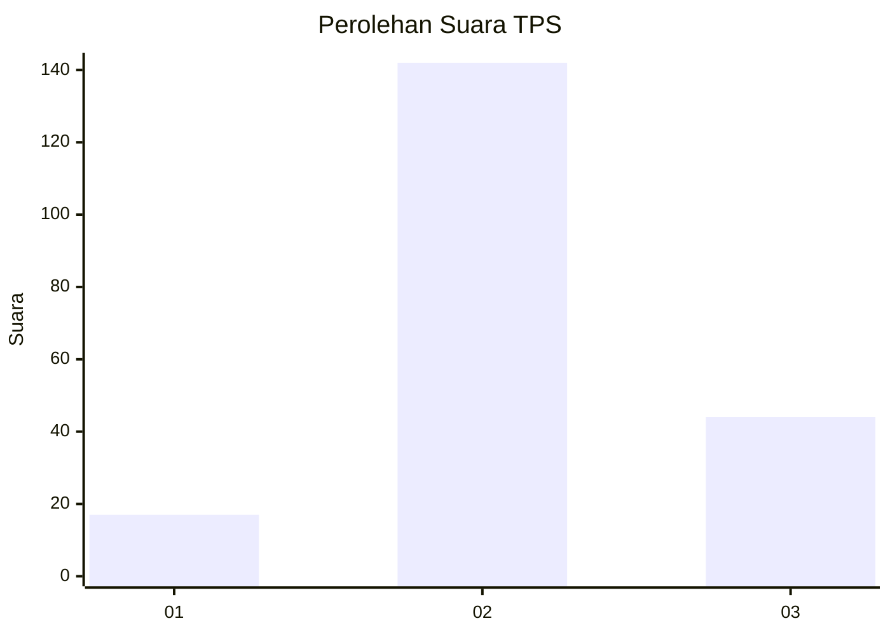
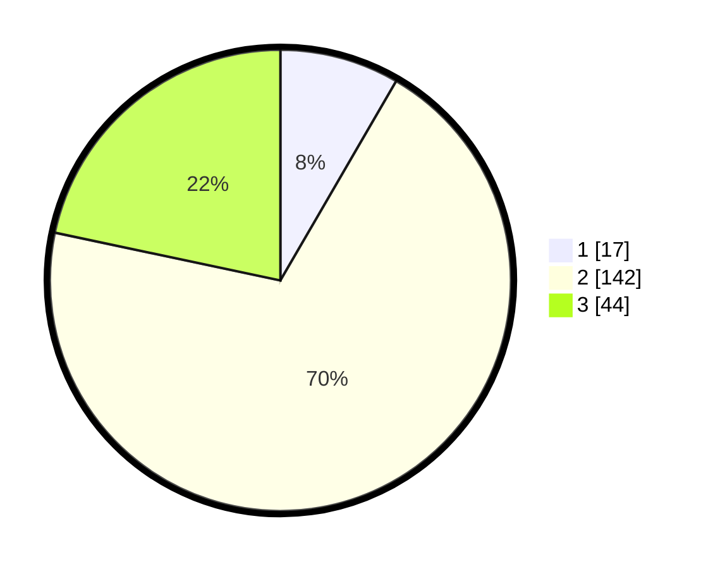

# Hasil

## Grafik

## Tabel

| No. | Nama Paslon    | Suara | Suara (raw) | Persentase |
|:--- |:-------------- | -----:| -----------:| ----------:|
| 1   | ANIES MUHAIMIN | 17    | [17][p-1]   | 8,37       |
| 2   | PRABOWO GIBRAN | 142   | [142][p-2]  | 69,95      |
| 3   | GANJAR MAHFUD  | 44    | [44][p-3]   | 21,67      |

[p-1]: https://github.com/gigit-pemilu/pemilu-2024-35-jawa-timur/blob/main/pilpres/hitung-suara/sub/35-jawa-timur/sub/03-trenggalek/sub/10-gandusari/sub/2001-ngrayung/sub/003-tps/sub/paslon-1.txt
[p-2]: https://github.com/gigit-pemilu/pemilu-2024-35-jawa-timur/blob/main/pilpres/hitung-suara/sub/35-jawa-timur/sub/03-trenggalek/sub/10-gandusari/sub/2001-ngrayung/sub/003-tps/sub/paslon-2.txt
[p-3]: https://github.com/gigit-pemilu/pemilu-2024-35-jawa-timur/blob/main/pilpres/hitung-suara/sub/35-jawa-timur/sub/03-trenggalek/sub/10-gandusari/sub/2001-ngrayung/sub/003-tps/sub/paslon-3.txt

## Foto C Plano

https://sirekap-obj-formc.kpu.go.id/dbe2/pemilu/ppwp/35/03/10/20/01/3503102001003-20240217-151916--45bf0f68-b258-40f6-b853-430dcd963182.jpg

https://sirekap-obj-formc.kpu.go.id/dbe2/pemilu/ppwp/35/03/10/20/01/3503102001003-20240217-154117--aefadcf6-aae2-4600-88fd-9534027bd779.jpg

## Metadata

| Key        | Value               |
| ---------- | ------------------- |
| Time Stamp | 2024-02-20 14:00:00 |

