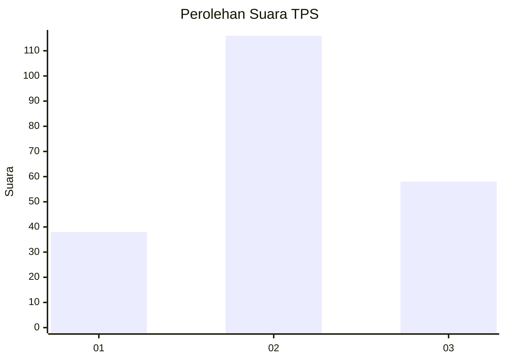
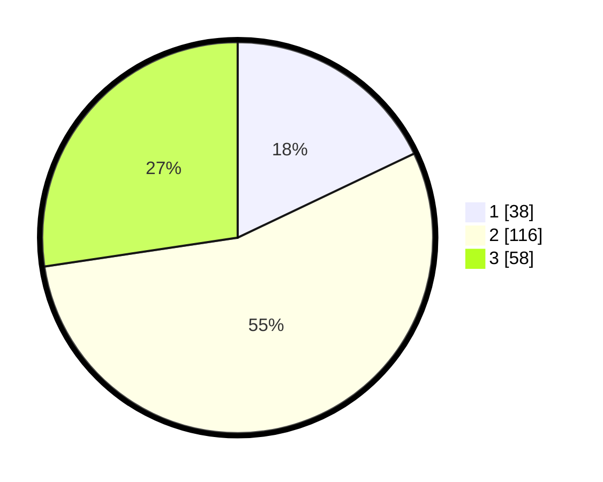

# Hasil

## Grafik

## Tabel

| No. | Nama Paslon    | Suara | Suara (raw) | Persentase |
|:--- |:-------------- | -----:| -----------:| ----------:|
| 1   | ANIES MUHAIMIN | 38    | [38][p-1]   | 17,92      |
| 2   | PRABOWO GIBRAN | 116   | [116][p-2]  | 54,72      |
| 3   | GANJAR MAHFUD  | 58    | [58][p-3]   | 27,36      |

[p-1]: https://github.com/gigit-pemilu/pemilu-2024/blob/main/pilpres/hitung-suara/sub/35-jawa-timur/sub/03-trenggalek/sub/10-gandusari/sub/2001-ngrayung/sub/005-tps/sub/paslon-1.txt
[p-2]: https://github.com/gigit-pemilu/pemilu-2024/blob/main/pilpres/hitung-suara/sub/35-jawa-timur/sub/03-trenggalek/sub/10-gandusari/sub/2001-ngrayung/sub/005-tps/sub/paslon-2.txt
[p-3]: https://github.com/gigit-pemilu/pemilu-2024/blob/main/pilpres/hitung-suara/sub/35-jawa-timur/sub/03-trenggalek/sub/10-gandusari/sub/2001-ngrayung/sub/005-tps/sub/paslon-3.txt

## Foto C Plano

https://sirekap-obj-formc.kpu.go.id/c623/pemilu/ppwp/35/03/10/20/01/3503102001005-20240216-151119--f5be8c06-988b-41b1-a172-a33b31d6efd2.jpg

https://sirekap-obj-formc.kpu.go.id/c623/pemilu/ppwp/35/03/10/20/01/3503102001005-20240216-151120--cabe90ec-9cb8-4eaf-8556-d153f3101509.jpg

https://sirekap-obj-formc.kpu.go.id/c623/pemilu/ppwp/35/03/10/20/01/3503102001005-20240216-115425--633f7f54-22f4-45ad-8eff-21c2e5c2f0fd.jpg

## Metadata

| Key        | Value               |
| ---------- | ------------------- |
| Time Stamp | 2024-02-19 15:00:00 |

## DATA PEMILIH TETAP

Jumlah pemilih dalam DPT: **269**.
 * L: **135**.
 * P: **134**.

## DATA PENGGUNA HAK PILIH

Jumlah pengguna hak pilih dalam DPT: **223**.
 * L: **107**.
 * P: **116**.

Jumlah pengguna hak pilih dalam DPTb: **0**.
 * L: **0**.
 * P: **0**.

Jumlah pengguna hak pilih dalam DPK: **0**.
 * L: **0**.
 * P: **0**.

Jumlah pengguna hak pilih: **223**.
 * L: **107**.
 * P: **116**.

## JUMLAH SUARA SAH DAN TIDAK SAH

JUMLAH SELURUH SUARA SAH: **212**.

JUMLAH SUARA TIDAK SAH: **11**.

JUMLAH SELURUH SUARA SAH DAN SUARA TIDAK SAH: **223**.

