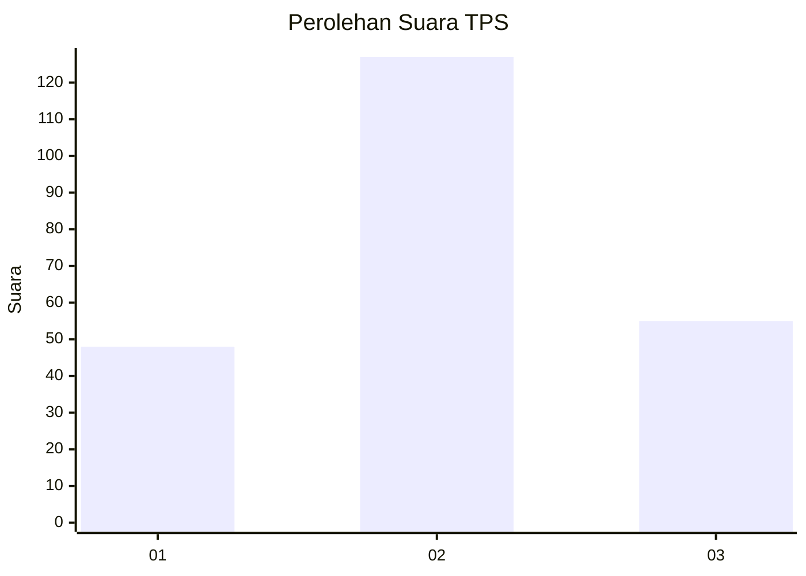
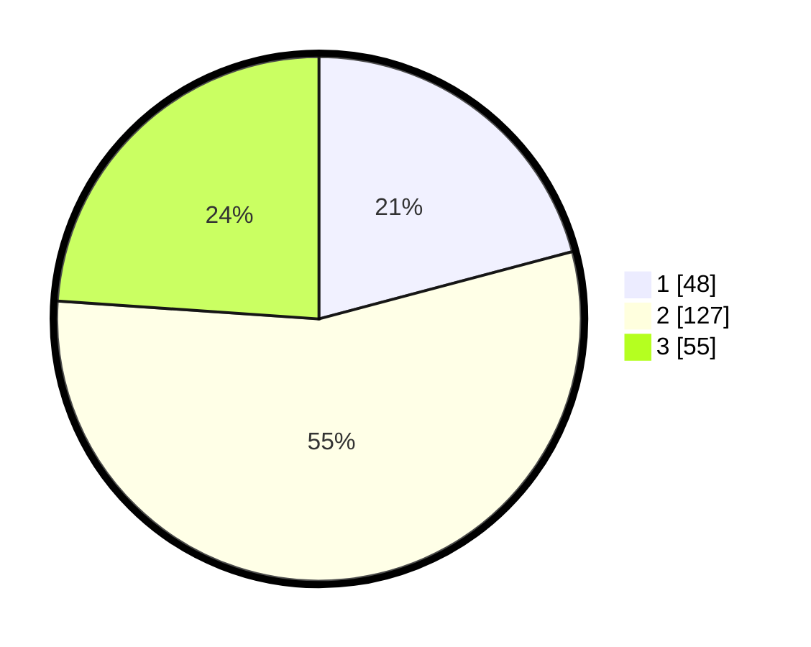

# Hasil

## Grafik

## Tabel

| No. | Nama Paslon    | Suara | Suara (raw) | Persentase |
|:--- |:-------------- | -----:| -----------:| ----------:|
| 1   | ANIES MUHAIMIN | 48    | [48][p-1]   | 20,87      |
| 2   | PRABOWO GIBRAN | 127   | [127][p-2]  | 55,22      |
| 3   | GANJAR MAHFUD  | 55    | [55][p-3]   | 23,91      |

[p-1]: https://github.com/gigit-pemilu/pemilu-2024/blob/main/pilpres/hitung-suara/sub/35-jawa-timur/sub/03-trenggalek/sub/10-gandusari/sub/2002-wonorejo/sub/010-tps/sub/paslon-1.txt
[p-2]: https://github.com/gigit-pemilu/pemilu-2024/blob/main/pilpres/hitung-suara/sub/35-jawa-timur/sub/03-trenggalek/sub/10-gandusari/sub/2002-wonorejo/sub/010-tps/sub/paslon-2.txt
[p-3]: https://github.com/gigit-pemilu/pemilu-2024/blob/main/pilpres/hitung-suara/sub/35-jawa-timur/sub/03-trenggalek/sub/10-gandusari/sub/2002-wonorejo/sub/010-tps/sub/paslon-3.txt

## Foto C Plano

https://sirekap-obj-formc.kpu.go.id/ea00/pemilu/ppwp/35/03/10/20/02/3503102002010-20240215-220726--c3f280e4-c7d6-41a8-902f-95c433fc7c92.jpg

https://sirekap-obj-formc.kpu.go.id/ea00/pemilu/ppwp/35/03/10/20/02/3503102002010-20240215-220821--5c5eae54-8fda-48d2-9a23-e119f607fc5f.jpg

https://sirekap-obj-formc.kpu.go.id/ea00/pemilu/ppwp/35/03/10/20/02/3503102002010-20240215-220540--4ed16262-0fd0-41c4-b8e1-d52ba6c20516.jpg

## Metadata

| Key        | Value               |
| ---------- | ------------------- |
| Time Stamp | 2024-02-15 23:29:50 |

