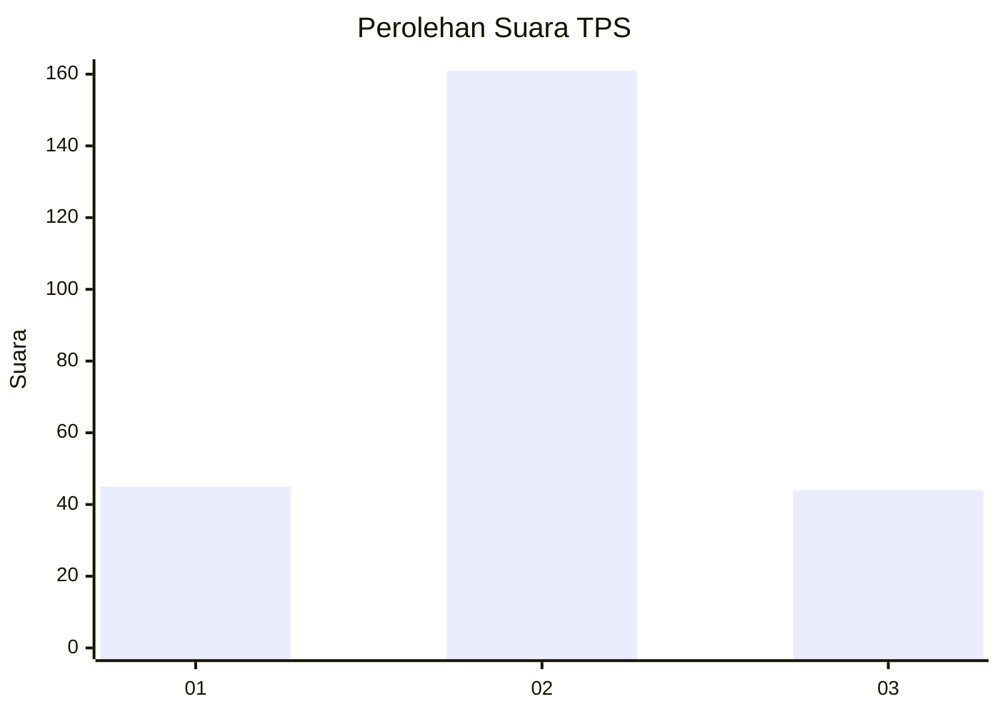
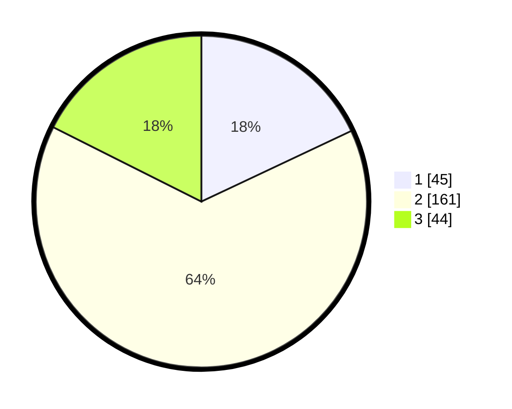

# Hasil

## Grafik

## Tabel

| No. | Nama Paslon    | Suara | Suara (raw) | Persentase |
|:--- |:-------------- | -----:| -----------:| ----------:|
| 1   | ANIES MUHAIMIN | 45    | [45][p-1]   | 18,00      |
| 2   | PRABOWO GIBRAN | 161   | [161][p-2]  | 64,40      |
| 3   | GANJAR MAHFUD  | 44    | [44][p-3]   | 17,60      |

[p-1]: https://github.com/gigit-pemilu/pemilu-2024-35-jawa-timur/blob/main/pilpres/hitung-suara/sub/35-jawa-timur/sub/03-trenggalek/sub/10-gandusari/sub/2008-karanganyar/sub/004-tps/sub/paslon-1.txt
[p-2]: https://github.com/gigit-pemilu/pemilu-2024-35-jawa-timur/blob/main/pilpres/hitung-suara/sub/35-jawa-timur/sub/03-trenggalek/sub/10-gandusari/sub/2008-karanganyar/sub/004-tps/sub/paslon-2.txt
[p-3]: https://github.com/gigit-pemilu/pemilu-2024-35-jawa-timur/blob/main/pilpres/hitung-suara/sub/35-jawa-timur/sub/03-trenggalek/sub/10-gandusari/sub/2008-karanganyar/sub/004-tps/sub/paslon-3.txt

## Foto C Plano

https://sirekap-obj-formc.kpu.go.id/9b61/pemilu/ppwp/35/03/10/20/08/3503102008004-20240215-202617--54476405-1e48-4fe5-ba33-ebdb77952f5e.jpg

https://sirekap-obj-formc.kpu.go.id/9b61/pemilu/ppwp/35/03/10/20/08/3503102008004-20240215-203136--5bba8bda-bf75-4200-9461-6a3e6e0aeaa3.jpg

https://sirekap-obj-formc.kpu.go.id/9b61/pemilu/ppwp/35/03/10/20/08/3503102008004-20240215-204028--de3cc435-8afc-47b3-9d69-3f058d9c62a8.jpg

## Metadata

| Key        | Value               |
| ---------- | ------------------- |
| Time Stamp | 2024-02-16 00:30:27 |

