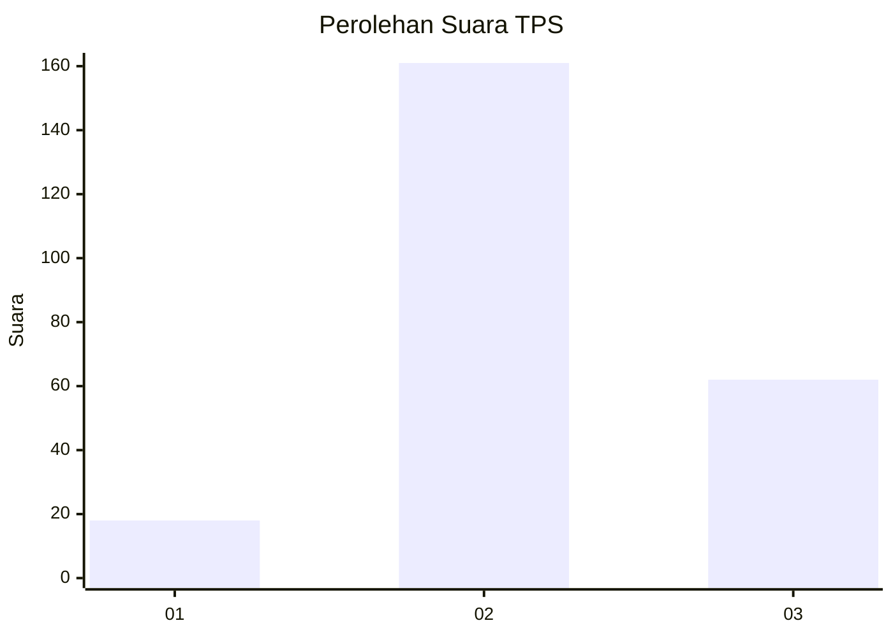
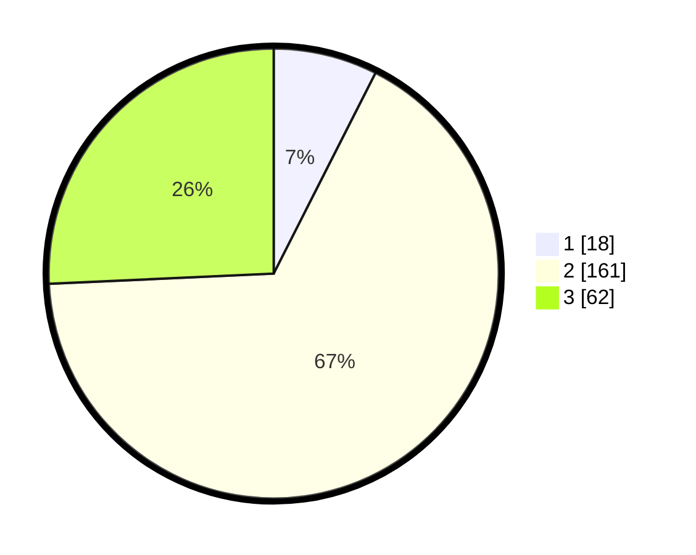

# Hasil

## Grafik

## Tabel

| No. | Nama Paslon    | Suara | Suara (raw) | Persentase |
|:--- |:-------------- | -----:| -----------:| ----------:|
| 1   | ANIES MUHAIMIN | 18    | [18][p-1]   | 7,47       |
| 2   | PRABOWO GIBRAN | 161   | [161][p-2]  | 66,80      |
| 3   | GANJAR MAHFUD  | 62    | [62][p-3]   | 25,73      |

[p-1]: https://github.com/gigit-pemilu/pemilu-2024-35-jawa-timur/blob/main/pilpres/hitung-suara/sub/35-jawa-timur/sub/03-trenggalek/sub/10-gandusari/sub/2011-sukorame/sub/008-tps/sub/paslon-1.txt
[p-2]: https://github.com/gigit-pemilu/pemilu-2024-35-jawa-timur/blob/main/pilpres/hitung-suara/sub/35-jawa-timur/sub/03-trenggalek/sub/10-gandusari/sub/2011-sukorame/sub/008-tps/sub/paslon-2.txt
[p-3]: https://github.com/gigit-pemilu/pemilu-2024-35-jawa-timur/blob/main/pilpres/hitung-suara/sub/35-jawa-timur/sub/03-trenggalek/sub/10-gandusari/sub/2011-sukorame/sub/008-tps/sub/paslon-3.txt

## Foto C Plano

https://sirekap-obj-formc.kpu.go.id/5e91/pemilu/ppwp/35/03/10/20/11/3503102011008-20240215-203212--37cfbaec-1567-4c08-a269-49731bbe93f6.jpg

https://sirekap-obj-formc.kpu.go.id/5e91/pemilu/ppwp/35/03/10/20/11/3503102011008-20240215-220007--040ef48a-a9a5-4e00-bea9-4a2cafdb61e8.jpg

https://sirekap-obj-formc.kpu.go.id/5e91/pemilu/ppwp/35/03/10/20/11/3503102011008-20240215-204917--5ccb6f60-ac1e-4ad3-8895-fca5476e3e26.jpg

## Metadata

| Key        | Value               |
| ---------- | ------------------- |
| Time Stamp | 2024-02-19 16:00:00 |

