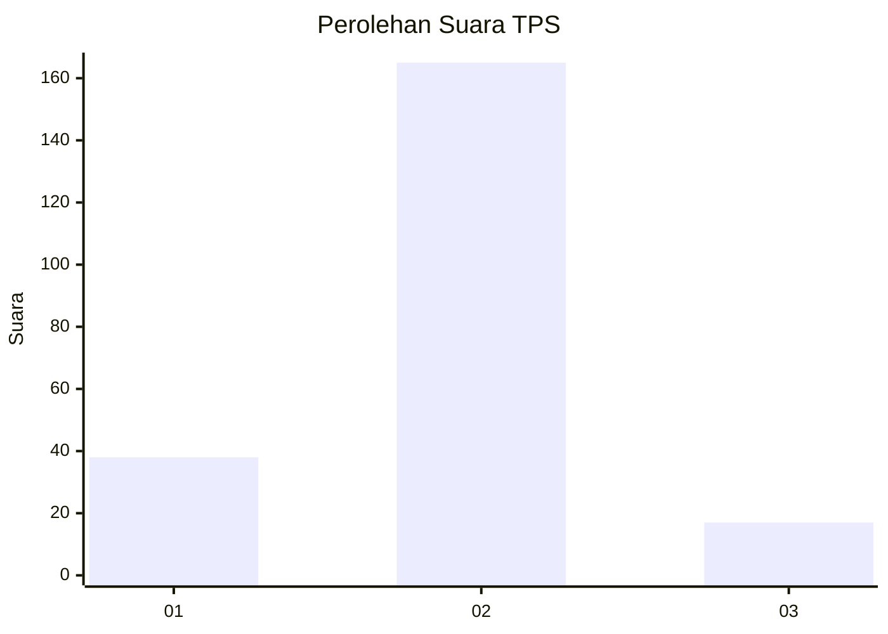
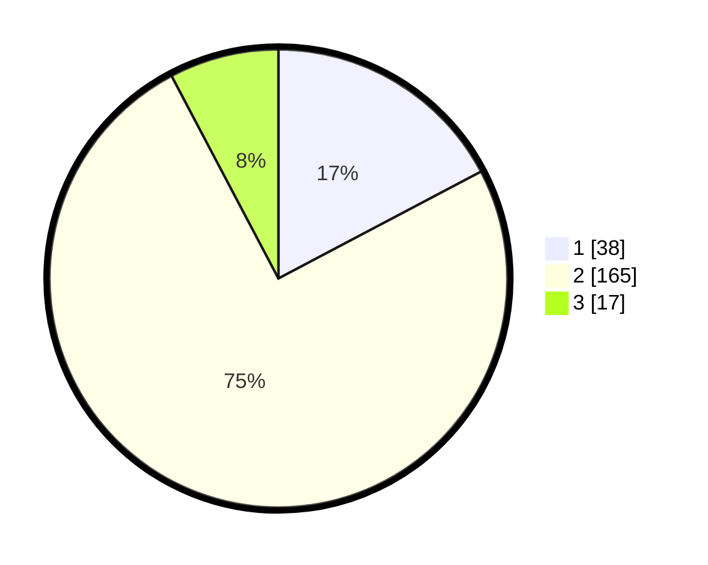

# Hasil

## Grafik

## Tabel

| No. | Nama Paslon    | Suara | Suara (raw) | Persentase |
|:--- |:-------------- | -----:| -----------:| ----------:|
| 1   | ANIES MUHAIMIN | 38    | [38][p-1]   | 17,27      |
| 2   | PRABOWO GIBRAN | 165   | [165][p-2]  | 75,00      |
| 3   | GANJAR MAHFUD  | 17    | [17][p-3]   | 7,73       |

[p-1]: https://github.com/gigit-pemilu/pemilu-2024/blob/main/pilpres/hitung-suara/sub/35-jawa-timur/sub/03-trenggalek/sub/10-gandusari/sub/2011-sukorame/sub/017-tps/sub/paslon-1.txt
[p-2]: https://github.com/gigit-pemilu/pemilu-2024/blob/main/pilpres/hitung-suara/sub/35-jawa-timur/sub/03-trenggalek/sub/10-gandusari/sub/2011-sukorame/sub/017-tps/sub/paslon-2.txt
[p-3]: https://github.com/gigit-pemilu/pemilu-2024/blob/main/pilpres/hitung-suara/sub/35-jawa-timur/sub/03-trenggalek/sub/10-gandusari/sub/2011-sukorame/sub/017-tps/sub/paslon-3.txt

## Foto C Plano

https://sirekap-obj-formc.kpu.go.id/9b7d/pemilu/ppwp/35/03/10/20/11/3503102011017-20240215-044432--8cd17a35-057b-468e-92ea-fcc69b5d6e23.jpg

https://sirekap-obj-formc.kpu.go.id/9b7d/pemilu/ppwp/35/03/10/20/11/3503102011017-20240214-234522--6a12626b-d63e-45d3-a8f7-d697d4b14a8a.jpg

https://sirekap-obj-formc.kpu.go.id/9b7d/pemilu/ppwp/35/03/10/20/11/3503102011017-20240215-044537--d24bd0c7-568a-4b6d-ab24-4db2cd1881b9.jpg

## Metadata

| Key        | Value               |
| ---------- | ------------------- |
| Time Stamp | 2024-02-15 18:30:25 |

