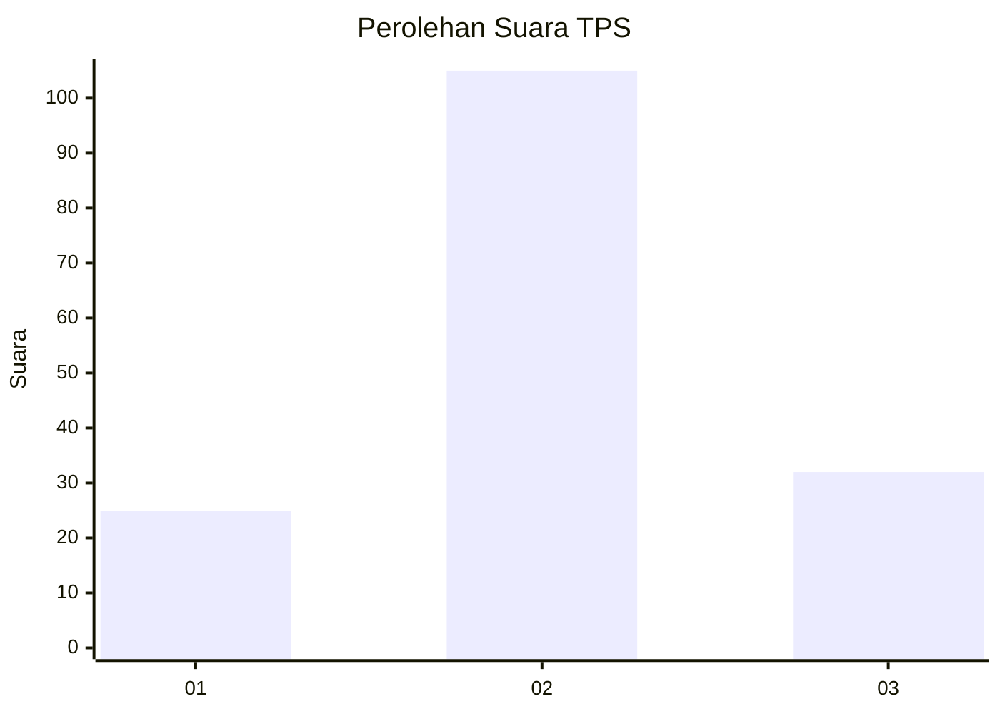
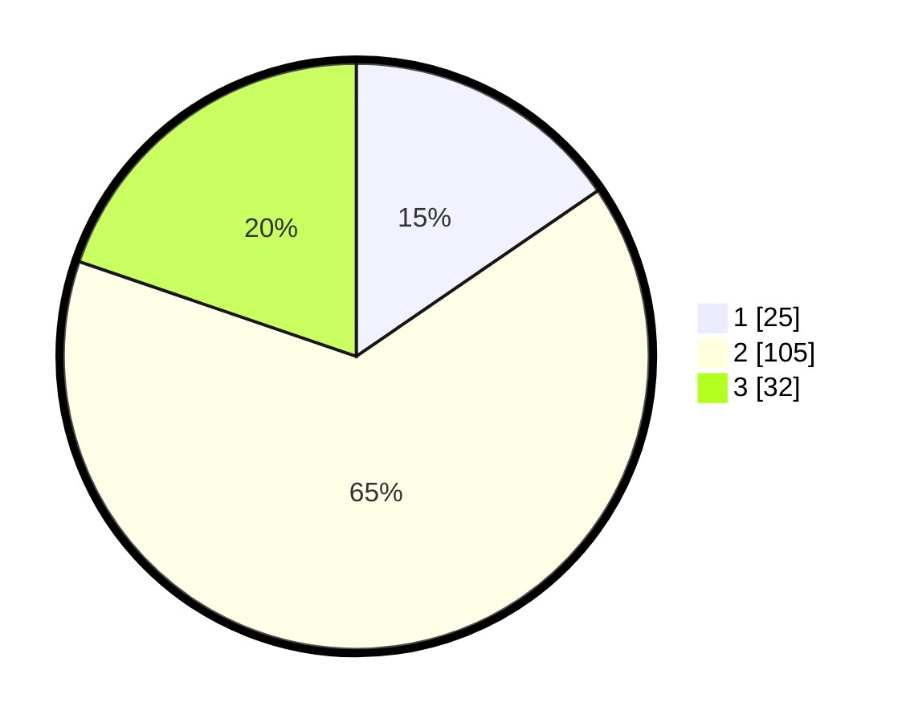

# Hasil

## Grafik

## Tabel

| No. | Nama Paslon    | Suara | Suara (raw) | Persentase |
|:--- |:-------------- | -----:| -----------:| ----------:|
| 1   | ANIES MUHAIMIN | 25    | [25][p-1]   | 15,43      |
| 2   | PRABOWO GIBRAN | 105   | [105][p-2]  | 64,81      |
| 3   | GANJAR MAHFUD  | 32    | [32][p-3]   | 19,75      |

[p-1]: https://github.com/gigit-pemilu/pemilu-2024-35-jawa-timur/blob/main/pilpres/hitung-suara/sub/35-jawa-timur/sub/03-trenggalek/sub/11-trenggalek/sub/1002-tamanan/sub/001-tps/sub/paslon-1.txt
[p-2]: https://github.com/gigit-pemilu/pemilu-2024-35-jawa-timur/blob/main/pilpres/hitung-suara/sub/35-jawa-timur/sub/03-trenggalek/sub/11-trenggalek/sub/1002-tamanan/sub/001-tps/sub/paslon-2.txt
[p-3]: https://github.com/gigit-pemilu/pemilu-2024-35-jawa-timur/blob/main/pilpres/hitung-suara/sub/35-jawa-timur/sub/03-trenggalek/sub/11-trenggalek/sub/1002-tamanan/sub/001-tps/sub/paslon-3.txt

## Foto C Plano

https://sirekap-obj-formc.kpu.go.id/66da/pemilu/ppwp/35/03/11/10/02/3503111002001-20240215-002841--30bf2ed8-82cf-4831-ab68-7ef69472162a.jpg

https://sirekap-obj-formc.kpu.go.id/66da/pemilu/ppwp/35/03/11/10/02/3503111002001-20240215-002909--db3a3bab-0c23-4ddf-906e-46e1e8b859b7.jpg

https://sirekap-obj-formc.kpu.go.id/66da/pemilu/ppwp/35/03/11/10/02/3503111002001-20240214-194518--4351da36-7053-410b-a846-df76c7c78022.jpg

## Metadata

| Key        | Value               |
| ---------- | ------------------- |
| Time Stamp | 2024-02-16 11:00:29 |

## DATA PEMILIH TETAP

Jumlah pemilih dalam DPT: **179**.
 * L: **78**.
 * P: **101**.

## DATA PENGGUNA HAK PILIH

Jumlah pengguna hak pilih dalam DPT: **148**.
 * L: **66**.
 * P: **82**.

Jumlah pengguna hak pilih dalam DPTb: **14**.
 * L: **4**.
 * P: **10**.

Jumlah pengguna hak pilih dalam DPK: **0**.
 * L: **0**.
 * P: **0**.

Jumlah pengguna hak pilih: **162**.
 * L: **70**.
 * P: **92**.

## JUMLAH SUARA SAH DAN TIDAK SAH

JUMLAH SELURUH SUARA SAH: **162**.

JUMLAH SUARA TIDAK SAH: **0**.

JUMLAH SELURUH SUARA SAH DAN SUARA TIDAK SAH: **162**.

