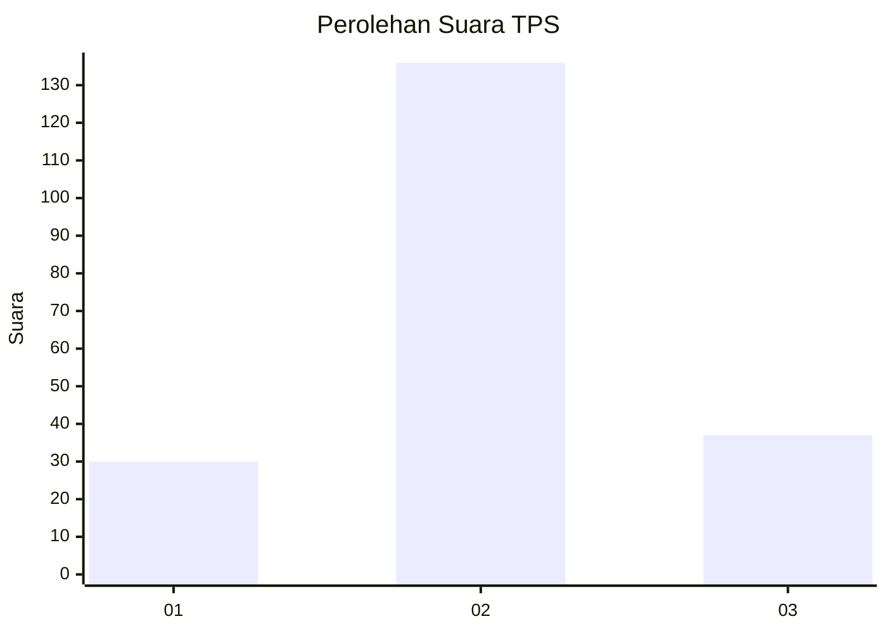
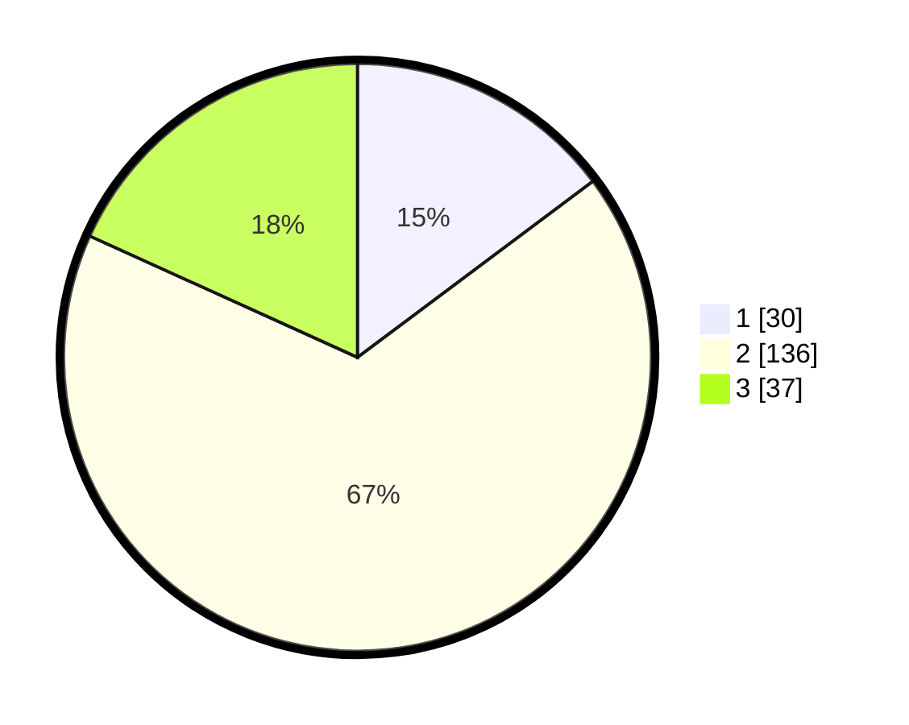

# Hasil

## Grafik

## Tabel

| No. | Nama Paslon    | Suara | Suara (raw) | Persentase |
|:--- |:-------------- | -----:| -----------:| ----------:|
| 1   | ANIES MUHAIMIN | 30    | [30][p-1]   | 14,78      |
| 2   | PRABOWO GIBRAN | 136   | [136][p-2]  | 67,00      |
| 3   | GANJAR MAHFUD  | 37    | [37][p-3]   | 18,23      |

[p-1]: https://github.com/gigit-pemilu/pemilu-2024-35-jawa-timur/blob/main/pilpres/hitung-suara/sub/35-jawa-timur/sub/03-trenggalek/sub/11-trenggalek/sub/1002-tamanan/sub/002-tps/sub/paslon-1.txt
[p-2]: https://github.com/gigit-pemilu/pemilu-2024-35-jawa-timur/blob/main/pilpres/hitung-suara/sub/35-jawa-timur/sub/03-trenggalek/sub/11-trenggalek/sub/1002-tamanan/sub/002-tps/sub/paslon-2.txt
[p-3]: https://github.com/gigit-pemilu/pemilu-2024-35-jawa-timur/blob/main/pilpres/hitung-suara/sub/35-jawa-timur/sub/03-trenggalek/sub/11-trenggalek/sub/1002-tamanan/sub/002-tps/sub/paslon-3.txt

## Foto C Plano

https://sirekap-obj-formc.kpu.go.id/254e/pemilu/ppwp/35/03/11/10/02/3503111002002-20240215-024455--03756cae-168c-4ac6-a928-1ee7504bc717.jpg

https://sirekap-obj-formc.kpu.go.id/254e/pemilu/ppwp/35/03/11/10/02/3503111002002-20240215-024637--544e0d38-fd80-4404-9867-911bcb3e15e7.jpg

https://sirekap-obj-formc.kpu.go.id/254e/pemilu/ppwp/35/03/11/10/02/3503111002002-20240215-024737--85e2d57c-4005-48c7-bc85-f738e2fd28a0.jpg

## Metadata

| Key        | Value               |
| ---------- | ------------------- |
| Time Stamp | 2024-02-15 17:30:25 |

