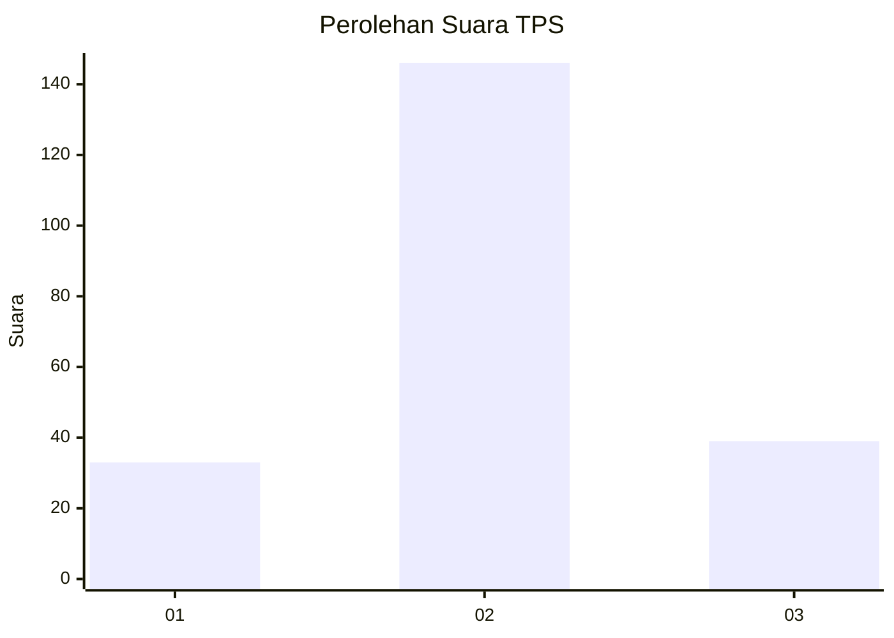
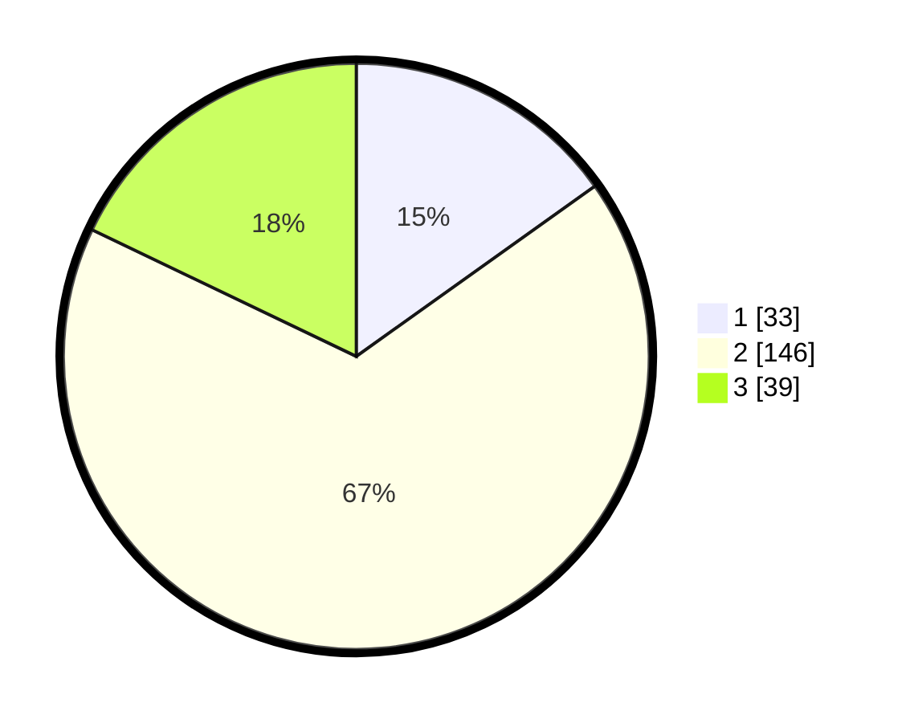

# Hasil

## Grafik

## Tabel

| No. | Nama Paslon    | Suara | Suara (raw) | Persentase |
|:--- |:-------------- | -----:| -----------:| ----------:|
| 1   | ANIES MUHAIMIN | 33    | [33][p-1]   | 15,14      |
| 2   | PRABOWO GIBRAN | 146   | [146][p-2]  | 66,97      |
| 3   | GANJAR MAHFUD  | 39    | [39][p-3]   | 17,89      |

[p-1]: https://github.com/gigit-pemilu/pemilu-2024/blob/main/pilpres/hitung-suara/sub/35-jawa-timur/sub/03-trenggalek/sub/11-trenggalek/sub/1002-tamanan/sub/006-tps/sub/paslon-1.txt
[p-2]: https://github.com/gigit-pemilu/pemilu-2024/blob/main/pilpres/hitung-suara/sub/35-jawa-timur/sub/03-trenggalek/sub/11-trenggalek/sub/1002-tamanan/sub/006-tps/sub/paslon-2.txt
[p-3]: https://github.com/gigit-pemilu/pemilu-2024/blob/main/pilpres/hitung-suara/sub/35-jawa-timur/sub/03-trenggalek/sub/11-trenggalek/sub/1002-tamanan/sub/006-tps/sub/paslon-3.txt

## Foto C Plano

https://sirekap-obj-formc.kpu.go.id/b69b/pemilu/ppwp/35/03/11/10/02/3503111002006-20240215-040700--68be838b-9e78-4c67-bbfd-06ba3c253279.jpg

https://sirekap-obj-formc.kpu.go.id/b69b/pemilu/ppwp/35/03/11/10/02/3503111002006-20240215-041706--73ef1d4a-caff-40e7-a521-25a3d0b2e7cd.jpg

https://sirekap-obj-formc.kpu.go.id/b69b/pemilu/ppwp/35/03/11/10/02/3503111002006-20240217-212329--eaad047c-02e1-46cc-abc2-633360067498.jpg

## Metadata

| Key        | Value               |
| ---------- | ------------------- |
| Time Stamp | 2024-02-19 06:16:00 |

## DATA PEMILIH TETAP

Jumlah pemilih dalam DPT: **276**.
 * L: **129**.
 * P: **147**.

## DATA PENGGUNA HAK PILIH

Jumlah pengguna hak pilih dalam DPT: **221**.
 * L: **103**.
 * P: **118**.

Jumlah pengguna hak pilih dalam DPTb: **1**.
 * L: **1**.
 * P: **0**.

Jumlah pengguna hak pilih dalam DPK: **3**.
 * L: **0**.
 * P: **3**.

Jumlah pengguna hak pilih: **225**.
 * L: **104**.
 * P: **121**.

## JUMLAH SUARA SAH DAN TIDAK SAH

JUMLAH SELURUH SUARA SAH: **218**.

JUMLAH SUARA TIDAK SAH: **7**.

JUMLAH SELURUH SUARA SAH DAN SUARA TIDAK SAH: **225**.

