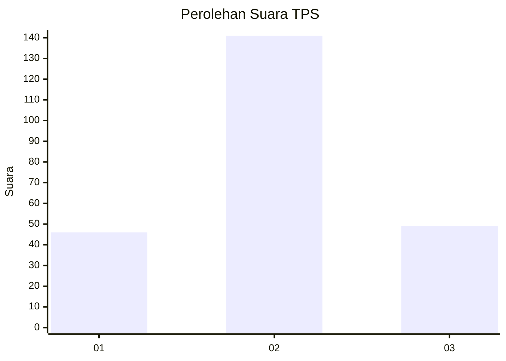
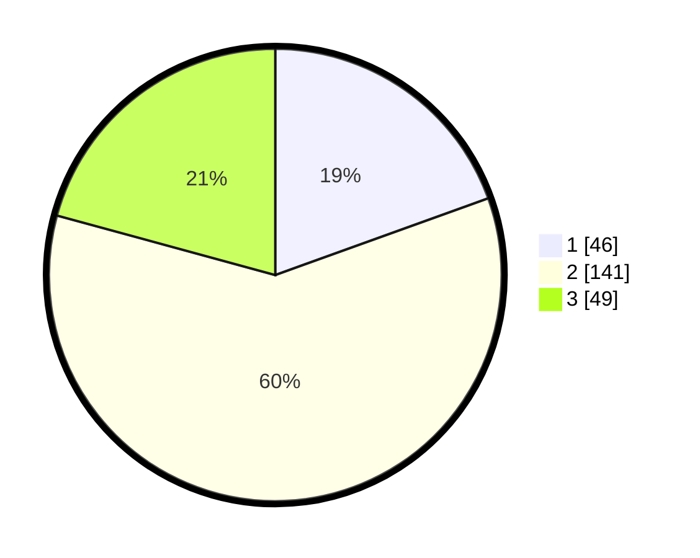

# Hasil

## Grafik

## Tabel

| No. | Nama Paslon    | Suara | Suara (raw) | Persentase |
|:--- |:-------------- | -----:| -----------:| ----------:|
| 1   | ANIES MUHAIMIN | 46    | [46][p-1]   | 19,49      |
| 2   | PRABOWO GIBRAN | 141   | [141][p-2]  | 59,75      |
| 3   | GANJAR MAHFUD  | 49    | [49][p-3]   | 20,76      |

[p-1]: https://github.com/gigit-pemilu/pemilu-2024-35-jawa-timur/blob/main/pilpres/hitung-suara/sub/35-jawa-timur/sub/03-trenggalek/sub/11-trenggalek/sub/1002-tamanan/sub/015-tps/sub/paslon-1.txt
[p-2]: https://github.com/gigit-pemilu/pemilu-2024-35-jawa-timur/blob/main/pilpres/hitung-suara/sub/35-jawa-timur/sub/03-trenggalek/sub/11-trenggalek/sub/1002-tamanan/sub/015-tps/sub/paslon-2.txt
[p-3]: https://github.com/gigit-pemilu/pemilu-2024-35-jawa-timur/blob/main/pilpres/hitung-suara/sub/35-jawa-timur/sub/03-trenggalek/sub/11-trenggalek/sub/1002-tamanan/sub/015-tps/sub/paslon-3.txt

## Foto C Plano

https://sirekap-obj-formc.kpu.go.id/1e2e/pemilu/ppwp/35/03/11/10/02/3503111002015-20240214-214200--9ccc2385-d222-40e5-a476-45e26762e8bd.jpg

https://sirekap-obj-formc.kpu.go.id/1e2e/pemilu/ppwp/35/03/11/10/02/3503111002015-20240214-215728--c751f380-6ca9-4b73-809c-fb388f6feb53.jpg

https://sirekap-obj-formc.kpu.go.id/1e2e/pemilu/ppwp/35/03/11/10/02/3503111002015-20240214-215817--822a1261-db66-4bc3-a1e3-1f2d987a89f7.jpg

## Metadata

| Key        | Value               |
| ---------- | ------------------- |
| Time Stamp | 2024-02-16 16:25:10 |

