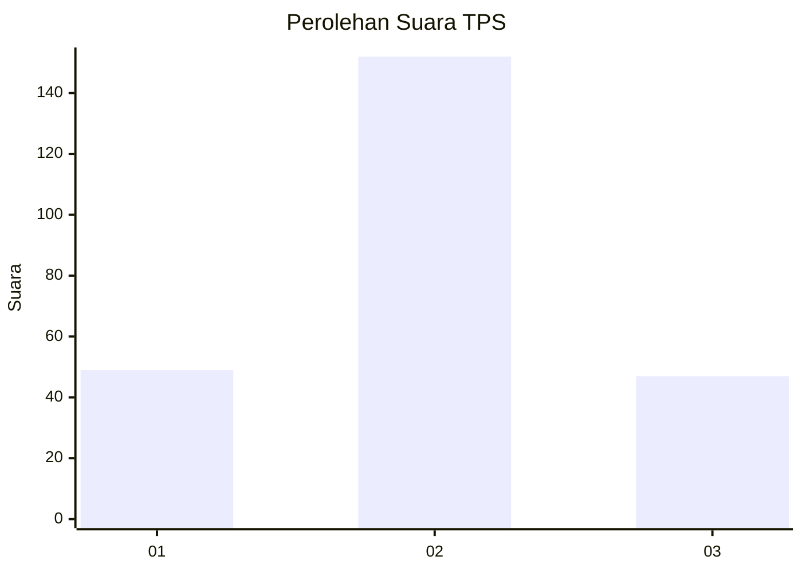
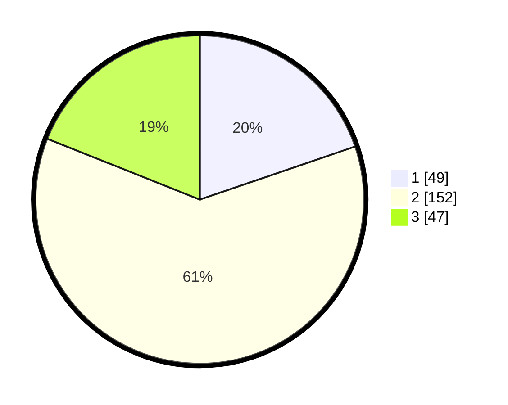

# Hasil

## Grafik

## Tabel

| No. | Nama Paslon    | Suara | Suara (raw) | Persentase |
|:--- |:-------------- | -----:| -----------:| ----------:|
| 1   | ANIES MUHAIMIN | 49    | [49][p-1]   | 19,76      |
| 2   | PRABOWO GIBRAN | 152   | [152][p-2]  | 61,29      |
| 3   | GANJAR MAHFUD  | 47    | [47][p-3]   | 18,95      |

[p-1]: https://github.com/gigit-pemilu/pemilu-2024-35-jawa-timur/blob/main/pilpres/hitung-suara/sub/35-jawa-timur/sub/03-trenggalek/sub/11-trenggalek/sub/1003-ngantru/sub/007-tps/sub/paslon-1.txt
[p-2]: https://github.com/gigit-pemilu/pemilu-2024-35-jawa-timur/blob/main/pilpres/hitung-suara/sub/35-jawa-timur/sub/03-trenggalek/sub/11-trenggalek/sub/1003-ngantru/sub/007-tps/sub/paslon-2.txt
[p-3]: https://github.com/gigit-pemilu/pemilu-2024-35-jawa-timur/blob/main/pilpres/hitung-suara/sub/35-jawa-timur/sub/03-trenggalek/sub/11-trenggalek/sub/1003-ngantru/sub/007-tps/sub/paslon-3.txt

## Foto C Plano

https://sirekap-obj-formc.kpu.go.id/25b5/pemilu/ppwp/35/03/11/10/03/3503111003007-20240216-163005--5aa92b78-144d-4ae0-8b29-5bc8a5bfd33c.jpg

https://sirekap-obj-formc.kpu.go.id/25b5/pemilu/ppwp/35/03/11/10/03/3503111003007-20240216-163159--61eacfa2-7dc4-430e-9df6-6ccc92842622.jpg

https://sirekap-obj-formc.kpu.go.id/25b5/pemilu/ppwp/35/03/11/10/03/3503111003007-20240216-163351--e631b226-ffe4-45c5-a4cc-9b36eac02a3b.jpg

## Metadata

| Key        | Value               |
| ---------- | ------------------- |
| Time Stamp | 2024-02-25 17:00:00 |

