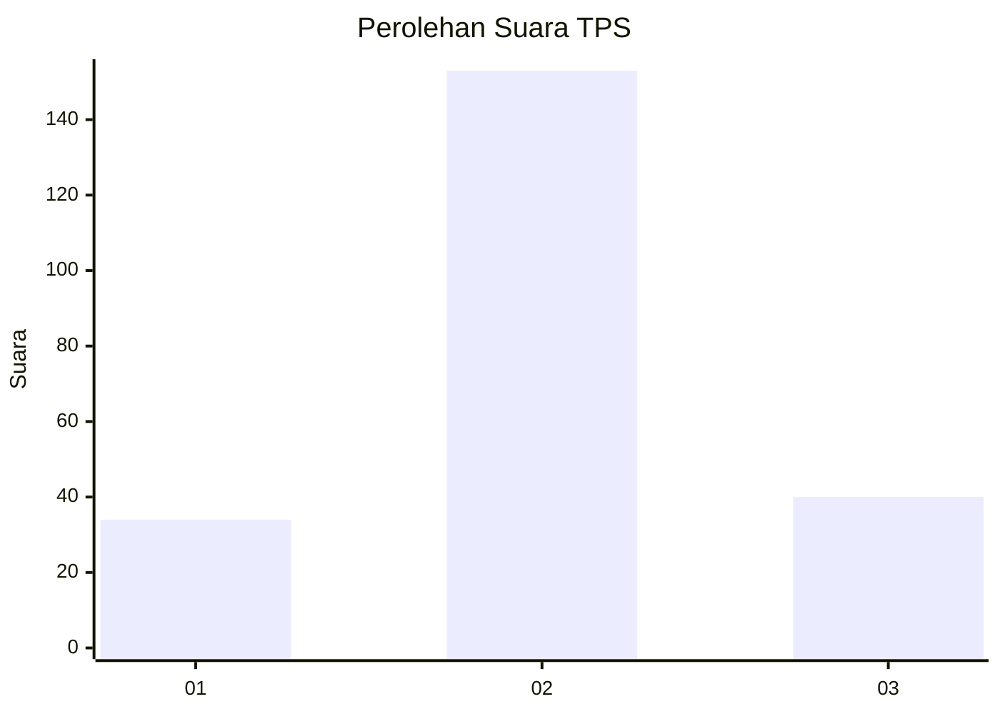
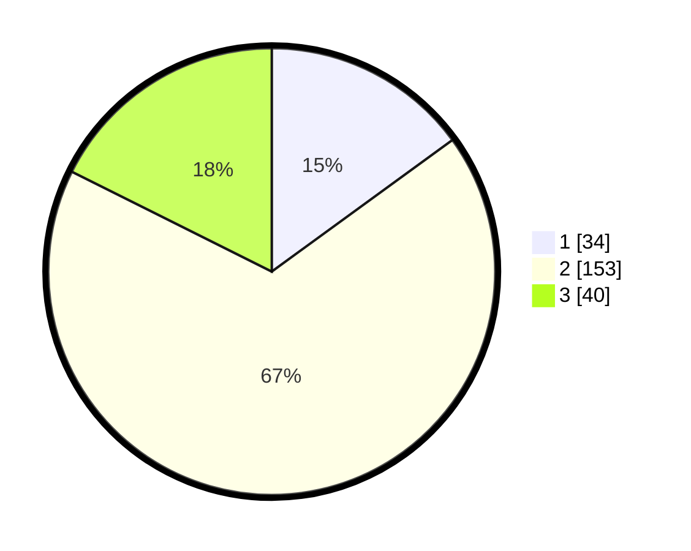

# Hasil

## Grafik

## Tabel

| No. | Nama Paslon    | Suara | Suara (raw) | Persentase |
|:--- |:-------------- | -----:| -----------:| ----------:|
| 1   | ANIES MUHAIMIN | 34    | [34][p-1]   | 14,98      |
| 2   | PRABOWO GIBRAN | 153   | [153][p-2]  | 67,40      |
| 3   | GANJAR MAHFUD  | 40    | [40][p-3]   | 17,62      |

[p-1]: https://github.com/gigit-pemilu/pemilu-2024/blob/main/pilpres/hitung-suara/sub/35-jawa-timur/sub/03-trenggalek/sub/11-trenggalek/sub/1005-kelutan/sub/001-tps/sub/paslon-1.txt
[p-2]: https://github.com/gigit-pemilu/pemilu-2024/blob/main/pilpres/hitung-suara/sub/35-jawa-timur/sub/03-trenggalek/sub/11-trenggalek/sub/1005-kelutan/sub/001-tps/sub/paslon-2.txt
[p-3]: https://github.com/gigit-pemilu/pemilu-2024/blob/main/pilpres/hitung-suara/sub/35-jawa-timur/sub/03-trenggalek/sub/11-trenggalek/sub/1005-kelutan/sub/001-tps/sub/paslon-3.txt

## Foto C Plano

https://sirekap-obj-formc.kpu.go.id/db73/pemilu/ppwp/35/03/11/10/05/3503111005001-20240214-215638--937d752d-ef78-4213-868b-9b033a006640.jpg

https://sirekap-obj-formc.kpu.go.id/db73/pemilu/ppwp/35/03/11/10/05/3503111005001-20240214-215657--62477612-eff2-407f-967a-9c271ac7eb69.jpg

https://sirekap-obj-formc.kpu.go.id/db73/pemilu/ppwp/35/03/11/10/05/3503111005001-20240220-104406--bcb80aed-a1b5-4c33-a8ab-e9f1b0755c21.jpg

## Metadata

| Key        | Value               |
| ---------- | ------------------- |
| Time Stamp | 2024-02-20 11:00:00 |

