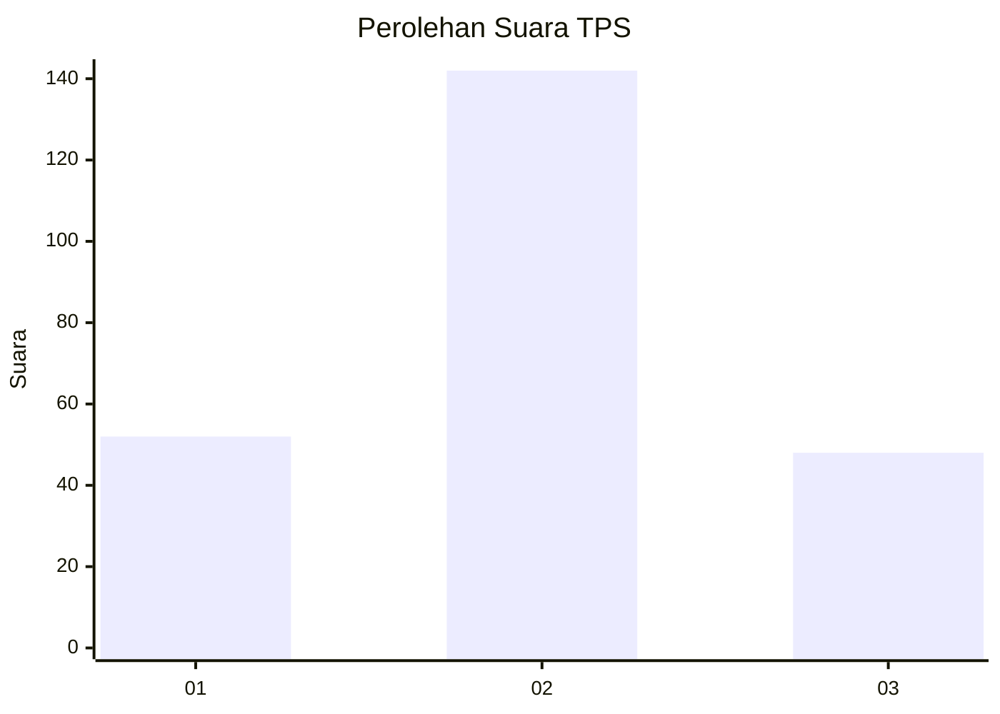
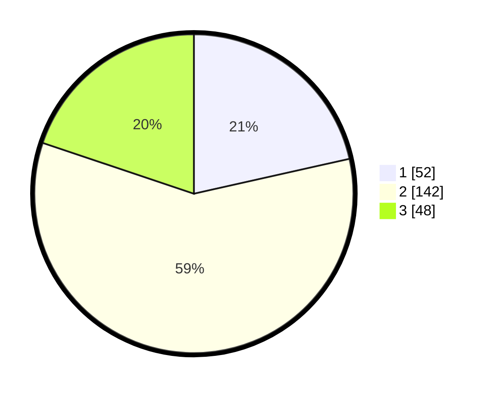

# Hasil

## Grafik

## Tabel

| No. | Nama Paslon    | Suara | Suara (raw) | Persentase |
|:--- |:-------------- | -----:| -----------:| ----------:|
| 1   | ANIES MUHAIMIN | 52    | [52][p-1]   | 21,49      |
| 2   | PRABOWO GIBRAN | 142   | [142][p-2]  | 58,68      |
| 3   | GANJAR MAHFUD  | 48    | [48][p-3]   | 19,83      |

[p-1]: https://github.com/gigit-pemilu/pemilu-2024/blob/main/pilpres/hitung-suara/sub/35-jawa-timur/sub/03-trenggalek/sub/11-trenggalek/sub/1005-kelutan/sub/003-tps/sub/paslon-1.txt
[p-2]: https://github.com/gigit-pemilu/pemilu-2024/blob/main/pilpres/hitung-suara/sub/35-jawa-timur/sub/03-trenggalek/sub/11-trenggalek/sub/1005-kelutan/sub/003-tps/sub/paslon-2.txt
[p-3]: https://github.com/gigit-pemilu/pemilu-2024/blob/main/pilpres/hitung-suara/sub/35-jawa-timur/sub/03-trenggalek/sub/11-trenggalek/sub/1005-kelutan/sub/003-tps/sub/paslon-3.txt

## Foto C Plano

https://sirekap-obj-formc.kpu.go.id/c0e9/pemilu/ppwp/35/03/11/10/05/3503111005003-20240217-100556--4c8bb295-29db-4dca-8b94-3a636e994bb5.jpg

https://sirekap-obj-formc.kpu.go.id/c0e9/pemilu/ppwp/35/03/11/10/05/3503111005003-20240217-113908--d41f9fe1-ae4b-4ab5-8822-975b9ffe9690.jpg

https://sirekap-obj-formc.kpu.go.id/c0e9/pemilu/ppwp/35/03/11/10/05/3503111005003-20240217-113401--e6a70e7a-ed82-4db1-b039-adc6f6a61f97.jpg

## Metadata

| Key        | Value               |
| ---------- | ------------------- |
| Time Stamp | 2024-02-17 18:00:00 |

