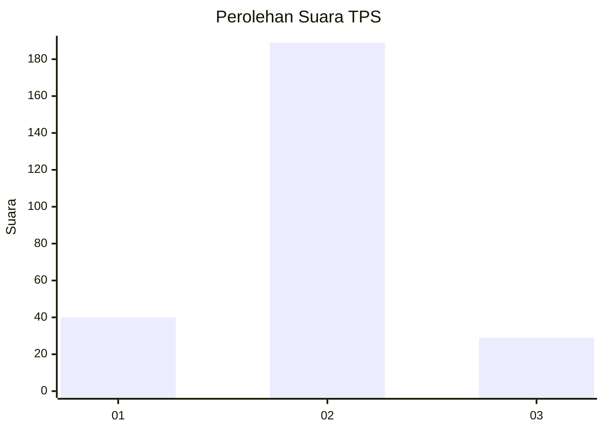
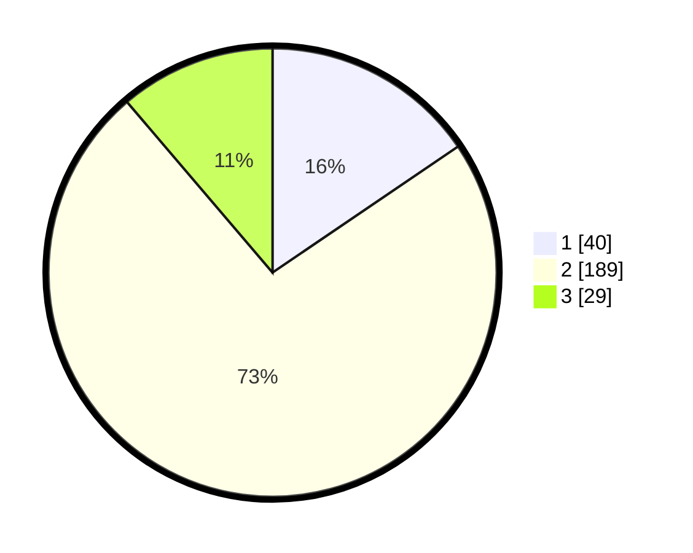

# Hasil

## Grafik

## Tabel

| No. | Nama Paslon    | Suara | Suara (raw) | Persentase |
|:--- |:-------------- | -----:| -----------:| ----------:|
| 1   | ANIES MUHAIMIN | 40    | [40][p-1]   | 15,50      |
| 2   | PRABOWO GIBRAN | 189   | [189][p-2]  | 73,26      |
| 3   | GANJAR MAHFUD  | 29    | [29][p-3]   | 11,24      |

[p-1]: https://github.com/gigit-pemilu/pemilu-2024/blob/main/pilpres/hitung-suara/sub/35-jawa-timur/sub/03-trenggalek/sub/11-trenggalek/sub/1005-kelutan/sub/009-tps/sub/paslon-1.txt
[p-2]: https://github.com/gigit-pemilu/pemilu-2024/blob/main/pilpres/hitung-suara/sub/35-jawa-timur/sub/03-trenggalek/sub/11-trenggalek/sub/1005-kelutan/sub/009-tps/sub/paslon-2.txt
[p-3]: https://github.com/gigit-pemilu/pemilu-2024/blob/main/pilpres/hitung-suara/sub/35-jawa-timur/sub/03-trenggalek/sub/11-trenggalek/sub/1005-kelutan/sub/009-tps/sub/paslon-3.txt

## Foto C Plano

https://sirekap-obj-formc.kpu.go.id/d860/pemilu/ppwp/35/03/11/10/05/3503111005009-20240215-015656--59d7b8fb-9313-4f4a-b5df-0a439499e464.jpg

https://sirekap-obj-formc.kpu.go.id/d860/pemilu/ppwp/35/03/11/10/05/3503111005009-20240215-015717--86800878-d09b-4653-976f-c13417637110.jpg

https://sirekap-obj-formc.kpu.go.id/d860/pemilu/ppwp/35/03/11/10/05/3503111005009-20240215-015931--c001c1dd-3d17-4caa-b0b1-57fcc3809c84.jpg

## Metadata

| Key        | Value               |
| ---------- | ------------------- |
| Time Stamp | 2024-02-15 12:00:28 |

