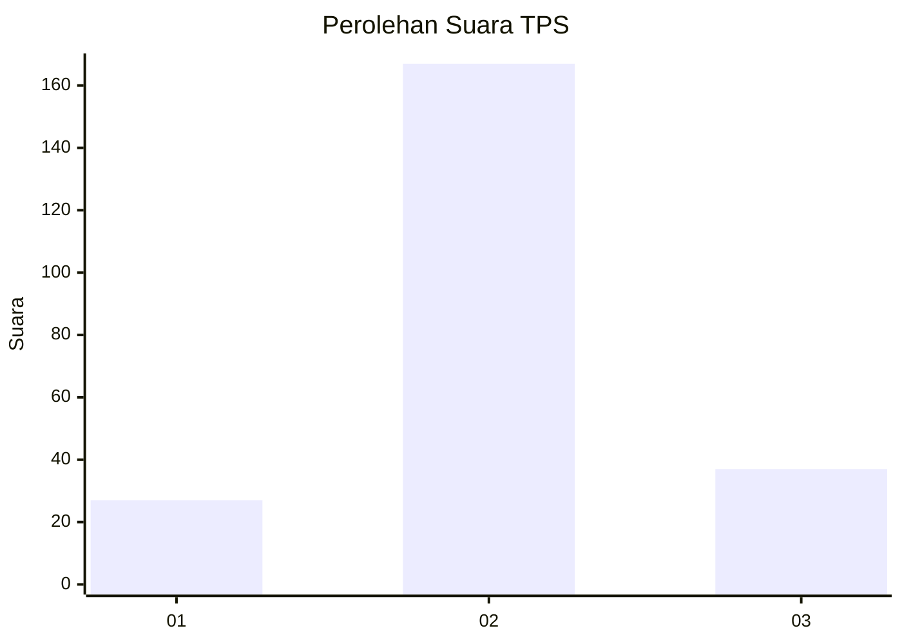
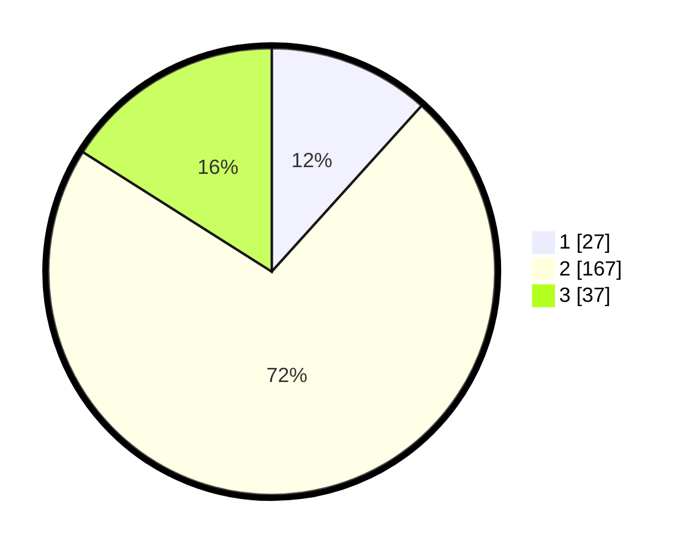

# Hasil

## Grafik

## Tabel

| No. | Nama Paslon    | Suara | Suara (raw) | Persentase |
|:--- |:-------------- | -----:| -----------:| ----------:|
| 1   | ANIES MUHAIMIN | 27    | [27][p-1]   | 11,69      |
| 2   | PRABOWO GIBRAN | 167   | [167][p-2]  | 72,29      |
| 3   | GANJAR MAHFUD  | 37    | [37][p-3]   | 16,02      |

[p-1]: https://github.com/gigit-pemilu/pemilu-2024-35-jawa-timur/blob/main/pilpres/hitung-suara/sub/35-jawa-timur/sub/03-trenggalek/sub/11-trenggalek/sub/1005-kelutan/sub/013-tps/sub/paslon-1.txt
[p-2]: https://github.com/gigit-pemilu/pemilu-2024-35-jawa-timur/blob/main/pilpres/hitung-suara/sub/35-jawa-timur/sub/03-trenggalek/sub/11-trenggalek/sub/1005-kelutan/sub/013-tps/sub/paslon-2.txt
[p-3]: https://github.com/gigit-pemilu/pemilu-2024-35-jawa-timur/blob/main/pilpres/hitung-suara/sub/35-jawa-timur/sub/03-trenggalek/sub/11-trenggalek/sub/1005-kelutan/sub/013-tps/sub/paslon-3.txt

## Foto C Plano

https://sirekap-obj-formc.kpu.go.id/8fbb/pemilu/ppwp/35/03/11/10/05/3503111005013-20240214-222011--8db2f8ac-1a63-4ccb-b8d0-cf30487033aa.jpg

https://sirekap-obj-formc.kpu.go.id/8fbb/pemilu/ppwp/35/03/11/10/05/3503111005013-20240214-203949--6cc6fb6a-c979-4869-8603-29576098ceb4.jpg

https://sirekap-obj-formc.kpu.go.id/8fbb/pemilu/ppwp/35/03/11/10/05/3503111005013-20240214-204035--6a047d24-b216-461e-ad9c-a9ef39f04c40.jpg

## Metadata

| Key        | Value               |
| ---------- | ------------------- |
| Time Stamp | 2024-02-15 18:00:26 |

