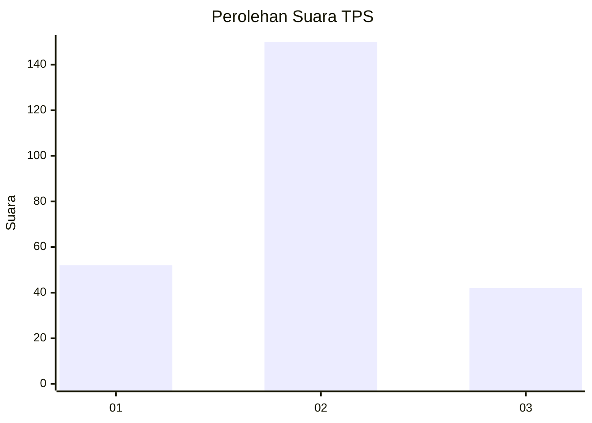

# Hasil

## Grafik

## Tabel

| No. | Nama Paslon    | Suara | Suara (raw) | Persentase |
|:--- |:-------------- | -----:| -----------:| ----------:|
| 1   | ANIES MUHAIMIN | 52    | [52][p-1]   | 21,31      |
| 2   | PRABOWO GIBRAN | 150   | [150][p-2]  | 61,48      |
| 3   | GANJAR MAHFUD  | 42    | [42][p-3]   | 17,21      |

[p-1]: https://github.com/gigit-pemilu/pemilu-2024/blob/main/pilpres/hitung-suara/sub/35-jawa-timur/sub/03-trenggalek/sub/11-trenggalek/sub/1006-surodakan/sub/012-tps/sub/paslon-1.txt
[p-2]: https://github.com/gigit-pemilu/pemilu-2024/blob/main/pilpres/hitung-suara/sub/35-jawa-timur/sub/03-trenggalek/sub/11-trenggalek/sub/1006-surodakan/sub/012-tps/sub/paslon-2.txt
[p-3]: https://github.com/gigit-pemilu/pemilu-2024/blob/main/pilpres/hitung-suara/sub/35-jawa-timur/sub/03-trenggalek/sub/11-trenggalek/sub/1006-surodakan/sub/012-tps/sub/paslon-3.txt

## Foto C Plano

https://sirekap-obj-formc.kpu.go.id/57e3/pemilu/ppwp/35/03/11/10/06/3503111006012-20240216-125606--9bc1f6a6-4739-4657-918e-35601bc927ad.jpg

https://sirekap-obj-formc.kpu.go.id/57e3/pemilu/ppwp/35/03/11/10/06/3503111006012-20240219-225721--dcc000b2-3981-4e3c-9b37-2938807f8991.jpg

https://sirekap-obj-formc.kpu.go.id/57e3/pemilu/ppwp/35/03/11/10/06/3503111006012-20240216-130003--897bd66c-101d-4675-9863-6ea127fa63c4.jpg

## Metadata

| Key        | Value               |
| ---------- | ------------------- |
| Time Stamp | 2024-02-25 16:00:00 |

