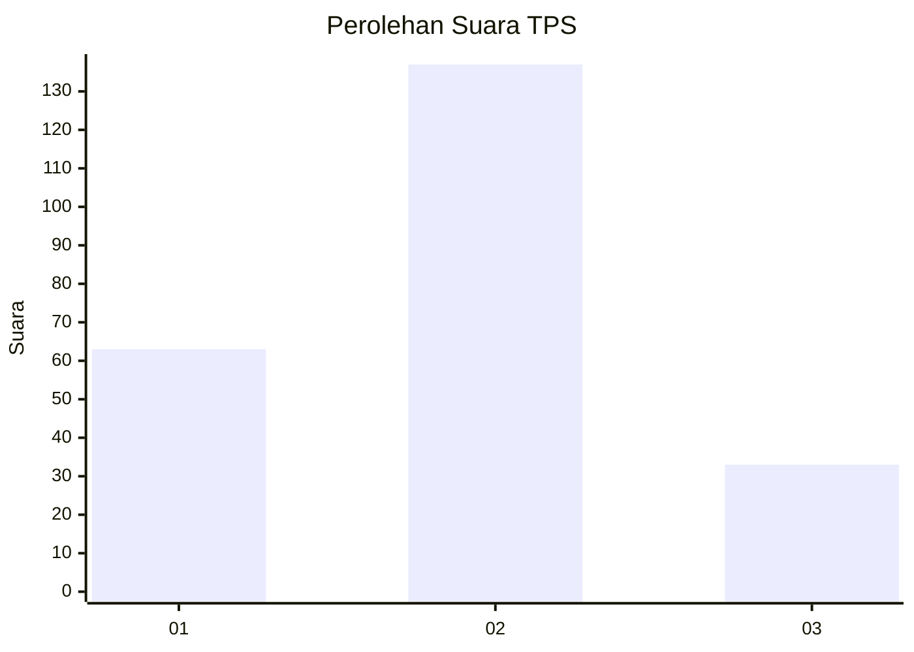
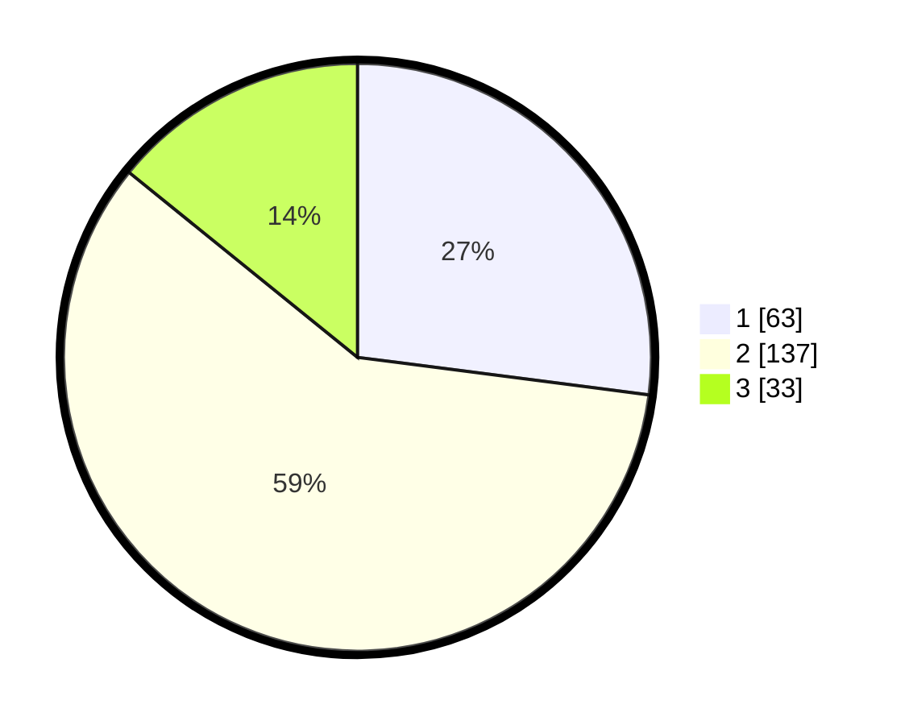

# Hasil

## Grafik

## Tabel

| No. | Nama Paslon    | Suara | Suara (raw) | Persentase |
|:--- |:-------------- | -----:| -----------:| ----------:|
| 1   | ANIES MUHAIMIN | 63    | [63][p-1]   | 27,04      |
| 2   | PRABOWO GIBRAN | 137   | [137][p-2]  | 58,80      |
| 3   | GANJAR MAHFUD  | 33    | [33][p-3]   | 14,16      |

[p-1]: https://github.com/gigit-pemilu/pemilu-2024/blob/main/pilpres/hitung-suara/sub/35-jawa-timur/sub/03-trenggalek/sub/11-trenggalek/sub/1006-surodakan/sub/014-tps/sub/paslon-1.txt
[p-2]: https://github.com/gigit-pemilu/pemilu-2024/blob/main/pilpres/hitung-suara/sub/35-jawa-timur/sub/03-trenggalek/sub/11-trenggalek/sub/1006-surodakan/sub/014-tps/sub/paslon-2.txt
[p-3]: https://github.com/gigit-pemilu/pemilu-2024/blob/main/pilpres/hitung-suara/sub/35-jawa-timur/sub/03-trenggalek/sub/11-trenggalek/sub/1006-surodakan/sub/014-tps/sub/paslon-3.txt

## Foto C Plano

https://sirekap-obj-formc.kpu.go.id/f146/pemilu/ppwp/35/03/11/10/06/3503111006014-20240217-194544--025a1e97-2b95-4a97-be88-321f46c3e737.jpg

https://sirekap-obj-formc.kpu.go.id/f146/pemilu/ppwp/35/03/11/10/06/3503111006014-20240217-161730--0ae7573b-3a87-46c4-b9f5-a2c36bbe2465.jpg

https://sirekap-obj-formc.kpu.go.id/f146/pemilu/ppwp/35/03/11/10/06/3503111006014-20240217-161841--5c58ba43-3c5d-49c3-bc5c-8f65fa919d0c.jpg

## Metadata

| Key        | Value               |
| ---------- | ------------------- |
| Time Stamp | 2024-02-19 06:16:00 |

