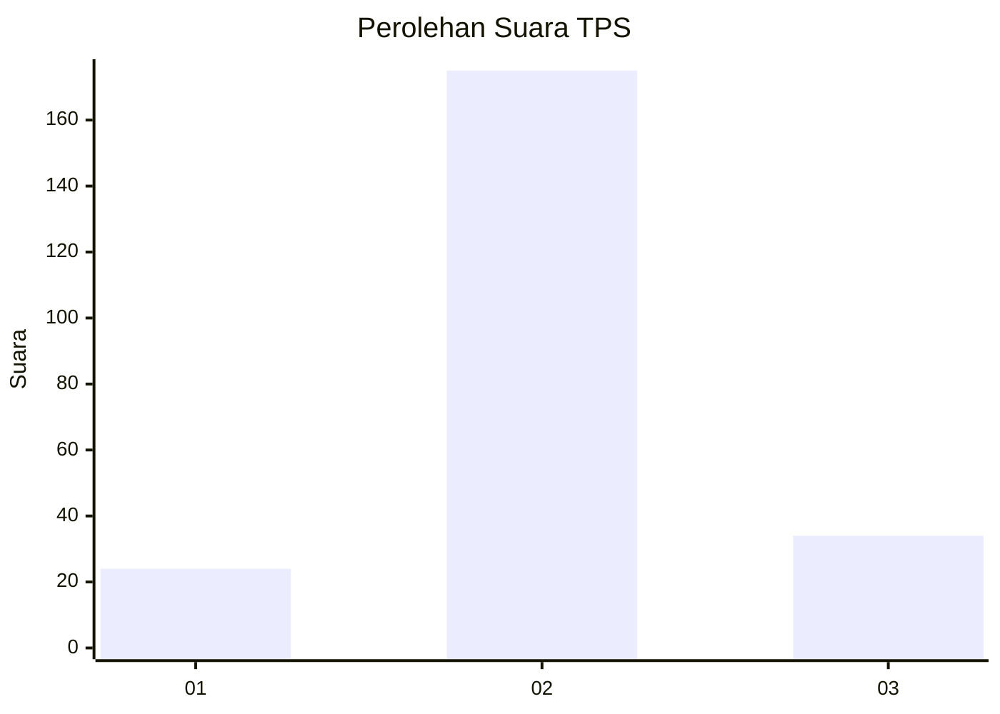

# Hasil

## Grafik

## Tabel

| No. | Nama Paslon    | Suara | Suara (raw) | Persentase |
|:--- |:-------------- | -----:| -----------:| ----------:|
| 1   | ANIES MUHAIMIN | 24    | [24][p-1]   | 10,30      |
| 2   | PRABOWO GIBRAN | 175   | [175][p-2]  | 75,11      |
| 3   | GANJAR MAHFUD  | 34    | [34][p-3]   | 14,59      |

[p-1]: https://github.com/gigit-pemilu/pemilu-2024/blob/main/pilpres/hitung-suara/sub/35-jawa-timur/sub/03-trenggalek/sub/11-trenggalek/sub/1006-surodakan/sub/017-tps/sub/paslon-1.txt
[p-2]: https://github.com/gigit-pemilu/pemilu-2024/blob/main/pilpres/hitung-suara/sub/35-jawa-timur/sub/03-trenggalek/sub/11-trenggalek/sub/1006-surodakan/sub/017-tps/sub/paslon-2.txt
[p-3]: https://github.com/gigit-pemilu/pemilu-2024/blob/main/pilpres/hitung-suara/sub/35-jawa-timur/sub/03-trenggalek/sub/11-trenggalek/sub/1006-surodakan/sub/017-tps/sub/paslon-3.txt

## Foto C Plano

https://sirekap-obj-formc.kpu.go.id/f552/pemilu/ppwp/35/03/11/10/06/3503111006017-20240219-214441--85fb3964-872b-4663-95bb-94fb8270b2e2.jpg

https://sirekap-obj-formc.kpu.go.id/f552/pemilu/ppwp/35/03/11/10/06/3503111006017-20240219-214327--bc948507-db4b-4b96-aaeb-9d5ed97d524c.jpg

https://sirekap-obj-formc.kpu.go.id/f552/pemilu/ppwp/35/03/11/10/06/3503111006017-20240219-214844--fb3c96b2-01b6-4cf5-bdb3-6cca3b46b787.jpg

## Metadata

| Key        | Value               |
| ---------- | ------------------- |
| Time Stamp | 2024-02-24 22:31:28 |

